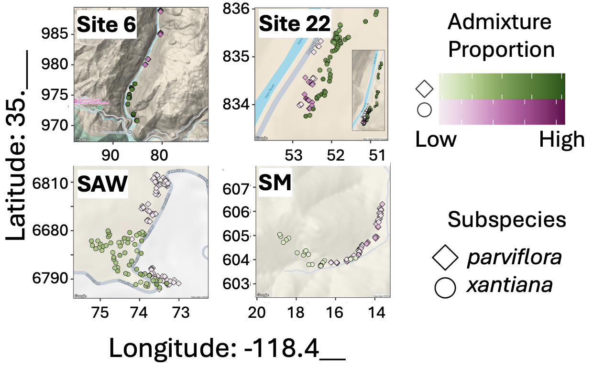

## •  18. ANOVA assumptions  {.unnumbered  #anova_assumptions}

---
format: html
webr:
  autoload-packages: true
---

```{r}
#| echo: false
#| message: false
#| warning: false
library(knitr)
library(dplyr)
library(readr)
library(stringr)
library(janitor)
library(ggforce)
library(webexercises)
library(ggplot2)
library(tidyr)
library(broom)
library(forcats)
source("../../_common.R") 

hz_link <- "https://raw.githubusercontent.com/ybrandvain/datasets/refs/heads/master/zones_df_admix_weight_cutoff0.9_gps_dist2het_phenos_excl_GC.csv"

clarkia_hz <- read_csv(hz_link)|> 
  select(-weighted)|>
  rename(admix_proportion = `cutoff0.9`) |>
  filter(!is.na(admix_proportion))|>
  clean_names() |>
  mutate(site = if_else(site == "SAW", "SR", site)) |>
  filter(subsp=="P")|>
  mutate(site = fct_reorder(site, mean_petal_area_sq_cm))
```


::: {.motivation style="background-color: #ffe6f7; padding: 10px; border: 1px solid #ddd; border-radius: 5px;"}


**Motivating Scenario:**  You are ready to run an ANOVA to compare means among more than two groups. Before doing so, you need to check whether your data meet ANOVA’s assumptions (and know what to do if they do not).

**Learning Goals: By the end of this subchapter, you should be able to:**    

- List the assumptions of an ANOVA.   

- Evaluate if your data meet these assumptions.

- Identify options for dealing with violations of these assumptions, and know how to choose among them.

:::

---


Like the two-sample t-test (and all linear models), ANOVA assumes:

- Independence   
- Random sampling (no bias)  
- Equal variance among groups (homoscedasticity)  
- Normality of residuals. As in the two-sample t-test, this requires approximate normality within groups.  
 
Here we use the *parviflora* admixture data  to look into these assumptions

## ANOVA assumes...

### ANOVA assumes equal variance among groups

**Homoscedasticity** means that the variance is similar across groups. This makes sense, as we use a mean squares error in ANOVA. In fact, the very derivation of ANOVA assumes that all groups have equal variance.


```{r}
#| column: margin
#| eval: false 
clarkia_hz|>
    group_by(site)|>
    summarise(var_admix =
      var(admix_proportion))
```


```{r}
#| column: margin
#| echo: false 
clarkia_hz|>
    group_by(site)|> # below I multiply the variance by a lot to make it easier to read.
    summarise(var_admix = var(admix_proportion) * 10000)                                   |>     mutate(var_admix = paste(round(var_admix, digits = 2)," x 10^4", sep=""))|>kable()
```


As we can see, the variance among groups differs quite substantially. So, we should think twice before conducting a standard ANOVA. Below I will introduce Welch's ANOVA, to accommodate this issue. But I will nonetheless analyze the data by a standard ANOVA as well to show you the mechanics. At the end we will compare and contrast results from a standard and Welch's ANOVA to see how worried we should be about equal variance. 

---

### ANOVA assumes normal residuals within groups   
  
As in the t-test, and in all linear models, we use the normal framework to evaluate the null hypothesis proposed by an ANOVA. Of course data are rarely perfectly normal, but the data we are  examining here seem particularly far from this assumption (see @fig-notnormal). I will proceed here, not because this is the right thing to do, but simply to show you how an ANOVA works.

```{r}
#| fig-width: 12
#| column: page-right
#| label: fig-notnormal
#| code-fold: true
#| fig-cap: "Diagnostic plots for assessing ANOVA assumptions across the four Clarkia xantiana parviflora hybrid-zone populations (SR, S22, SM, S6). (A) Normal Q–Q plots of residuals for each population. The points should follow the 1:1 line if residuals are approximately normally distributed; deviations—especially at the tails—indicate departures from normality. (B) Histograms of the admixture-proportion data within each population. Both A and B show that our data includes extreme outliers (in SR, S22, and S6) and bimodality (in S22, and SM), so we should be cautious in interpreting these ANOVA results (and we may consider an alternative NHST framework)."
#| fig-alt: "Two rows of four panels show diagnostic plots for ANOVA residuals and data from four Clarkia xantiana parviflora sites labeled SR, S22, SM, and S6.Row A shows Q–Q plots comparing residual quantiles to a normal distribution; SR’s points lie close to the diagonal line, while S22, SM, and S6 show curvature or outliers, suggesting non-normal residuals. Row B shows histograms of admixture proportions; SR and SM have tight, low-variance distributions near zero, whereas S22 and S6 show wider, slightly skewed spreads. Together these visuals illustrate how to check ANOVA’s assumptions of normality and equal variance."
library(patchwork)
qq_clarkia_hz <- clarkia_hz|>
    ggplot(aes(sample = admix_proportion))+
    geom_qq()+
    geom_qq_line()+
    facet_wrap(~site, scales = "free_y", nrow = 1)
    
hist_clarkia_hz <- clarkia_hz|>
    ggplot(aes(x = admix_proportion))+
    geom_histogram( bins = 10, color = "white")+
    facet_wrap(~site, nrow = 1, scales = "free_y")

qq_clarkia_hz / hist_clarkia_hz + plot_annotation( tag_levels = "A" )
```

---

### ANOVA assumes independence within groups   

Ugh the news gets even worse. These samples are taken from a reasonable proportion of the extant plants and have a spatial structure to them (@fig-map-x). My sense is that they are siblings or even genetically identical "clones". The appropriate statistical procedure is not clear,  but we will hold our nose, do our best, and acknowledge the potential non-independence. 

```{r}
#| echo: false
#| label: fig-map-x
#| fig-cap: "A map of the plants collected from each field site. Subspecies *parviflora* plants in purple diamonds. Subspecies *xantiana* plants in green circles. Color intensity shows the admixture proportion."    
#| fig-alt: "Maps of sampling locations for all Clarkia xantiana plants at Sites 6, 22, SAW, and SM. Each point represents an individual plant positioned by latitude and longitude. Diamonds indicate subspecies parviflora and circles indicate subspecies xantiana. Point color ranges from light to dark (green or purple), showing increasing admixture proportion. Plants cluster spatially within each site, with variation in both subspecies identity and admixture across locations."

```

--- 

### ANOVA assumes unbiased sampling within groups  


We did an awesome job here. Don't worry about this one! 

## What to do when you violate assumptions 

We’ll continue using these data to learn how ANOVA works. But when the assumptions are clearly broken, as in this example, we need to think about what to do. I want to emphasize that there’s usually not a single right answer, and that your choice will be a compromise between trade-offs of each potential approach. Below are some options, along with my (strong) opinions. I also note that you **don't need to pick a single analysis**, sometimes it makes sense to present results from different types of analyses to show that your take-home message is robust to any specific assumptions. 

**Most importantly, think about what you’re doing and why.** While you should not run a statistical test that gives meaningless results, there’s usually  a trade-off between statistical purity and clear communication of your results. Don’t rush to the most statistically pure approach, if it means your results are difficult to interpret. 

If you're interested in NHST, breaking assumptions means that your p-values aren’t properly calibrated, so you cannot literally interpret your p-value. But how often do you  care about the exact p-value? If you're  worried about misleading confidence intervals, consider the trade-offs between having these perfectly calibrated, and loss of information that may occur when presenting results on a scale that is difficult to interpret. Let clarity about your goals and the meaning of your results take precedence over strict rule following.


- **Minor violations:**  If the test is known to be robust to small deviations—like mild non-normality or modest differences in variance—you can usually proceed without concern.

- **Major non-normality:** When data are far from normal within groups, consider transforming your data (e.g., log, square root) *or* using a model that explicitly captures the shape of the distribution that generated your data. We’ll return to this idea later when we discuss generalized linear models.

- **Robust approaches:**  Methods like Welch’s ANOVA (which allows group variances to differ, below), or approaches that “trim” extreme outliers, are generally solid and defensible choices.

- **Permutation tests:**  are often appealing because they avoid assumptions about the distribution of the data. But they still require independence within groups. A simple permutation test cannot fix this problem. As always, no method gets you out of thinking carefully about how your data were generated.


- **Rank-based tests:**  Alternatives like the [Kruskal–Wallis test](https://en.wikipedia.org/wiki/Kruskal%E2%80%93Wallis_test) assess differences in medians rather than means and are less sensitive to assumption violations. However, their effect sizes are harder to interpret in practical or biological terms.

:::fyi

## Welch's ANOVA when variance differs

You can use [Welch's ANOVA](https://statisticsbyjim.com/anova/welchs-anova-compared-to-classic-one-way-anova/) when variance differs substantially among groups. Welch's ANOVA has the same underlying logic as a standard ANOVA, but relaxes the assumption of equal variance. Specifically, it adjusts the calculation of the test statistic and degrees of freedom to account for differences in group variances, effectively giving less influence to groups with higher variance. This means that F and the degrees of freedom etc can be interpreted similarly as in a standard ANOVA, but are calculated differently.   


The [oneway.test()](https://stat.ethz.ch/R-manual/R-devel/library/stats/html/oneway.test.html) function in R uses Welch's ANOVA by default:

```{r}
oneway.test(admix_proportion ~ site, data = clarkia_hz)
```

Here, we resoundingly reject the null hypothesis that all groups have the same mean. 
:::