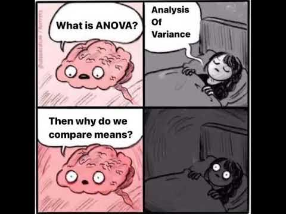
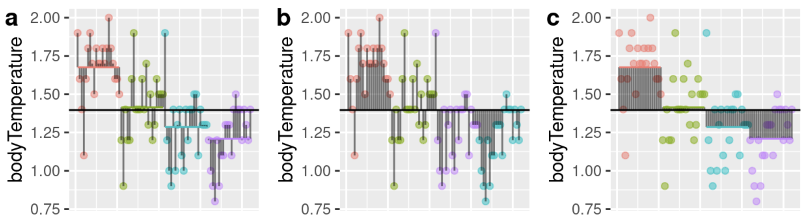

## • 18. ANOVA summary {.unnumbered #anova_summary}


---
format: html
webr:
  packages: ['dplyr', 'readr', 'broom' ,'ggplot2', 'forcats', 'multcomp', 'broom', 'Hmisc', 'patchwork']
  autoload-packages: true
---


Links to: [Summary](#anova_summary_chapter-summary). [Chatbot tutor](#anova_summary_chatbot_tutor).  [Questions](#anova_summary_practice-questions). [Glossary](#anova_summary_glossary-of-terms). [R packages](#anova_summaryR_packages_introduced). [R functions](#anova_summary_key-r-functions). [More resources](#anova_summary_additional-resources).


```{r}
#| echo: false
#| message: false
#| warning: false
library(webexercises)
library(dplyr)
library(janitor)
library(readr)
library(knitr)
library(infer)
library(ggplot2)
library(forcats)
```


## Chapter summary  {#anova_summary_chapter-summary}  
 
 


```{r}
#| echo: false
#| column: margin
#| fig-cap: "Enjoy this \"insomnia meme\" about the ANOVA. From [this video](https://www.youtube.com/watch?v=9W4gOJZfKhA)"
#| fig-alt:  "A four-panel comic shows a brain talking to a person in bed at night. In panel one, the brain asks, \"What is ANOVA?\" In panel two, the person replies, \"Analysis of Variance.\" In panel three, the brain nervously asks, \"Then why do we compare means?\" In panel four, the person lies awake in the dark, wide-eyed, clearly disturbed by the question."
library(knitr)

```
 
We previously introduced F and the ANOVA approach as an alternative to the two sample t-test. Here we show its true utility - by testing the single null hypothesis that all samples come from the same statistical population, we avoid the "multiple testing problem." As such, compared to the naive testing of all pairwise differences, the ANOVA approach allows us to fairly test for differences in means among numerous groups. If we reject the null that all groups are equal, we conduct a "post-hoc" test to see which groups differ.

### Chatbot tutor  {#anova_summary_chatbot_tutor} 

:::tutor


Please interact with this custom chatbot ([**ChatGPT link here**](https://chatgpt.com/g/g-68faf019c2788191bcf1fbc8a80d0c6b-anova-tutor),[Gemini link here](https://gemini.google.com/gem/1jxezNFbnQb9Uy7x8ne7OF847sSUYH4lU?usp=sharing)). I have made it to help you with this chapter. I suggest interacting with at least ten back-and-forths to ramp up  and then stopping when you feel like you got what you needed from it. 

:::


## Practice Questions {#anova_summary_practice-questions}


Try these questions! By using the R environment you can work without leaving this "book". I even pre-loaded all the packages you need! 


### Setup

Fiddler males have a greatly enlarged "major" claw, which is used to attract females and to defend a burrow. Darnell and Munguia (2011) suggested that this appendage might also act as a heat sink, keeping males cooler while out of the burrow on hot days. To test this, they placed four groups of crabs into separate plastic cups and supplied a source of radiant heat (60-watt light bulb) from above. The four groups were intact male crabs; male crabs with the major claw removed; male crabs with the other (minor) claw removed (control), and intact female fiddler crabs. They measured body temperature of crabs every 10 minutes for 1.5 hours. These measurements were used to calculate a rate of heat gain for every individual crab in degrees C/log minute.

Rates of heat gain for all crabs are loaded here as `crabs` but can be downloaded from this link: 
https://raw.githubusercontent.com/ybrandvain/datasets/refs/heads/master/crabs.csv 


```{webr-r}
#| context: setup
#| message: false
#| warning: false
library(forcats)
library(dplyr)
library(readr)
library(ggplot2)
library(multcomp)
library(broom)
library(Hmisc)
library(patchwork)

crab_link <- "https://raw.githubusercontent.com/ybrandvain/datasets/refs/heads/master/crabs.csv"

crabs <- read_csv(crab_link)
```


```{webr-r}
```

:::exercises
**Q1.a)** There are four groups. How many potential pairwise comparisons are there? `r fitb("6")`.

`r hide("Explanation")`
For 4 groups, the number of unique pairs is:
$$\frac{k(k - 1)}{2} = \frac{4(3)}{2} = 6$$
`r unhide()`


**Q1.b)** Assume all samples come from the same population (i.e. the null hypothesis is true). If we conducted all pairwise tests and rejected a null if the p-value was less than 0.05,  what is the probability of rejecting at least one true null across all of these pairwise tests? `r fitb(0.265, num = TRUE, tol = .05)`

`r hide("Explanation")`
The probability of not incorrectly rejecting a true null is 0.95. To not falsely reject any true nulls we need six such successes. 
$$0.95^6 \approx 0.735$$ 
So the probability of incorrectly rejecting at least one true null is:

$$1 - 0.735 = 0.265 $$

`r unhide()`
:::

--- 

```{webr-r}
#| autorun: true
library(ggplot2); library(Hmisc); library(broom);
library(multcomp); library(broom)

crabs |>
  ggplot(aes(x = crabType , 
             y = bodyTemperature, 
             color = crabType))+
  geom_jitter(height = 0, width = .2, size = 3)+
  stat_summary(color = "black", 
               fun.data = "mean_cl_normal")+
  theme(legend.position= "none")
```
:::exercises

**Q2)** Consider the plot above. Before running an ANOVA or post-hoc test, which  comparison do you think is most likely to be significantly different? `r longmcq(c("female x male major removed",answer = "female x male minor removed", "intact x male major removed","intact x male minor removed", "male major removed x male minor removed"))`


:::

---

**Calculate the sample size, mean, and variance for each treatment** 

```{webr-r}
```


:::exercises

**Q3)** Compare the variance within each treatment. What is the greatest fold difference in variance between  treatments? `r longmcq(c("It's exactly the same",answer = "Less than two-fold", "Between two and five-fold", "Between five and ten-fold","More than ten-fold"))`

**Q4)** With this difference in variance among groups, the assumption of homoscedasticity is  `r longmcq(c(answer = "Probably not a major concern", "Somewhat worrisome, but we can plow ahead anyway", "A big concern, we must transform or try Welch's ANOVA"))`


:::

```{r}
#| echo: false
#| column: page-right
#| label: fig-partition
#| fig-cap: "Three panels (a–c) show body temperature measurements for individual crabs across four treatment groups. Points represent individual observations, horizontal colored segments indicate group means, and vertical black lines show deviations between observations and means or between means and the overall mean."
#| fig-alt: "Three plots display body temperature values for four groups of crabs (distinguished by color). In each plot, individual data points are shown with a short horizontal line marking each group’s mean, and a single horizontal black line indicating the overall mean. **Panel a:** Vertical black lines connect each individual observation to its group mean. **Panel b:** Vertical black lines connect each individual observation directly to the overall mean. **Panel c:** vertical black lines connect each group mean to the overall mean."

```

---


:::exercises

**Q5)** Consult @fig-partition to answer the questions below:    

**Q5.a)** Which panel in @fig-partition shows total deviations? `r mcq(c("a",answer = "b","c"))`.   
**Q5.b)** Which panel in @fig-partition shows model deviations? `r mcq(c("a","b", answer = "c"))`.    
**Q5.c)** Which panel in @fig-partition shows error deviations? `r mcq(c(answer = "a","b","c"))`.  
:::

---

**Assume we were using the code below to build an ANOVA for the crabs data**  


```{r}
#| eval: false
crabs                                          |>
    mutate(grand_mean = mean(bodyTemperature)) |>
    group_by(crabType)                         |>
    mutate(group_mean = mean(bodyTemperature)) |>
    ungroup()                                  |>
    summarise(this_partition = sum((group_mean - grand_mean)^2))
```

:::exercises


**Q6)** What would be the best name for `this_partition`? `r mcq(c("MS_total", "MS_model", "MS_error", "SS_total", answer = "SS_model", "SS_error"))`
:::


```{webr-r}
library(broom)

augmented_crab <- lm(bodyTemperature ~ crabType, data = crabs) |>
  augment()

augmented_crab |> 
    ggplot(aes(x= bodyTemperature))+
    geom_qq()+
    geom_qq_line()+
    facet_wrap(~crabType)+
    labs(title = "Plot 1", x="bodyTemperature")

augmented_crab |> 
    ggplot(aes(x= bodyTemperature))+
    geom_qq()+
    geom_qq_line()+
    labs(title = "Plot 2", x="bodyTemperature")

augmented_crab |> 
    ggplot(aes(x= .fitted))+
    geom_qq()+
    geom_qq_line()+
    facet_wrap(~crabType)+
    labs(title = "Plot 3", x=".fitted")

augmented_crab |> 
    ggplot(aes(x= .resid))+
    geom_qq()+
    geom_qq_line()+
    facet_wrap(~crabType)+
    labs(title = "Plot 4", x=".resid")
```
   
---

:::exercises


**Q7.a)** Why didn't the code above work?  `r longmcq(c("We did not load the *broom* package", "We never generated *augmented_crab*", "You must use the original tibble, not *augment()* output to make a plot", answer= "geom_qq expects the aesthetic to be called *sample*, not *x*"))`

---


`r hide("Click here to see the plots if you couldn't fix the error")`

```{r}
#| echo: false
#| message: false
#| warning: false
#| fig-cap: "**Plot 1:** Normal Q–Q plots of body temperature values for each crab group, shown separately by crab type."
#| fig-alt: "Plot 1: A set of four Q–Q plots (one per crab type) compares observed body temperature values to a normal distribution. In each panel, points fall roughly along a diagonal reference line, with some deviations at the tails. The plots show the distribution of raw body temperature values within each group."
library(broom)

crab_link <- "https://raw.githubusercontent.com/ybrandvain/datasets/refs/heads/master/crabs.csv"

crabs <- read_csv(crab_link)
augmented_crab <- lm(bodyTemperature ~ crabType, data = crabs) |>
  augment()

augmented_crab |> 
    ggplot(aes(sample= bodyTemperature))+
    geom_qq()+
    geom_qq_line()+
    facet_wrap(~crabType)+
    labs(title = "Plot 1", x="bodyTemperature")
```

---


```{r}
#| echo: false
#| message: false
#| warning: false
#| fig-cap: "**Plot 2:** Normal Q–Q plot of all body temperature values pooled across crab types."
#| fig-alt: "Plot 2: A single Q–Q plot compares all body temperature values (ignoring group membership) to a normal distribution. Points roughly follow a diagonal reference line, with some spread at the extremes. The plot shows the overall distribution of body temperature across all crabs combined."
augmented_crab |> 
    ggplot(aes(sample= bodyTemperature))+
    geom_qq()+
    geom_qq_line()+
    labs(title = "Plot 2", x="bodyTemperature")
```

---


```{r}
#| echo: false
#| message: false
#| warning: false
#| fig-cap: "**Plot 3:**  Normal Q–Q plots of model-predicted values for each crab group."
#| fig-alt: "Plot 3: A set of four Q–Q plots (one per crab type) compares model-predicted body temperature values to a normal distribution. Within each group, the points fall in tight clusters along the diagonal line, reflecting limited variation in predicted values within each group."
augmented_crab |> 
    ggplot(aes(sample= .fitted))+
    geom_qq()+
    geom_qq_line()+
    facet_wrap(~crabType)+
    labs(title = "Plot 3", x=".fitted")
```


---


```{r}
#| echo: false
#| message: false
#| warning: false
#| fig-cap: "**Plot 4:** Normal Q–Q plots of deviations between observed and predicted values for each crab group."
#| fig-alt: "Plot 4: Four facetted Q–Q plots (one per crab type) show the differences between observed and model-predicted body temperature values to a normal distribution. Points in each panel are centered around zero and spread along the diagonal reference line, with some deviations at the tails, showing how these differences are distributed within each group."
augmented_crab |> 
    ggplot(aes(sample= .resid))+
    geom_qq()+
    geom_qq_line()+
    facet_wrap(~crabType)+
    labs(title = "Plot 4", x=".resid")
```

`r unhide()`

---

**Q7.b)** Fixing this error, which assumption are these plots meant to evaluate?  `r longmcq(c("Equal variance among groups", answer= "Normal distributions of residuals", "Independence" , "Unbiased data"))`

**Q7.c)** Which two of the plots are reasonable ways to evaluate this assumption. `r longmcq(c("Plot 1 and Plot 2", "Plot 1 and Plot 3", answer = "Plot 1 and Plot 4", "Plot 2 and Plot 3", "Plot 2 and Plot 4", "Plot 3 and Plot 4"))`

---


**Q8)**  In the context of an ANOVA, which R code gives you:       

 
**Q8.a)** Estimates of model coefficients ONLY?   `r longmcq(c("*lm(y ~ x) |> anova()* OR *aov(y ~ x) |> summary()*", "*aov(y ~ x) |> TukeyHSD()*",  "*lm(y ~ x)|> summary()* ",answer =  "*lm(y ~ x)*"))`

**Q8.b)** An ANOVA table `r longmcq(c(answer =  "*lm(y ~ x) |> anova()* OR *aov(y ~ x) |> summary()*", "aov(y ~ x) |> TukeyHSD()",  "lm(y ~ x)|> summary()","*lm(y ~ x)*"))`


**Q8.c)** Results of a post-hoc test (Note there are other post-hoc options too)  `r longmcq(c( "*lm(y ~ x) |> anova()* OR *aov(y ~ x) |> summary()*", answer = "aov(y ~ x) |> TukeyHSD()",  "lm(y ~ x)|> summary() ","*lm(y ~ x)*"))`

**Q8.d)** Model coefficients and standard errors,  plus numerous potentially misleading p-values and t-values that should largely be ignored `r longmcq(c( "*lm(y ~ x) |> anova()* OR *aov(y ~ x) |> summary()*", "aov(y ~ x) |> TukeyHSD()", answer =  "lm(y ~ x)|> summary() ","*lm(y ~ x)*"))`

:::

--- 

**Run the relevant statistical tests below**
```{webr-r}
#| context: setup
#| message: false
#| warning: false
crabs <- mutate(crabs , crabType=factor(crabType))
```

```{webr-r}
#| autorun: true
# For stupid reasons crabType must be a factor
crabs <- mutate(crabs , crabType=factor(crabType))

```


---

:::exercises


**Q9)**  Run an ANOVA on the data. What do we do to the null hypothesis? `r mcq(c(answer = "Reject it","Fail to reject it","Accept it","Fail to accept it"))`   


**Q10)** According to the post-hoc test, if `female` is in significance group, "a", which group(s) is `intact male` in? `r mcq(c("a only", "b only", "c only", "a,b", "a,c",answer = "b,c", "a,b,c"))`

`r hide("Explanation")`


Let's work through this one, because it wasn't easy.   

- First we run our model, and conduct our post-hoc test: 

```{r}
#| eval: false
# Load Data
crab_link <- "https://raw.githubusercontent.com/ybrandvain/datasets/refs/heads/master/crabs.csv"
crabs <- read_csv(crab_link)

# Format data
crabs <- mutate(crabs , crabType=factor(crabType))

# Analyze data
aov(bodyTemperature ~ crabType, data = crabs)|>
  TukeyHSD()
```

```{r}
#| echo: false
#| message: false
#| warning: false
# Load Data
crab_link <- "https://raw.githubusercontent.com/ybrandvain/datasets/refs/heads/master/crabs.csv"
crabs <- read_csv(crab_link)

# Format data
crabs <- mutate(crabs , crabType=factor(crabType))
library(tibble)
(aov(bodyTemperature ~ crabType, data = crabs)|> TukeyHSD())[[1]] |> data.frame()|>rownames_to_column()|> dplyr::select(comparison = rowname,   p.adj)|>
    mutate(  p.adj = round(  p.adj, digits = 7))
```


Let’s hone in on the comparisons with `p.adj` $< 0.05$ (i.e., where we reject the null hypothesis).  
 
- We see that `female` significantly differs from everyone else (all comparisons involving female have `p.adj` $< 0.05$). So we put female in significance group a. **Because `female` differs from all other groups, no other groups are in significance group a.**   

- The post-hoc test reveals one more significant difference — `male minor removed` differs from `male major removed`. **So, we place one in group say b and one in group c** (it doesn’t matter which is which).    

- Finally, `intact male` only differs significantly from `female`. So, it cannot be in group a, but it does not differ from either `male minor removed` or `male major removed`. So, **`intact male`  belongs to both significance groups b and c.**

`r unhide()`

:::


---

## 📊 Glossary of Terms {#anova_summary_glossary-of-terms}

---

:::glossary

* **Multiple Testing Problem**: The inflation of the false positive rate when conducting many hypothesis tests simultaneously.
* **One-way ANOVA**: A comparison of means across more than two groups.
* **Residual**: The difference between an observation and its value predicted by the linear model. 
* **Homoscedasticity**: Equal variance across groups.  
* **$df_\text{model}$**: Degrees of freedom model, which equals the number of terms in our linear model.
* **$df_\text{error}$**: Degrees of freedom error, which equals $n-df_\text{error}$.   
* **Between-Group Variation ($\text{SS}_\text{model}$)**: Variation explained by differences among group means. $\text{SS}_\text{model} = \Sigma{(\hat{Y_i} - \bar{Y})^2}$. We can also find $\text{MS}_\text{model}$ by dividing $\text{SS}_\text{model}$ by $df_\text{model}$. 
* **Within-Group Variation ($\text{SS}_\text{error}$)**: Variation among observations within each group.  $\text{SS}_\text{error} = \Sigma{(Y_i-\hat{Y_i})^2}$. We can also find $\text{MS}_\text{error}$ by dividing $\text{SS}_\text{error}$ by $df_\text{error}$.
* **F Statistic**: Ratio of between-group to within-group variance: $F = \frac{\text{MS}_\text{model}}{\text{MS}_\text{error}}$.   
* **$R^2$**: Proportion of total variance explained by the model. $R^2 = \frac{SS_\text{model}}{SS_\text{total}}$.  
* **Post-hoc Test**: A follow-up test conducted after rejecting ANOVA’s null hypothesis to determine which specific groups differ.
* **Significance Groups**: A compact way to summarize post-hoc results using letters; groups sharing a letter are not significantly different.  


:::


---


## 📦 R Packages Introduced {#anova_summaryR_packages_introduced}

:::packages

- [`broom`](https://broom.tidymodels.org/index.html): A collection of functions to tidy the outputs of a linear model,  including; `tidy()`, `augment()`, and `glance()`.     
- [`multcomp`](https://multcomp.r-forge.r-project.org/). A package with numerous tools for multiple comparisons, including general linear hypothesis testing (`glht()`) and functions to generate significance groupings (`cld()`).    
- [`rstatix`](https://rpkgs.datanovia.com/rstatix/)   A package for statistical tests, including post-hoc procedures like the Games–Howell test (`games_howell_test()`).     
- [`Hmisc`](https://hbiostat.org/r/hmisc/): An R package with "miscellaneous" functions. In this chapter, it is used for `mean_cl_normal`, which works with `stat_summary()` to add means and confidence intervals to plots.    

:::

---

## 🛠️ Key R Functions {#anova_summary_key-r-functions}

:::functions


* [`lm()`](https://stat.ethz.ch/R-manual/R-devel/library/stats/html/lm.html): Fits a linear model, which is the underlying framework for ANOVA. Running `lm(y ~ group)`, fits an ANOVA, where group means are expressed through coefficients.<br><br>    

* [`anova()`](https://stat.ethz.ch/R-manual/R-devel/library/stats/html/anova.html): Produces an ANOVA table from a fitted model (typically from `lm()`). It partitions variation into components (model vs. error) and reports sums of squares, mean squares, the F statistic, and p-values.<br><br>      

* [`summary()`](https://stat.ethz.ch/R-manual/R-devel/library/stats/html/summary.lm.html).  Summarizes a fitted lm() model, providing coefficients, standard errors, t-values, and p-values. In ANOVA contexts, these p-values are often misleading for multi-group comparisons and should be ignored.    <br><br>  

* [`aov()`](https://stat.ethz.ch/R-manual/R-devel/library/stats/html/aov.html): Like `lm()`, `aov` Fits an ANOVA model using a formula (e.g., `y ~ group`). Unlike `lm`  the output is designed to work with one way ANOVA-style analyses and to integrate  with functions like `TukeyHSD()` for post-hoc testing, but does not provide coefficients for a linear model. <br><br>   

* [`TukeyHSD()`](https://stat.ethz.ch/R-manual/R-devel/library/stats/html/TukeyHSD.html): Performs Tukey’s post-hoc test following an ANOVA fit with `aov()`.       <br><br>  

* [`glht()`](https://search.r-project.org/CRAN/refmans/multcomp/html/glht.html): Conducts general linear hypothesis tests, including Tukey-style post-hoc comparisons, from models fit with `lm()`. It is more flexible than `TukeyHSD()` and works with a wider range of models.    <br><br>   
 
* [`oneway.test()`](https://stat.ethz.ch/R-manual/R-devel/library/stats/html/oneway.test.html):   Conducts Welch's ANOVA, which does not assume equal variance across groups. Use `games_howell_test()` for the corresponding post-hoc test.<br><br>


* [`games_howell_test()`](https://search.r-project.org/CRAN/refmans/rstatix/html/games_howell_test.html):  Performs a post-hoc test that does not assume equal variance among groups. It is typically used after Welch’s ANOVA (i.e. output from `oneway.test()`) and is robust to heteroscedasticity.    <br><br>  

* [`cld()`](https://search.r-project.org/CRAN/refmans/multcomp/html/cld.html): Converts post-hoc test results (e.g., from `glht()`) into  significance groups (a, b, etc.) that summarize which groups differ.        <br><br>  

* [`augment()`](https://broom.tidymodels.org/reference/augment.lm.html): Adds model outputs (e.g., fitted values and residuals) back onto the original dataset.   <br><br>  
* [`tidy()`](https://broom.tidymodels.org/reference/tidy.lm.html):Converts model output into a clean, tabular format. 
:::

---


## Additional resources   {#anova_summary_additional-resources}

:::learnmore 

**Videos:**         

[ANOVA Introduction](https://www.youtube.com/watch?v=W36DMVJ4Ibo), by [Mine Çetinkaya-Rundel](https://mine-cr.com/).

[ANOVA: Crash Course Statistics #33](https://www.youtube.com/watch?v=oOuu8IBd-yo). 

[ANOVA A visual introduction](https://www.youtube.com/watch?v=0Vj2V2qRU10) by [Brandon Foltz](https://www.bcfoltz.com/)

**Readings**

- Chapters [16](https://courses.washington.edu/psy524a/_book/anova-part-1---the-ratio-of-variances.html), [17](https://courses.washington.edu/psy524a/_book/anova-part-2-partitioning-sums-of-squares.html) and [18](https://courses.washington.edu/psy524a/_book/apriori-and-post-hoc-comparisons.html) of "Introduction to Statistics and Data Analysis"  by Geoffrey M. Boynton. 

- [Comparing several means (one-way ANOVA)](https://learningstatisticswithr.com/book/anova.html) from Learning statistics with R: A tutorial for psychology students and other beginners. (Version 0.6.1) Danielle Navarro.

:::

