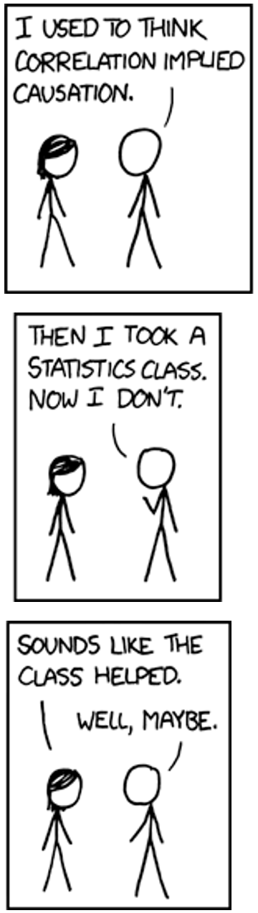

## • 6. Association Summary: I {.unnumbered}


---
format: html
webr:
  packages: ['dplyr', 'tidyr' ,'ggplot2','janitor','readr','effectsize']
  autoload-packages: true
---


Links to: [Summary](#summarizing_associations_chapter-summary_I). [Chatbot tutor](#summarizing_associations_chatbot_tutor_I).  [Questions](#summarizing_associations_practice-questions_I). [Glossary](#summarizing_associations_glossary-of-terms_I). [R functions](#summarizing_associations_key-r-functions_I). [R packages](#summarizing_associations_r-packages-introduced_I). [More resources](#summarizing_associations_additional-resources_I).


## Chapter Summary  {#summarizing_associations_chapter-summary_I}    


```{r}
#| echo: false
#| column: margin
#| fig-alt: "Correlation doesn't imply causation, but it does waggle its eyebrows suggestively and gesture furtively while mouthing *look over there*."
#| fig-cap: "[A cartoon on correlation from xkcd](https://xkcd.com/552/). The original rollover text says: \"Correlation doesn't imply causation, but it does waggle its eyebrows suggestively and gesture furtively while mouthing *look over there*\". See [this link](https://www.explainxkcd.com/wiki/index.php/552:_Correlation) for a more detailed explanation." 

library(knitr)
library(webexercises)

```

Associations reveal how variables relate to one another - e.g. if they tend to increase together, differ across groups, or cluster. Differences in conditional means (or proportions) describe how a numeric (or categorical) response variable varies across levels of a categorical explanatory variable. While these summaries can highlight patterns, interpretation requires care: strong associations don’t necessarily imply causation, and predictions may not hold across contexts or datasets.

### Chatbot tutor  {#summarizing_associations_chatbot_tutor_I}


:::tutor

Please interact with this custom chatbot ([**For ChatGPT**](https://chatgpt.com/g/g-69a8a0e105b48191abd631ca8ccd7c9c-associations-i-chatbot-tutor), or [Gemini](https://gemini.google.com/gem/1YRLqrR-QoJk5Ug3Jt9CQfSKNpPlXYVrg?usp=sharing)) I have made to help you with this chapter. I suggest interacting with at least ten back-and-forths to ramp up  and then stopping when you feel like you got what you needed from it. 
:::


## Practice Questions   {#summarizing_associations_practice-questions_I}  


Try these questions! By using the R environment you can work without leaving this "book". To help you jump right into thinking and analysis, I have formatted the titanic data and subset it to only be adult males in "1st" class, or "Crew". I now call it `titanic_males`. If you're curious to see what I did, expand the code below.

```{r}
#| code-fold: true
#| message: false
#| warning: false
#| code-summary: "Code for data formating"
library(dplyr)
library(tidyr)
titanic_males <- Titanic[,"Male","Adult",]     |>
    data.frame()                               |>
    mutate(Class = as.character(Class))        |>
    dplyr::filter(Class %in% c("1st","Crew"))  |>
     uncount(weights = Freq)                
```


```{webr-r}
#| context: setup
titanic_males <- Titanic[,"Male","Adult",]     |>
    data.frame()                               |>
    mutate(Class = as.character(Class))        |>
    dplyr::filter(Class %in% c("1st","Crew"))  |>
     uncount(weights = Freq)                
```

```{webr-r}
library(ggplot2)
library(dplyr)
library(tidyr)
library(janitor)

titanic_males |>
  ggplot(aes(x = Class, fill = Survived )) +
  geom_bar(position = "XXX")
```


**Visualizing associations:** Consider the code above. There are three good options for "XXX" in `position = "XXX"`:   

- "dodge".  
- "fill"
- "stack" (the default).    

Replace "XXX", with each of these options, and then answer the following three questions.

:::exercises


**Q1)** Which makes it easiest to read-off the number of males in 1st class? `r mcq(c("dodge","fill",answer = "stack"))`. 

**Q2)** Which makes it easiest to read off the number of males in the crew that did not survive? `r mcq(c(answer ="dodge","fill", "stack"))`. 

**Q3)** Which makes it easiest to compare compare survival probabilities of males in first class vs. the crew? `r mcq(c("dodge", answer = "fill", "stack"))`. 

::: 

---

```{webr-r}
library(dplyr)
library(tidyr)
library(janitor)


```

Use the web R environment above to answer the following questions about the `titanic_males` data set

:::exercises

**Q4)**  In the `titanic_males` dataset (adult males in "1st" class or the "Crew"), what proportion::    


 
- **Q4a)** Were "1st" class? `r fitb(num = TRUE, answer =  0.168756, tol = 0.032)` </br></br>

- **Q4b)** Survived? `r fitb(num = TRUE, answer =0.2401157, tol = 0.01)`  </br></br>

- **Q4c)** Were "1st" class AND survived?  `r fitb(num = TRUE, answer = 0.05496625, tol = 0.005)`  </br></br>

- **Q4d)**  Survived, conditional on being in 1st class (i.e. the proportion of first-class males who survived), (i.e. P(Survive | 1st))?    `r fitb(num = TRUE, answer = 0.326, tol = 0.027)` </br></br>

- **Q4e)**  Survived, conditional on being in crew class (i.e. the proportion of males in the crew who survived),  (i.e. P(Survive | Crew))? `r fitb(num = TRUE, answer = 0.223, tol = 0.027)` </br></br>

`r hide("Code for answers:")`

`r hide("Q4a) What proportion were 1st class?")`

```{r}
titanic_males  |>
  summarise(prop_1st = mean(Class == "1st"))
```

`r unhide()`


`r hide("Q4b) What proportion survived?")`

```{r}
titanic_males  |>
  summarise(prop_survived = mean(Survived == "Yes"))
```

`r unhide()`


`r hide("Q4c) What were in 1st class AND survived?")`

```{r}
titanic_males  |>
 summarise(mean(Survived == "Yes" & Class == "1st"))
```

`r unhide()`

`r hide("Q4d and e) Find survival conditional on Class")`

```{r}
titanic_males                                     |>
  group_by(Class)                                 |>
  summarise(p_survived = mean(Survived == "Yes"))
```

`r unhide()`

`r unhide()`

---

**Q5)** What do you conclude from the answers above?  `r longmcq(c(answer = "First-class males were more likely to survive than male crew members.", "Survival was independent of class it was safer to be a crew member.", "Because more crew members survived than first-class passengers.","Because the joint probability is small, class and survival are unrelated." ))`

:::  


    
```{r}
#| code-fold: true
#| eval: false
library(readr)
ril_link <- "https://raw.githubusercontent.com/ybrandvain/datasets/refs/heads/master/clarkia_rils.csv"
ril_data <- readr::read_csv(ril_link) 
gc_rils2 <- readr::read_csv(ril_link) |>
    rename(visits = mean_visits)|>
    mutate(visited = ifelse(visits > 0,"some_visits","no_visits")) |>
    dplyr::filter(location == "GC", !is.na(prop_hybrid), ! is.na(visits),!is.na(petal_color),!is.na(petal_area_mm))|>
    select(anther_stigma_distance = asd_mm , visited)
```


```{webr-r}
#| context: setup
ril_link <- "https://raw.githubusercontent.com/ybrandvain/datasets/refs/heads/master/clarkia_rils.csv"
ril_data <- readr::read_csv(ril_link) 
gc_rils2 <- readr::read_csv(ril_link) |>
    rename(visits = mean_visits)|>
    mutate(visited = ifelse(visits > 0,"some_visits","no_visits")) |>
    dplyr::filter(location == "GC", !is.na(prop_hybrid), ! is.na(visits),!is.na(petal_color),!is.na(petal_area_mm))|>
    select(anther_stigma_distance = asd_mm , visited)
```


```{webr-r}
#| autorun: true
library(effectsize)
glimpse(gc_rils2)
```

**The set of questions below**  focuses on comparing the association between pollinator visitation (`no_visits` vs `some_visits`) to the association between petal color and proportion hybrid seed. Use the webR console above to work through these!

:::exercises

**Q6)** The difference in mean anther stigma distance conditional on being visited (`some_visits - no_visits`)  is: `r fitb(0.143 , tol = 0.01)`. 

**Q7)** According to traditional interpretations of Cohen's D, this "effect" is: `r mcq(c("Not worth reporting","Tiny", answer = "Small","Medium","Large"))`

**Q8)**From these analyses we conclude (pick best): `r longmcq(c("Anther–stigma distance causes pollinators to visit plants more often.", "Pollinators prefer plants with greater anther–stigma separation.", "There is no relationship between anther–stigma distance and visitation.",answer = "Visited plants tend to have greater anther–stigma distance than plants that did not receive visits."))`

---

:::


---


```{r}
#| eval: false

# plot 1
ggplot(gc_rils2,  aes(x = visited, y = anther_stigma_distance))+
    geom_jitter(width = .2, height = 0)+
    stat_summary(geom="line", aes(group =1))

# plot 2
ggplot(gc_rils2,  aes(anther_stigma_distance))+
    geom_histogram()+
    facet_wrap(~visited)

# plot 3
ggplot(gc_rils2,  aes(anther_stigma_distance, fill = visited))+
    geom_density(alpha = .4)

# plot 4
ggplot(gc_rils2,  aes(y=anther_stigma_distance, x = visited))+
    geom_boxplot()+
    geom_jitter(height = 0, width = .2)

# plot 5    
ggplot(gc_rils2,  aes(y=anther_stigma_distance, x = visited))+
    geom_jitter(width = 1)    
```


```{webr-r}
library(ggplot2)


```


:::exercises

**Q9)** Which plot above is the worst? `r mcq(c("Plot 1","Plot 2", "Plot 3", "Plot 4",answer = "Plot 5"))`

:::

## 📊 Glossary of Terms   {#summarizing_associations_glossary-of-terms}  

:::glossary


- **Conditional Proportion**: The proportion of a category (e.g., visited flowers) within levels of another variable (e.g., pink or white petals).  
  - Written as $P(A|B)$, the probability of A given B.
- **Conditional Mean**: The average of a numeric variable within each group of a categorical variable.
- **Difference in Means**: A common summary of how a numeric variable differs across groups.
- **Cohen’s D**: Standardized difference between two group means.  
  $D = \frac{\bar{X}_1 - \bar{X}_2}{s_{pooled}}$
- **Confounding Variable**: A third variable that creates a false appearance of association between two others.


:::  


## Key R Functions {#summarizing_associations_key-r-functions}  

:::functions


#### 📊 **Visualizing Associations**

- **[`stat_summary()`](https://ggplot2.tidyverse.org/reference/stat_summary.html)**: Adds summary statistics like means and error bars to plots.
- **[`geom_smooth()`](https://ggplot2.tidyverse.org/reference/geom_smooth.html)**: Adds a trend line to scatterplots.

---

#### 📈 **Summarizing Associations Between Variables**


- **[`group_by()`](https://dplyr.tidyverse.org/reference/group_by.html)** *([dplyr])*: Groups data for grouped summaries like conditional proportions or means. 
- **[`summarise()`](https://dplyr.tidyverse.org/reference/summarise.html)** *([dplyr])*: Summarizes multiple rows into a single value, e.g., a mean, covariance, or correlation.   
- **[`mean()`](https://stat.ethz.ch/R-manual/R-devel/library/base/html/mean.html)** *([base R])*: Computes means (or proportions). In this chapter we combine this with `group_by()` to find conditional means (or conditional proportions).

We often combine these below with the following chain of operations.      
`data|>group_by()|>summarize(mean())`.    

####  **Judging the Strength of Associations**

- **[`cohens_d()`](https://easystats.github.io/effectsize/reference/cohens_d.html)** from the [`effectsize`](https://easystats.github.io/effectsize/) package. Computes Cohen's D.      
    - *Example syntax:* `cohens_d(y ~ x, data = my_data )`.  


:::


## R Packages Introduced     {#summarizing_associations_r-packages-introduced_1}    

:::packages
[`effectsize`](https://easystats.github.io/effectsize/): Calculates standard measures of effect size, including Cohen's D.  


:::


## Additional resources   {#summarizing_associations_additional-resources}              


:::learnmore 


**Videos:**  

[Correlation Doesn't Equal Causation: Crash Course Statistics #8](https://www.youtube.com/watch?v=GtV-VYdNt_g&pp=0gcJCfcAhR29_xXO).  

[Calling Bullshit](https://callingbullshit.org/index.html) has a fantastic set of videos on correlation and causation.      


- [Correlation and Causation](https://www.youtube.com/watch?v=YAAHJm1pi1E): "Correlations are often used to make claims about causation. Be careful about the direction in which causality goes. For example: do food stamps cause poverty?"      
- [What are Correlations?](https://www.youtube.com/watch?v=BKQqKKjAwqM) :"Jevin providers an informal introduction to linear correlations."      
- [Spurious Correlations?](https://www.youtube.com/watch?v=WNsLcg2GQMY): "We look at [Tyler Vigen’s silly examples of quantities appear to be correlated over time](https://www.tylervigen.com/spurious-correlations)), and note that scientific studies may accidentally pick up on similarly meaningless relationships."     
- [Correlation Exercise](https://www.youtube.com/watch?v=SijyVCYWzjQ)" "When is correlation all you need, and causation is beside the point? Can you figure out which way causality goes for each of several correlations?"    
- [Common Causes](https://callingbullshit.org/videos.html): "We explain how common causes can generate correlations between otherwise unrelated variables, and look at the correlational evidence that storks bring babies. We look at the need to think about multiple contributing causes. The fallacy of post hoc propter ergo hoc: the mistaken belief that if two events happen sequentially, the first must have caused the second."    
- [Manipulative Experiments](https://www.youtube.com/watch?v=-p7_HFJLA_k): "We look at how manipulative experiments can be used to work out the direction of causation in correlated variables, and sum up the questions one should ask when presented with a correlation.
:::