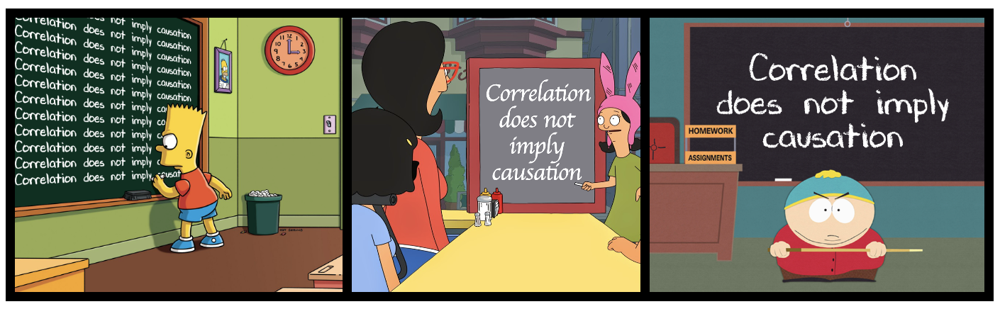

# 6. Associations: Part I {#associations}


```{r}
#| echo: false
#| message: false
#| warning: false
library(knitr)
library(dplyr)
library(readr)
library(stringr)
library(DT)
library(webexercises)
library(ggplot2)
library(tidyr)
source("../_common.R") 

ril_link <- "https://raw.githubusercontent.com/ybrandvain/datasets/refs/heads/master/clarkia_rils.csv"
ril_data <- readr::read_csv(ril_link) |>
  dplyr::mutate(growth_rate = case_when(growth_rate =="1.8O" ~ "1.80",
                                          .default = growth_rate),  
                growth_rate = as.numeric(growth_rate),
                visited = mean_visits > 0)
gc_rils <- ril_data |>
  filter(location == "GC", !is.na(prop_hybrid), ! is.na(mean_visits))|>
  select(petal_color, petal_area_mm, num_hybrid, offspring_genotyped, prop_hybrid, mean_visits , asd_mm )
```


::: {.motivation style="background-color: #ffe6f7; padding: 10px; border: 1px solid #ddd; border-radius: 5px;"}


**Motivating Scenario:**   
You're curious to know the extent to which two variables are associated and need background on standard ways to summarize associations.  

**Learning Goals: By the end of this chapter, you should be able to:** 

1. **Recognize the difference between correlation and causation**    

   - Memorize the phrase "*Correlation does not necessarily imply causation*," explain what it means and why it's important in statistics, and know that this is true of all measures of association.  
   - Identify when correlation may or may not reflect a causal relationship.   
   

2. **Explain and interpret summaries of associations with a binary explanatory variable**    

   - Describe an association between two binary variables.  
       - As differences in conditional proportions.   
   - Describe an association between a binary explanatory variable and a continuous response 
       - As differences in conditional means.   
       - As an "effect size".   
   - Use R to calculate and interpret summaries of association.  
   - Use R to visualize difference between two categorical predictor values.    

:::     

---

```{r}
#| eval: false
library(GGally)
ggpairs(gc_rils)
```

```{r}
#| echo: false
#| message: false
#| label: fig-allcor
#| warning: false
#| cap-location: margin
#| fig-height: 9
#| fig-width: 9
#| fig-cap: "A matrix of plots showing associations among several variables in the RIL dataset. It includes combinations of categorical and continuous variables related to floral traits, pollinator visitation, and hybrid seed formation. The diagonals show distributions of individual variables, while the upper triangle displays correlation coefficients, and the lower triangle shows scatterplots or boxplots depending on the variable type."
#| fig-alt: "A matrix of plots showing pairwise relationships among variables in the Clarkia xantiana dataset. The matrix includes bar plots for categorical variables, histograms and density plots for distributions, scatterplots for continuous variables, and boxplots comparing continuous and categorical variables. Correlation coefficients are displayed in the upper triangle for numeric pairs. The figure visually summarizes a range of associations among traits such as petal color, pollinator visitation, petal area, anther–stigma distance, and hybridization rate."
library(GGally)
gc_rils|> dplyr::filter(!is.na(petal_color))|>mutate(log_petal_area = log10(petal_area_mm),log_asd= log10(asd_mm), visited = mean_visits!=0, visits_if_visited =ifelse(mean_visits == 0 , NA, mean_visits))|> select(-num_hybrid, -offspring_genotyped, -petal_area_mm, -asd_mm, -mean_visits )|> relocate(-where(is.numeric))|>ggpairs()+theme(axis.text = element_blank() )
```


<article class="drop-cap">Summarizing a single variable can be illuminating. But we usually want to know more than that in our biostatistical adventures. We want to know about associations between variables. A careful study of @fig-allcor (plus a bit more information) shows some potentially interesting associations:</article>        


- Pink flowers seem to have a better chance of receiving at least one pollinator than do white flowers.    
- Despite our attempts to genetically disentangle floral traits by creating Recombinant  Inbred Lines (RILs), an association between petal area and anther stigma distance remains.     <br>


Of course, it’s not just the association between variables we care about — it’s what such associations imply. We want to:      

- Predict one variable from another.   
- Anticipate what some intervention will do to a biological system. 

In future chapters we will see when and how we can achieve these higher goals. But for now, know that while such goals are noble, 

> We cannot make causal claims or even good predictions from correlations alone. 


## Correlation is not causation

```{r}
#| echo: false
#| fig-cap: ""


```

**“Correlation is not causation.”**  You've probably heard that before — but what does it actually mean? Let’s start by unpacking the two key concepts in that statement:

- **Correlation** means that two variables are associated.   
    - A positive association means that when one variable is large (or small) the other is often big (or large).  
    - A negative association means that when one variable is large (or small) the other is often small (or large).


- **Causation** means that changing one variable produces a change in the other. (For a deeper dive, see [Wikipedia](https://en.wikipedia.org/wiki/Causality).)


```{r}
#| echo: false
#| column: margin
#| label: fig-train
#| fig-cap: "This man is not starting and stopping the train.  ([tweet](https://x.com/universoviral/status/1155765554583613441))"
include_graphics("../figs/summarizing_data/associations/AmeetRKini - 1186491285919731713.mp4")
```


Correlation is often confused for causation because it's easy to assume that if two things are associated, one must be causing the other — especially when the association feels intuitive or lines up with our expectations, but this is wrong. While correlation may hint at causation, a direct cause is neither necessary nor sufficient to generate a correlation.  Take the video in @fig-train  -- an alien might think this man is starting and stopping the train, but clearly he has nothing to do with the train starting or stopping. 

There are three basic reasons why and when we can have a correlation without a causal relationship-- Coincidence, Confound, and Reverse causation.   

- **Coincidence:**    Chance is surprisingly powerful. In a world full of many possible combinations between variables, some strong associations will arise purely by luck. Later sections of the book will show how to evaluate the "NULL" hypothesis that an observed association arose by chance.   

```{r}
#| column: margin
#| echo: false
#| message: false
#| warning: false
#| fg-alt: "Three scatterplots labeled A, B, and C, showing pairwise relationships among traits in parviflora recombinant inbred lines. Plot A shows a positive relationship between anther–stigma distance and proportion hybrid. Plot B shows a positive association between petal area and anther–stigma distance. Plot C shows a positive association between petal area and proportion hybrid. Each plot includes a fitted regression line. Together, these plots suggest that petal area might confound the relationship between anther–stigma distance and hybridization rate."
#| label: fig-confound
#| fig-cap: "**Potential confounding** in parviflora RILs. The observed association between proportion hybrid seed and anther–stigma distance (**A**), might be due to the fact that both anther–stigma distance (**B**), and proportion hybrid  seed increases with petal area (**C**), rather than a causal effect of anther–stigma distance itself.<br><br><br>"
#| fig-height: 6.5
library(patchwork)
a <- ggplot(gc_rils , aes(x = asd_mm, y = prop_hybrid))+
  geom_point(size = 5, alpha = .5)+
  geom_smooth(method = 'lm', se = FALSE, linewidth = 4)+
  labs(title = "A", 
       x = "Anther stigma\ndistance", 
       y = "Proportion\nhybrid")+
  theme_light()+
  theme(axis.text = element_blank(), 
        axis.title = element_text(size= 28),
        title = element_text(size= 28))

b <- ggplot(gc_rils , aes(x = petal_area_mm, y = asd_mm))+
  geom_point(size = 5, alpha = .5)+
  geom_smooth(method = 'lm', se = FALSE, linewidth = 4)+
  labs(title = "B", 
       x = "Petal area",
       y = "Anther stigma\ndistance")+
  theme_light()+
  theme(axis.text = element_blank(),  
        axis.title = element_text(size= 28),
        title = element_text(size= 28)
        )

c <- ggplot(gc_rils , aes(x = petal_area_mm, y = prop_hybrid))+
  geom_point(size = 5, alpha = .5)+
  geom_smooth(method = 'lm', se = FALSE, linewidth = 4)+
  labs(title = "C", x = "Petal area", y = "Proportion\nhybrid")+
  theme_light()+
  theme(axis.text = element_blank(), 
        axis.title = element_text(size= 28),
        title = element_text(size= 28))

(a+c) /(b + (ggplot()+theme_minimal()))
```

- **Confounding:** An association between two variables may reflect not a causal connection between them -- but rather the fact that both are caused by a third variable (known as a confound).  Such confounding may be at play in our RIL data -- we observe that anther–stigma distance is associated with the proportion hybrid seed, but anther–stigma distance is also associated petal area (presumably because both are caused by flower growth), which itself is associated with the proportion of hybrids (@fig-confound). So, does petal area or anther stigma distance (or both or neither) cause an increase in proportion of hybrid seed? The answer awaits better data, or at least better analyses (see section on causal inference), but I suspect that petal area, not anther stigma distance "causes" proportion hybrid. Unfortunately, we rarely know the confound, let alone its value. So, interpreting any association as causation requires exceptional caution.   

3.  **Reverse causation:** @fig-switchx shows that pink flowers are more likely to receive a pollinator than are white flowers. We assume this means that pink attracts pollinators-- and with the caveat that we must watch out for coincidence and confounds, this conclusion makes sense. However, an association alone cannot tell if pink flowers attracted pollinators or if pollinator visitation turned plants pink. In this case the answer is clear -- petal color was measured for RILs in the greenhouse, and there’s no biological mechanism by which a pollinator could change petal color. However, these answers require us to bring in biological knowledge --  the data alone can’t tell us which way the effect goes. 
 
 
```{r}
#| column: margin
#| echo: false
#| message: false
#| label: fig-switchx
#| warning: false
#| fig-cap: "**Visualizing an association between petal color and pollinator visitation.** Both panels show that pink-petaled flowers are more likely to be visited by pollinators than white-petaled flowers. In the left panel, visit status is on the x-axis and petal color is shown within bars; in the right panel, petal color is on the x-axis and visit status is shown within bars. While the association is the same, the visual framing shifts the way we interpret direction — we typically place and think of explanatory variables (causes) on the x-axis and outcomes on the y-axis. However, these alternative visualizations make it clear that the data cannot speak to cause."
#| fig-alt: "Two bar plots showing the relationship between petal color (pink or white) and pollinator visitation (visited or not visited). The left plot places visit status on the x-axis and shows the proportion of pink and white flowers within each visit category. The right plot reverses this, placing petal color on the x-axis and showing the proportion of flowers that were visited or not. Both plots show that pink flowers are more likely to be visited, but the choice of x-axis can influence how we interpret the relationship, emphasizing the importance of considering — but not assuming — causal direction."
#| fig-height: 4.2
library(patchwork)
tmp <- gc_rils|> 
  dplyr::filter(!is.na(petal_color))|>
  mutate(visited = mean_visits!=0, 
         visited = ifelse(visited,"some\nvisits","no\nvisits")) 
a<- ggplot(tmp,aes(x = visited, fill = petal_color))+
  geom_bar(position = "fill", 
           color = "black")+
  scale_fill_manual(values = c("pink","white") ) +
  scale_y_continuous(expand = c(0,0), 
                     limits =c(-.003,1.003),
                     breaks = c(0,1/4,1/2,3/4,1),
                     labels =c("0","1/4","1/2","3/4","1") ) + 
  theme_light()+
  labs(y = "Proportion",fill = "Petal color")+
  theme(axis.text = element_text(size= 28), 
        axis.title.y = element_text(size= 28),
        axis.title.x = element_blank(),
        legend.text = element_text(size= 28),
        axis.text.y = element_blank(),
        legend.title = element_text(size= 28),
        legend.position = "none")+
  annotate(x = c(1,2), y =c(.8,.5), geom = "text",
           label= c("pink\npetal", "pink petal") , 
           size = 8,angle = 90)+
  annotate(x = 1, y =.29, geom = "text",
           label= "white petal", size = 8,angle = 90)
  

tmp <- gc_rils|> 
  dplyr::filter(!is.na(petal_color))|>
  mutate(visited = mean_visits!=0, 
         visited = ifelse(visited,"\nvisited\n","\nnot\nvisited"),
       petal_color = ifelse(petal_color == "pink","pink\npetal","white\npetal"))   
b<- ggplot(tmp,aes(x = petal_color, fill = visited))+
  geom_bar(position = "fill", 
           color = "black")+
  scale_fill_manual(values = c("black","lightgrey") ) +
  scale_y_continuous(expand = c(0,0), 
                     limits =c(-.003,1.003),
                     breaks = c(0,1/4,1/2,3/4,1),
                     labels =c("0","1/4","1/2","3/4","1") ) + 
  theme_light()+
  labs(y = "Proportion",x = "Petal color")+
  theme(axis.text = element_text(size= 28), 
        #axis.title.y = element_text(size= 28),
        axis.title = element_blank(),
        legend.text = element_text(size= 28),
        legend.title = element_text(size= 28),
        legend.position = "none")+
  annotate(x = c(1,2), y =c(.73,.5), geom = "text",
           label= c("not\nvisited","not visited"), size = 8, 
           color = "white", angle = 90)+
  annotate(x = 1, y =.22, geom = "text",
           label= "visited", size = 8,angle = 90)
a+b
```


This issue isn’t just theoretical — I’m currently grappling with a real case in which the direction of causation is unclear. In natural hybrid zones, white-flowered *parviflora* plants tend to carry less genetic ancestry from *xantiana* (their sister taxon)  than do pink-flowered *parviflora* plants. There are two potential explanations for this observation:   

1. Perhaps, as the  RIL data suggests, white-flowered *parviflora* plants are less likely to hybridize with *xantiana* than are pink-flowered *parviflora*, so white-flowered plants have less *xantiana* ancestry (pink flowers cause more gene flow).       

2. Alternatively, all *xantiana* are pink-flowered, white-flowered *parviflora* can be white or pink. So maybe the pink flowers are actually caused by ancestry inherited from *xantiana* (more gene flow causes pink flowers). 

I do not yet know the answer. 

```{r}
# YANIV ADD FIGURE FROM SHELLEY
```

::: {.callout-tip collapse="true"}
## Making things independent  

If we cannot break the association between anther stigma distance and petal area by genetic crosses maybe we could do so by physical manipulation. For example, we could use tape or some other approach to move stigmas closer to or further from anthers. 
:::


## There is still value in finding associations


The caveats above are important, but they should not stop us from finding associations. With appropriate experimental designs, statistical analyses, biological knowledge, and humility in interpretation, quantifying associations is among the most important ways to summarize and understand data.   

The following sections provide the underlying logic, mathematical  formulas, and R functions to summarize associations.


## Let's get started with summarizing associations!    


The following sections introduce how to summarize associations between variables by:  

- [Describing associations between two categorical variables](#two_categorical_vars), and
- [Describing associations between a categorical explanatory and numeric response variable](#cat_cont) including  [differences in conditional means](#cat_cont_summarizing-associations-difference-in-conditional-means), and [Cohen's D](#cat_cont_summarizing-associations-cohens-d), and tools for [visualizing associations between a categorical explanatory variable and a numeric response](#cat_cont_visualizing-a-categorical-x-and-numeric-y).     
 


Then we [summarize the chapter](#summarizing_associations), present [practice questions](#summarizing_associations_practice-questions), a [glossary](#summarizing_associations_glossary-of-terms), a review of [R functions](#summarizing_associations_key-r-functions) and [R packages](#summarizing_associations_r-packages-introduced) introduced, and [present additional resources](#summarizing_associations_additional-resources).  


In the next chapter we will continue our study of associations as we will investigate associatiosn between continuous variables!