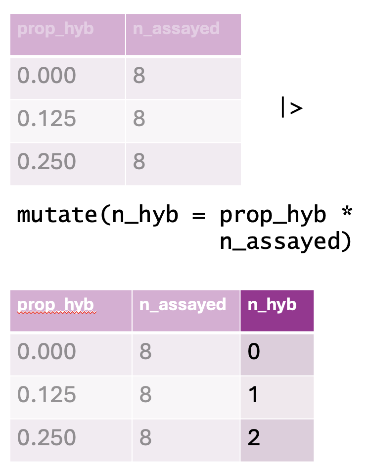

### • 4. Modifying columns {.unnumbered #add_vars}


```{r}
#| echo: false
#| message: false
#| warning: false
library(knitr)
library(dplyr)
library(readr)
library(stringr)
library(DT)
library(webexercises)
library(ggplot2)
library(tidyr)
source("../../_common.R") 
ril_link <- "https://raw.githubusercontent.com/ybrandvain/datasets/refs/heads/master/clarkia_rils.csv"
ril_data <- readr::read_csv(ril_link)
ril_data <- ril_data |> 
  select(location,  prop_hybrid,  mean_visits, petal_color, 
         petal_area_mm, asd_mm, growth_rate) |>
  rename(petal_area = petal_area_mm, 
#         visits     = mean_visits,
         anther_stigma_distance = asd_mm)
```


::: {.motivation style="background-color: #ffe6f7; padding: 10px; border: 1px solid #ddd; border-radius: 5px;"}


**Motivating scenario:**  you want to change or add a column in a tibble.      

**Learning goals: By the end of this sub-chapter you should be able to**  

1. Add or change a column with the  [`mutate()`](https://dplyr.tidyverse.org/reference/mutate.html) function in  the [`dplyr`](https://dplyr.tidyverse.org/index.html) package.  
2. Change between variable types in a column.  
:::     

---

```{r}
#| code-fold: true
#| code-summary: "Loading and formatting data to match where we last left off."
library(dplyr)
library(readr)
library(ggplot2)

ril_link <- "https://raw.githubusercontent.com/ybrandvain/datasets/refs/heads/master/clarkia_rils.csv"
ril_data <- readr::read_csv(ril_link)
ril_data <- ril_data |> 
  select(location,  prop_hybrid,  mean_visits, petal_color, 
         petal_area_mm, asd_mm, growth_rate) |>
  rename(petal_area = petal_area_mm, 
         asd        = asd_mm,
         visits     = mean_visits)
```

--- 

### Why clean a column?

Perhaps the most important rule in statistics is not to lie, cheat, or deceive. With that in mind, you might wonder why we should ever modify values in a column. @fig-cat shows an example of the need to modify columns. Such modifications  are not "cheating" or dishonest, they are necessary for honest analyses.     


```{r}
#| eval: false
library(ggplot2)
ggplot(ril_data, aes(x = growth_rate,  y = petal_area))+
  geom_point()
```


```{r}
#| label: fig-cat
#| echo: false
#| fig-height: 4.5
#| fig-cap: "A plot of petal area across growth rates. Can you spot something fishy? This is not a pretend example. I did not \"cook it up\" for this story. I see this mistake numerous times every year."  
#| fig-alt: "Scatterplot of petal_area vs growth_rate. There are many x-axis labels and x-axis ticks."
library(ggplot2)
library(dplyr)

ggplot(ril_data, aes(x = growth_rate, y = petal_area))+
  geom_point()+
  theme(axis.text.x = element_text(angle = 90, vjust = 0.5, hjust = 1))
```


```{=html}
<div style="border:1px solid #ddd; padding:12px; border-radius:8px;">
  <p><strong>Q):</strong> Identify a few weird things about Figure 1. Then guess why they may arise and how this plot could be fixed. (Write at least <span id="minWords">20</span> words to reveal my explanation.)</p>

  <textarea id="response" rows="4" style="width:100%;"></textarea>

  <p style="margin:8px 0;">
    Word count: <span id="wc">0</span>
  </p>

  <button id="revealBtn" disabled>Reveal explanation</button>

  <div id="answer" style="display:none; margin-top:10px; padding:10px; background:#fff7fb; border:1px solid #f2c9df; border-radius:8px;">
    <strong>Explanation:</strong>
    The x-axis has a ridiculous number of ticks/labels because R is treating growth_rate as a character, not a number. That means 0.12 and 0.121 become different categories rather than nearby numbers on a continuous scale. Converting growth_rate to numeric fixes it.
  </div>
</div>

<script>
  const minWords = 20;
  document.getElementById("minWords").textContent = minWords;

  const response = document.getElementById("response");
  const wcSpan = document.getElementById("wc");
  const revealBtn = document.getElementById("revealBtn");
  const answer = document.getElementById("answer");

  function countWords(text) {
    return text.trim().split(/\s+/).filter(Boolean).length;
  }

  response.addEventListener("input", () => {
    const wc = countWords(response.value);
    wcSpan.textContent = wc;
    revealBtn.disabled = wc < minWords;
  });

  revealBtn.addEventListener("click", () => {
    answer.style.display = "block";
  });
</script>
```

---

## Using [`dplyr`](https://dplyr.tidyverse.org)'s [`mutate()`](https://dplyr.tidyverse.org/reference/mutate.html) to change columns


To fix @fig-cat, we must convert `growth_rate` into a number. But this isn't the only time we want to change values in a column. We may want to:  

- Log transform data.    
- Standardize values by dividing by some constant.    
- Convert from Celsius to Fahrenheit.  
- and so on.

[`dplyr`](https://dplyr.tidyverse.org)'s [`mutate()`](https://dplyr.tidyverse.org/reference/mutate.html)  function helps us with this. Here's the syntax:


`TIBBLE_NAME |> mutate(COLUMN_NAME = FUNCTION(COLUMN_NAME))`     


In our case we use the [`as.numeric()`](https://stat.ethz.ch/R-manual/R-devel/library/base/html/numeric.html) function to convert `growth_rate` into a number. 


```{r}
#| warning: true
ril_data <- ril_data      |>
  mutate(growth_rate = as.numeric(growth_rate))
```

The error above is telling us that there was a character that could not be turned into a number, and was converted to NA. 

:::aside
It turns out the mistake was that I entered "1.80" as "1.8O." If you knew that to be true you could fix the data directly in the spreadsheet. Better yet make this correct in the `R` script, so the correction is documented and reproducible. 
:::


```{r}
#| label: fig-cont
#| fig-height: 4.5
#| fig-cap: "A corrected plot of petal area across growth rates."
#| fig-alt: "Corrected scatterplot of petal_area against growth_rate. The x-axis now displays a continuous scale with a modest number of evenly spaced numeric ticks, indicating growth_rate is being treated as numeric rather than categorical"
library(ggplot2)
library(dplyr)

ggplot(ril_data, aes(x = growth_rate, y = petal_area))+
  geom_point()
```


---

## Using [`dplyr`](https://dplyr.tidyverse.org)'s [`mutate()`](https://dplyr.tidyverse.org/reference/mutate.html) to add columns


```{r}
#| echo: false
#| column: margin
#| label: fig-mutate
#| fig-cap: "An illustration of the `mutate()` function. The top table represents the original dataset, containing columns for the proportion of hybrids (`prop_hyb`) and the number of individuals assayed (`n_assayed`). The `mutate()` function is then applied to compute `n_hyb`, the total number of hybrid individuals, by multiplying `prop_hyb` by `n_assayed`. The resulting dataset, shown in the bottom table, includes this newly created `n_hyb` column."  
#| fig-alt: "A visual representation of a data transformation using `mutate()` in `dplyr`. The top table contains two columns: `prop_hyb` (proportion of hybrids) and `n_assayed` (number of individuals assayed), with values showing different proportions and a constant sample size of 8. Below, an R code snippet applies `mutate(n_hyb = prop_hyb * n_assayed)`, generating a new column, `n_hyb`, which contains the computed number of hybrids (0, 1, and 2, respectively). The updated dataset is displayed in a bottom table with the new `n_hyb` column highlighted in a darker shade." 

```


Our data often include important information that is not directly noted. For example we may want to know 

- If a plant received any pollinators
- If a plant set any hybrid seeds
- If a plant's anther stigma distance is unusually large for its petal area 

Here we want to add columns, not overwrite old ones. No worries, we can also add columns with [`mutate()`](https://dplyr.tidyverse.org/reference/mutate.html) -- just be sure to use a new column name: 

```{r}
ril_data <- ril_data             |>
  mutate(visited      = visits > 0,
         has_hyb      = prop_hybrid > 0,
         rel_asd      = asd / petal_area)  
```

Below, I show this transformation after temporarily removing `location`  (for space, I do not save this change). Note a new [`dplyr::select()`](https://dplyr.tidyverse.org/reference/select.html) trick -- you can select all but specified columns with a minus sign. 


```{r}
#| echo: false
ril_data <- mutate(ril_data  , asd = round(asd, digits = 2))
```


```{r}
#| eval: false
library(dplyr)
ril_data |>
  rename(prop_hyb = prop_hybrid)|>
  select(-location) # select everything but location
```


```{r}
#| echo: false
#| column: page-right 
datatable(ril_data |> select(-location)|>rename(prop_hyb = prop_hybrid)|> mutate(rel_asd = round(rel_asd, digits = 4), petal_area = round(petal_area, digits = 4)))
```