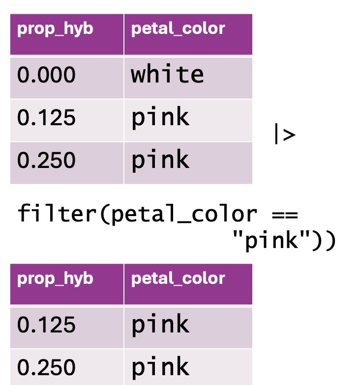

### • 4. Choose rows {.unnumbered #choose_rows}


::: {.motivation style="background-color: #ffe6f7; padding: 10px; border: 1px solid #ddd; border-radius: 5px;"}


**Motivating scenario:**  You want to limit your analysis to rows with certain values.        

**Learning goals: By the end of this sub-chapter you should be able to**  

1. Use the [`filter`](https://dplyr.tidyverse.org/reference/filter.html) function to choose the rows you want to work with.  
2. Display care so that you do not get the wrong answer when filtering your data.   

:::     


```{r}
#| echo: false
#| message: false
#| warning: false
library(knitr)
library(dplyr)
library(readr)
library(stringr)
library(webexercises)
library(ggplot2)
library(tidyr)
source("../../_common.R") 

```

```{r}
#| code-fold: true
#| code-summary: "Loading and formatting data to match where we last left off."
library(dplyr)
library(readr)
library(ggplot2)

ril_link <- "https://raw.githubusercontent.com/ybrandvain/datasets/refs/heads/master/clarkia_rils.csv"
ril_data <- readr::read_csv(ril_link)
ril_data <- ril_data |> 
  select(location,  prop_hybrid,  mean_visits, petal_color, 
         petal_area_mm, asd_mm, growth_rate) |>
  rename(petal_area  = petal_area_mm, 
         asd         = asd_mm,
         visits      = mean_visits)|>
  mutate(growth_rate = as.numeric(growth_rate),
         visited = visits > 0,
         has_hyb = prop_hybrid > 0,
         relative_asd = asd / petal_area) 
```


---   

@fig-bad is not good. Most of the space is wasted on `NA` values. This waste also obscured the true pattern. We can fix this by removing cases in which we did not record pollinator visits (i.e. when `visits` are `NA`).  Below, I show how to use [`dplyr`](https://dplyr.tidyverse.org/)'s  [`filter`](https://dplyr.tidyverse.org/reference/filter.html)  function to do this!

```{r}
#| fig-height: 4
#| fig-width: 14
#| label: fig-bad
#| column: page-right
#| fig-cap: "Counts of pink and white Clarkia RILs by location, including cases with missing pollinator visit data."
#| fig-alt: "Bar charts faceted by location (GC and SR) showing counts of pink, white, and missing (NA) petal colors, filled by whether a pollinator visit occurred. Many observations include missing visit data, causing large NA bars that dominate the plots and make patterns difficult to see."


ril_data |>
    ggplot(aes(x = petal_color, fill = visited))+
    geom_bar()+
    facet_wrap(~location, nrow = 1)+
  theme(legend.position = "bottom")
```

## Remove rows with filter() 


```{r}
#| echo: false
#| column: margin
#| label: fig-filter
#| fig-cap: "Using `filter()` to subset data based on a condition. The top table contains two columns: `prop_hyb` (proportion of hybrids) and `petal_color` (flower color), with values including both \"white\" and \"pink\" flowers. The function `filter(petal_color == \"pink\")` is applied to retain only rows where `petal_color` is \"pink.\" The resulting dataset, shown in the bottom table, excludes the \"white\" flower row and keeps only the observations where petal color is \"pink.\""
#| fig-alt: "A visual representation of filtering data using `filter()` in `dplyr`. The top table contains two columns: `prop_hyb` and `petal_color`, listing hybrid proportions alongside flower color (\"white\" and \"pink\"). Below, an R code snippet applies `filter(petal_color == \"pink\")`, removing rows where `petal_color` is not \"pink.\" The bottom table displays the filtered dataset, which includes only rows with pink flowers, while the white flower row has been excluded."

```

Removing `NA` data is a common reason to remove certain rows, but it is not the only one. You may want to:     

- Remove very large values that you know to be mistaken entries.  
- Focus on observations from (or not from) a certain treatment, or some other subset of the data.   
- And so on.

Use the syntax below to use [`dplyr`](https://dplyr.tidyverse.org/)'s [`filter`](https://dplyr.tidyverse.org/reference/filter.html) function to subset your data:


`TIBBLE_NAME |> dplyr::filter(LOGICAL CONDITION FOR ROWS TO KEEP)`     

So to remove `NA` values you want the data that are not `NA`. Recall that `!` means not, and [is.na()](https://stat.ethz.ch/R-manual/R-devel/library/Matrix/html/is.na-methods.html) asks the logical question -- "is this `NA`?" So, to remove  rows with `NA` values for a focal column:

`TIBBLE_NAME |> dplyr::filter(!is.na(FOCAL COLUMN))`     


```{r}
ril_data_no_missing_visits <- ril_data |> 
  dplyr::filter(!is.na(visits))
```


Now that we have removed the missing data, @fig-better clearly reveals that a higher proportion of Clarkia RILs planted at SR receive a pollinator visit than those planted at GC. @fig-better also clearly shows that at both locations a larger share of pink plants appear to receive visits as compared to white plants. Note that because we filtered on visits and not petal_color, the NA category still appears on the x-axis. 

```{r}
#| fig-height: 3.2
#| label: fig-better
#| fig-cap: "Counts of pink and white Clarkia RILs by location after removing rows with missing pollinator visit data."
#| fig-alt: "Bar charts faceted by location showing counts of pink and white Clarkia RILs after removing rows with missing pollinator visit data. Bars are filled by whether a pollinator visit occurred, revealing clearer differences between locations and flower colors."

ril_data_no_missing_visits |>
    ggplot(aes(x = petal_color, fill = visited))+
    geom_bar()+
    facet_wrap(~location, nrow = 1)
```

--- 


:::fyi
### Pay attention to two choices I made above. 
   
- **Above, I used the `dplyr::filter()` syntax.** I did this because  the stats package that loads automatically with R contains a different function called `filter()`. Without explicit direction, R might use the wrong filter function and give us weird errors. I therefore always specify which function I want by typing dplyr::filter() or by using [`conflicts_prefer()`](https://conflicted.r-lib.org/reference/conflicts_prefer.html) from the [`conflicted`](https://conflicted.r-lib.org/) package:  

```{r}
library(conflicted)
conflict_prefer("filter", winner = "dplyr")
```
 
- **I did not overwrite ril_data.** When I add, rename, or change columns with `mutate()`, I usually overwrite the original object to avoid cluttering my workspace with multiple slightly different versions of the same tibble. However, when filtering, I often assign the result to a new object because I don't want to lose observations that were removed by the filter.  
:::
