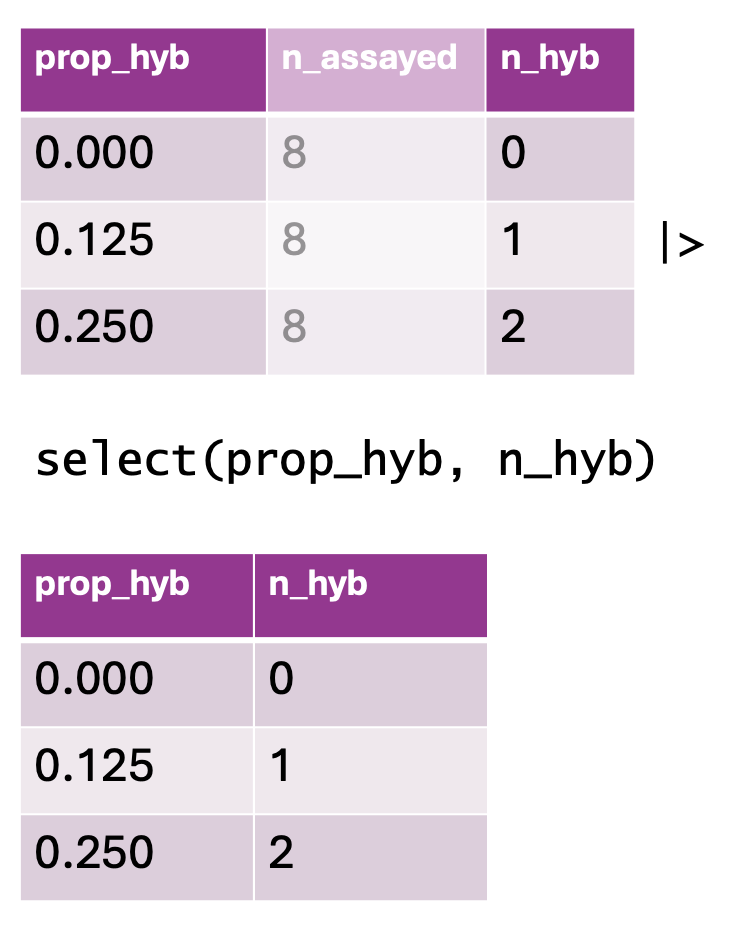

### • 4. Checking Data Review {.unnumbered #select_vars}


```{r}
#| echo: false
#| message: false
#| warning: false
library(knitr)
library(dplyr)
library(readr)
library(stringr)
library(webexercises)
library(ggplot2)
library(tidyr)
source("../../_common.R") 
path <- "https://raw.githubusercontent.com/ybrandvain/datasets/refs/heads/master/clarkia_rils.csv"
ril_data <- read_csv(path)

```


::: {.motivation style="background-color: #ffe6f7; padding: 10px; border: 1px solid #ddd; border-radius: 5px;"}


**Motivating scenario:**  you have your data loaded into R and want to examine it and prepare for analysis.        

**Learning goals: By the end of this sub-chapter you should be able to**  


1. Use [`dplyr`](https://dplyr.tidyverse.org/)'s  [`glimpse()`](https://dplyr.tidyverse.org/reference/glimpse.html) to get a sense of our data.  
2. Use [`dplyr`](https://dplyr.tidyverse.org/)'s  [`select()`](https://dplyr.tidyverse.org/reference/select.html) function to limit our data to a few variables of interest.  
3. Use [`dplyr`](https://dplyr.tidyverse.org/)'s  [`rename`()`](https://dplyr.tidyverse.org/reference/rename.html) function to change the names of specific columns.    

**NOTE:** This is largely a review and consolidation of material from the previous chapter. 
:::     

---

The good news is that `R` has many functions to help us deal with data. The bad news is that this means that there are a lot of `R` functions to keep in mind when dealing with data. So we begin this section with a review of three skills we learned in the previous chapter: 

- **Peeking at our data** with [`dplyr`](https://dplyr.tidyverse.org)'s [`glimpse()`](https://dplyr.tidyverse.org/reference/glimpse.html) function to know the names of each column and the type of data in each.  
- **Choosing columns of interest**  with [`dplyr`](https://dplyr.tidyverse.org)'s [`select()`](https://dplyr.tidyverse.org/reference/select.html) function. This let's us focus on a few columns of interest.   
- **Changing the names of a few columns** with  [`dplyr`](https://dplyr.tidyverse.org)'s [`rename()`](https://dplyr.tidyverse.org/reference/rename.html) function to make the data easier to wrangle.  

To set up this work we load libraries and data: 

```{r}
#| message: false
#| warning: false

library(dplyr)
library(readr)
library(tidyr)
library(conflicted)
conflicts_prefer(dplyr::select)

path <- "https://raw.githubusercontent.com/ybrandvain/datasets/refs/heads/master/clarkia_rils.csv"
ril_data <- read_csv(path)
```

--- 

## A [`glimpse()`](https://dplyr.tidyverse.org/reference/glimpse.html) at our data. 

To deal with data you must know how to refer to it and what type of data it is. The [`glimpse()`](https://dplyr.tidyverse.org/reference/glimpse.html) function provides information on both accounts: 

```{r}
glimpse(ril_data)
```

:::fyi
Also remember that:     

- The [`View()`](https://tibble.tidyverse.org/reference/view.html) function opens up the entire datasheet in a new window.      
- [`janitor`](https://sfirke.github.io/janitor/index.html)'s [`clean_names()`](https://sfirke.github.io/janitor/articles/janitor.html)  function standardizes and improves column names.  
:::

## [`select()`](https://dplyr.tidyverse.org/reference/select.html)ing columns of interest   


```{r}
#| echo: false
#| column: margin
#| label: fig-select
#| fig-cap: "Using the `select()` function to retain specific columns from a dataset. The top table contains three columns: `prop_hyb` (proportion of hybrids), `n_assayed` (number of individuals assayed), and `n_hyb` (the computed number of hybrids). The `select(prop_hyb, n_hyb)` function is applied, keeping only the `prop_hyb` and `n_hyb` columns. The bottom table displays the resulting dataset after column selection."
#| fig-alt: "A visual representation of using `select()` in `dplyr`. The top table contains three columns: `prop_hyb`, `n_assayed`, and `n_hyb`, showing values of hybrid proportions, sample sizes, and computed hybrid counts. Below, an R code snippet applies `select(prop_hyb, n_hyb)`, removing `n_assayed` and keeping only the first and last columns. The resulting table, displayed at the bottom, reflects the updated dataset with only `prop_hyb` and `n_hyb` remaining, shown with consistent formatting."  

```


The dataset above is not tiny -- seventeen columns accompany the 593 rows of data. To simplify your life, use [`dplyr`](https://dplyr.tidyverse.org/)'s [`select()`](https://dplyr.tidyverse.org/reference/select.html) function to limit the variables of interest:  


- `location`: The plant's location. The pollinator visitation experiment was limited to two locations  (either `SR` or `GC`), while the hybrid seed formation study was replicated at four locations (`SR`, `GC`, `LB` or `US`).  This should be a `<chr>` (character), and it is!
- `prop_hybrid`: The proportion of genotyped seeds that were hybrids.   
- `mean_visits`: The mean number of pollinator visits recorded (per fifteen minute pollinator observation) for that RIL genotype at that site.  This should be a number `<dbl>` (double), and it is.
- `petal_area_mm`: The area of the petals (in mm).  This should be a number `<dbl>` (double), and it is!       
- `asd_mm`: The distance between anther (the place where pollen comes from) and stigma (the place that pollen goes to) on a flower. The smaller this number, the easier it is for a plant to pollinated itself. This should be a number `<dbl>` (double), and it is.  
- `growth_rate`: This should be a number but is a <`chr`> character.  We will address why this is a problem and how to fix it in the next sub-section.  

```{r}

ril_data |> 
  select(location,   prop_hybrid,  mean_visits, petal_color, 
         petal_area_mm,  asd_mm, growth_rate)
```


## [`rename`()`](https://dplyr.tidyverse.org/reference/rename.html)ing columns of interest   

Recall that we can change column names to be more descriptive or less elaborate with [`dplyr`](https://dplyr.tidyverse.org/)'s  [`rename`()`](https://dplyr.tidyverse.org/reference/rename.html) function: 

```{r}
ril_data |> 
  select(location,  prop_hybrid,  mean_visits, petal_color, 
         petal_area_mm, asd_mm, growth_rate) |>
  rename(petal_area = petal_area_mm, 
         asd        = asd_mm,
         visits = mean_visits)
```


## Gotcha's and warnings: 

### Warning: R doesn't remember changes until you assign them.   

I like to test my code before overwriting the old data with the new. So, now that we see that our code worked as expected, enter the following. Otherwise `ril_data` is unchanged


```{r}
ril_data <- ril_data |> 
  select(location,  prop_hybrid,  mean_visits, petal_color, 
         petal_area_mm, asd_mm, growth_rate) |>
  rename(petal_area = petal_area_mm, 
         asd        = asd_mm,
         visits     = mean_visits)
  
```

### Warning: Consider order  

Remember: once you rename a column, the old name no longer exists in the pipeline. With this in mind consider the code below. Which code will work? `r mcq(c("A" , "B", "C", "A and B", answer = "A and C", "B and C", "It all works", "none of it works"))`

Feel free to mess around in the webR environment below (data and packages are loaded for you) to see for yourself.

```{webr-r}
#| context: setup
library(dplyr)
library(readr)
library(tidyr)
library(conflicted)
conflict_prefer(name = "select", winner = "dplyr")


path <- "https://raw.githubusercontent.com/ybrandvain/datasets/refs/heads/master/clarkia_rils.csv"
ril_data <- read_csv(path)
```


```{r}
#| eval: false
# A)
ril_data |> 
  select(location,  prop_hybrid,  
         mean_visits, petal_color, 
         petal_area_mm, asd_mm, growth_rate) |>
  rename(petal_area = petal_area_mm, 
         asd        = asd_mm,
         visits     = mean_visits)

# B) 
ril_data |> 
  rename(petal_area = petal_area_mm,  
         asd        = asd_mm,
         visits     = mean_visits) |>
  select(location,  prop_hybrid,  
         mean_visits, petal_color, 
         petal_area_mm, asd_mm, growth_rate) 

# C) 
ril_data |> 
  rename(petal_area = petal_area_mm,
         asd        = asd_mm,
         visits     = mean_visits) |>
  select(location,  prop_hybrid,  
         visits, petal_color, petal_area, 
         asd, growth_rate) 
```

```{webr-r}
library(dplyr)
library(readr)
# TRY HERE!

```
