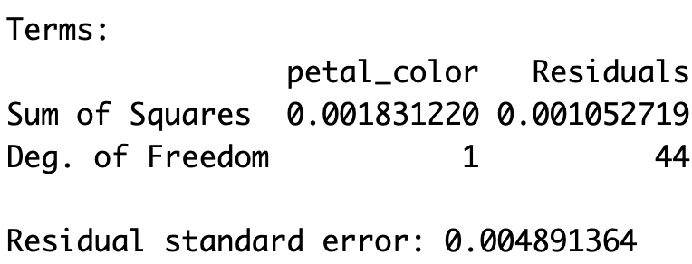

## •  16. F and ANOVA in R  {.unnumbered  #FR}


```{r}
#| echo: false
#| message: false
#| warning: false
library(knitr)
library(dplyr)
library(readr)
library(stringr)
library(janitor)
library(webexercises)
library(ggplot2)
library(tidyr)
library(forcats)
source("../../_common.R") 
hz_link <- "https://raw.githubusercontent.com/ybrandvain/datasets/refs/heads/master/zones_df_admix_weight_cutoff0.9_gps_dist2het_phenos_excl_GC.csv"
clarkia_hz <- read_csv(hz_link)|> 
  select(-weighted)|>
  rename(admix_proportion = `cutoff0.9`) |>
  filter(!is.na(admix_proportion))|>
  clean_names() |>
  mutate(site = if_else(site == "SAW", "SR", site)) |>
  filter(subsp=="P")|>
  filter(site == "SM") |>
  mutate(tmp = as.numeric(factor(petal_color)) + admix_proportion,
         id = factor(id),
         id = fct_reorder(id, tmp))
```

::: {.motivation style="background-color: #ffe6f7; padding: 10px; border: 1px solid #ddd; border-radius: 5px;"}


**Motivating Scenario:**  Now that you know what goes into calculating the sums of squares, degrees of freedom, mean squares, and F, you could do it yourself. Or you could save time and effort by asking  R to do this for you. Here, we run an ANOVA in R and learn how to read the results it gives back.


**Learning Goals: By the end of this subchapter, you should be able to:**     

- Run a one-way ANOVA in R using both [`aov()`](https://stat.ethz.ch/R-manual/R-devel/library/stats/html/aov.html) `|>` [`summary()`](https://stat.ethz.ch/R-manual/R-devel/library/stats/html/summary.lm.html) and [`lm()`](https://stat.ethz.ch/R-manual/R-devel/library/stats/html/lm.html) `|>` [`anova()`](https://stat.ethz.ch/R-manual/R-devel/library/stats/html/anova.html)` pipelines.  

- Interpret the ANOVA table, which includes sums of squares, mean squares, F statistic, and p-value.


- Use the [`broom`](https://broom.tidymodels.org/) package to:    
    - [`tidy()`](https://broom.tidymodels.org/reference/tidy.lm.html) ANOVA results and 
    - [`glance()`](https://broom.tidymodels.org/reference/glance.lm.html) at  model-level summaries (like $R^2$).

:::

---

In the previous sections we worked through the math and the theory, and even how we could use R to do our calculations for us. This is all useful and I hope it helps you understand what is going on behind the scenes. But now that we know what's going on, we can have R do our work for us. Here, I show you two ways to have R calculate the F statistic, and conduct an ANOVA test for us. 

In so doing, we consider how to interpret R's output, and how to convert it to a "tidy" format with [`broom`](https://broom.tidymodels.org/)'s [`glance()`](https://broom.tidymodels.org/reference/glance.lm.html) and [`tidy()`](https://broom.tidymodels.org/reference/tidy.lm.html) functions.

## The [`aov()`](https://stat.ethz.ch/R-manual/R-devel/library/stats/html/aov.html) `|>` [`summary()`](https://stat.ethz.ch/R-manual/R-devel/library/stats/html/summary.lm.html) pipeline

The [`aov()`](https://stat.ethz.ch/R-manual/R-devel/RHOME/library/stats/html/aov.html) function is built specifically to conduct ANOVA in R. To do so, it uses the familiar   formula syntax: `(RESPONSE ~ EXPLANATORY, data = DATA)` 


```{r}
#| echo: false
#| column: margin

```

```{r}
admix_anova <- aov(admix_proportion ~ petal_color, data= clarkia_hz )
```

The [`aov()`](https://stat.ethz.ch/R-manual/R-devel/RHOME/library/stats/html/aov.html) object contains the relevant sums of squares (which match our hand calculations!) and the degrees of freedom. To actually view the [ANOVA table](https://online.stat.psu.edu/stat415/lesson/13/13.2), we use [`summary()`](https://stat.ethz.ch/R-manual/R-devel/library/base/html/summary.html) on the aov object. This table includes the sums of squares, mean squares, the F statistic, and the associated p-value.


```{r}
summary(admix_anova)
```

---


[`broom`](https://broom.tidymodels.org/)'s [`tidy()`](https://broom.tidymodels.org/reference/tidy.lm.html) function provides this output in a "tidy" format, its [`glance()`](https://broom.tidymodels.org/reference/glance.lm.html)  function shows some relevant summaries of the model (including $R^2$).

```{r}
library(broom)
tidy(admix_anova)
glance(admix_anova)
```


## The [`lm()`](https://stat.ethz.ch/R-manual/R-devel/library/stats/html/lm.html) `|>` [`anova()`](https://stat.ethz.ch/R-manual/R-devel/library/stats/html/anova.html) pipeline

Alternatively, we can fit a linear model and then hand it to [`anova()`](https://stat.ethz.ch/R-manual/R-devel/library/stats/html/anova.html)
 to create the ANOVA table. This produces the same output as [`aov()`](https://stat.ethz.ch/R-manual/R-devel/library/stats/html/aov.html) `|>` [`summary()`](https://stat.ethz.ch/R-manual/R-devel/library/stats/html/sumary.lm.html), but the intermediate object is an lm object rather than an aov object. Sometimes one format is just easier to work with than the other, but your results will be the same.
 


```{r}
lm(admix_proportion ~ petal_color, data= clarkia_hz ) |>
  anova()
```
--- 

If we want more information about our model, we can pass the lm object to [`glance()`](https://broom.tidymodels.org/reference/glance.lm.html):


```{r}

lm(admix_proportion ~ petal_color, data= clarkia_hz ) |>
  glance()
```

:::aside
[`glance()`](https://broom.tidymodels.org/reference/glance.lm.html)  works on model objects like `lm` or `aov`, but not on the ANOVA table itself. So [`lm()`](https://stat.ethz.ch/R-manual/R-devel/library/stats/html/lm.html) `|>` [`anova()`](https://stat.ethz.ch/R-manual/R-devel/library/stats/html/anova.html) `|>` [`glance()`](https://broom.tidymodels.org/reference/glance.lm.html)  returns an empty tibble.
::: 

---

::: note

**Here is a brief summary of common linear model workflows in R and their outputs.** 

| Task                 | Function(s)           | Output object                              |
| -------------------- | --------------------- | ------------------------------------------ |
| Run ANOVA directly   | [`aov()`](https://stat.ethz.ch/R-manual/R-devel/library/stats/html/aov.html) `|>` [`summary()`](https://stat.ethz.ch/R-manual/R-devel/library/stats/html/summary.lm.html) | ANOVA table                                |
| Run via linear model | [`lm()`](https://stat.ethz.ch/R-manual/R-devel/library/stats/html/lm.html) `|>` [`anova()`](https://stat.ethz.ch/R-manual/R-devel/library/stats/html/anova.html)   | same ANOVA table, but model object is `lm` |
| Tidy results         | [`broom::tidy()`](https://broom.tidymodels.org/reference/tidy.lm.html)       | tidy table of terms                        |
| Model summary        | [`broom::glance()`](https://broom.tidymodels.org/reference/glance.lm.html)     | includes R², df, etc.                      |

:::