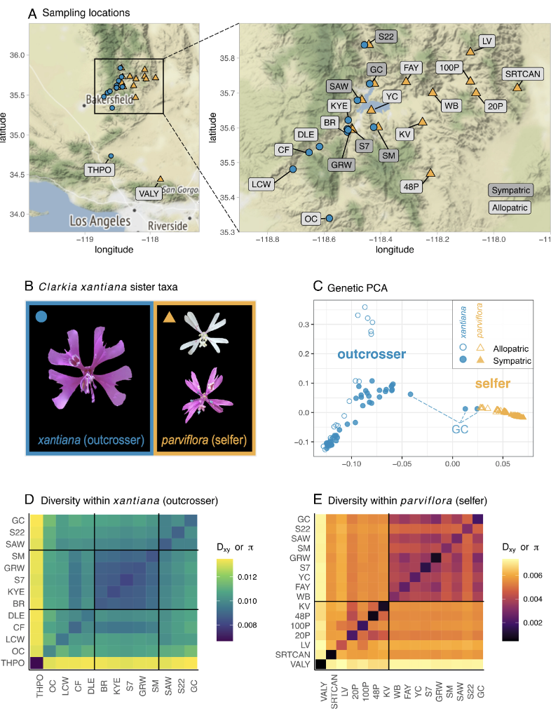
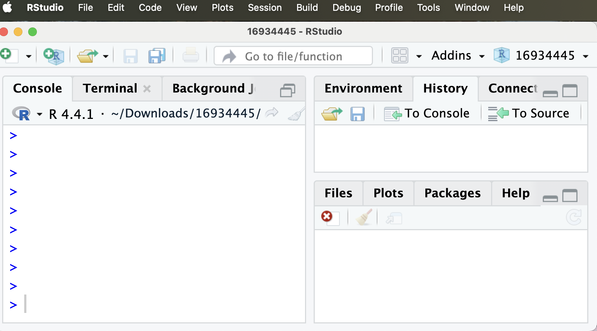
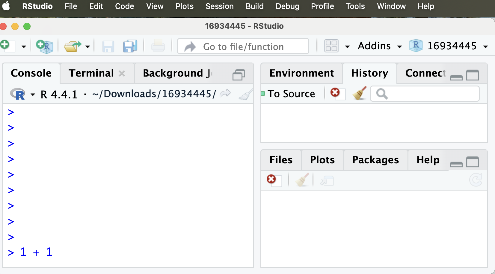
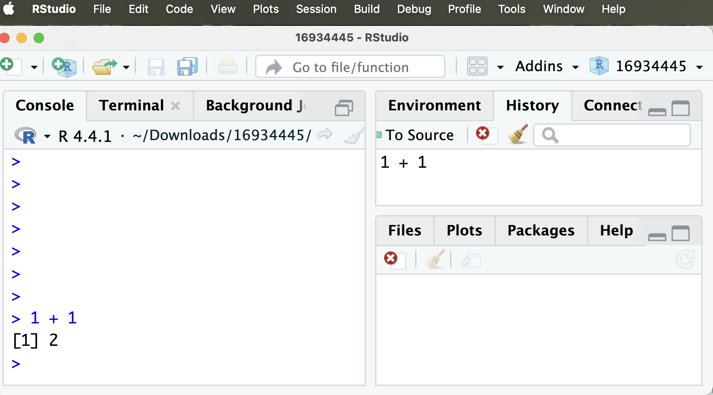

---
webr:
  packages: ['dplyr', 'readr']
  autoload-packages: false
---

# 1. Getting started with R {#getting_started}


::: {.motivation style="background-color: #ffe6f7; padding: 10px; border: 1px solid #ddd; border-radius: 5px;"}


**Motivating scenario:** You have heard about R and RStudio, and may have used them, but want a foundation so you can know what is going on as you do more and more with it.     

**Learning goals: By the end of this chapter you should be able to**  

1. Explain why we are using R and RStudio.    
2. Create vectors, perform calculations, ask logical questions, and assign variables in R.  
3. Use R functions, and understand what a function is.   
4. Install R packages.  
5. Load data into R, view it, and find the types of variables in each column.  
6. Know your way around RStudio.

---

**By the end of this introductory section, you should be able to**    


1. **Navigate the RStudio Console** and **run code** by typing a command and pressing Enter/Return.  
2. **Use R as a calculator**, including basic arithmetic and exponents (e.g., `+`, `*`, `^`).
3. **Ask logical questions in R** using comparison operators.
4. **Add comments to code** using `#` to leave notes that R will not interpret. 

:::     

---

```{r}
#| echo: false
#| label: fig-pnas
#| fig-cap: "Our R-generated figures concerning differentiation between *Clarkia xantiana* subspecies (from @sianta2024)."
#| column: margin
library(knitr)
library(webexercises)
library(DT)

```


<article class="drop-cap">Why are we learning a programming language, if we really just want to learn about *Clarkia xantiana*? Well, it's because scientists learn from data, ideally lots of data. R and other scripting languages allow us to:</article> 


- Describe and visualize data,
- Test null hypotheses,  
- Develop complex models, and
- Share our workflow so that our work can be reproduced, reevaluated, questioned, and improved. 


```{r}
#| echo: false
#| out-width: "100%"
#| label: "fig-wereoff"
#| fig-alt: "A nice picture of Clarkia's home."
#| fig-cap: "A pretty scene of Clarkia's home showing the world we get to summarize."

```

---

## What is R? What is RStudio?


**`R` is a computer program built for data analysis.** As opposed to GUIs, like Excel, or click-based stats programs, `R` is focused on writing and sharing scripts. Writing analyses as `R` scripts allows us to share them and reproduce exactly what we did.  `R` has become the computer language of choice for most statistical work because it's free, allows for reproducible analyses, makes great figures, and has many "packages" that support the integration of novel statistical approaches. In a recent paper, we used `R` to analyze hundreds of *Clarkia* genomes and learn about the history of speciation and gene flow in this group (@fig-pnas from @sianta2024). 


**RStudio is a user-friendly interface that makes it easier to get the most out of `R`.** "More precisely, R is a programming language that runs computations, while RStudio... provides an interface by adding many convenient features and tools." @ismay2019.  


## The Shortest Introduction to R  

Let's open RStudio to get familiar with it. @fig-RSTUDIO  displays a fresh RStudio session. The two panels on the right, which we will ignore for now -- are empty. The panel on the left, known as the "RStudio console" is also empty, save the `>` sign, which shows that it is ready for an `R` command. This is where we will first interface with `R`.

```{r}
#| echo: false
#| fig-cap: "The RStudio interface with a fresh, empty R session."
#| label: "fig-RSTUDIO"
#| fig-alt: "A screenshot of the RStudio interface. The Console pane on the left displays several > prompts, showing an empty R session."

```


**R can perform simple (or complex) calculations.**[**Math in R:** See posit\'s [recipe for using R as a calculator](https://posit.cloud/learn/recipes/basics/BasicB1) for more detail.]{.column-margin} For example, entering `1 + 1` returns `2`, and entering `2^3` (two raised to the power of three) returns `8`. Below, however, we see that typing `1 + 1` returns nothing  (@fig-RSTUDIO11).


```{r}
#| echo: false
#| fig-cap: "The RStudio interface with text 1 + 1 in the left console."
#| label: "fig-RSTUDIO11"
#| fig-alt: "Another screenshot of the RStudio interface. Now 1 + 1 is written at the bottom of the console pane, but the other panes are unchanged."

```

R did not do anything in @fig-RSTUDIO11 because we did not tell R to add `1 + 1`. Rather, we prepared to tell R to do this. By pressing the Return key, we tell R to do as we ask, and it returns the answer, 2  (@fig-RSTUDIO11enter).    

- Note that `R` actually returns `[1] 2`.  We will discuss what this means in the next section, but for now, ignore the `[1]` bit.   

- You can also see that the history pane (top right) now says `1 + 1`. This pane records a history of all of our code in this R session. 

```{r}
#| echo: false
#| fig-cap: "The RStudio interface with 1 + 1 entered."
#| label: "fig-RSTUDIO11enter"
#| fig-alt: "Another screenshot of the RStudio interface. Now 1 + 1 is entered at the bottom of the console pane. The pane displays the answer, 2, and the top right pane records the history of what we asked R (it now shows 1+1)."

```
 
### Asking logical questions


We often want to ask basic questions of our data - for example if two values are equal to one another or if one is greater than another. Later, we will see that these questions can be quite helpful when sorting through and filtering our data. 


The table below  introduces the standard ways we can ask such logical questions. Each such question returns either TRUE or FALSE.   


:::aside
**Use two equal signs to ask if something is equal to something else.** A common mistake is to simply use one equal sign. Don't make this mistake. Compare the code and output below:

```{r}
#| error: true
2 * 3 == 6  # Right way
2 * 3 = 6   # Wrong way  
```

:::


| Question                             | R Syntax  |
|--------------------------------------|----------|
| Does *a* equal *b*?                 | *a == b* |
| Does *a* not equal *b*?              | *a != b* |
| Is *a* greater than *b*?             | *a > b*  |
| Is *a* less than *b*?                | *a < b*  |
| Is *a* greater than or equal to *b*? | *a >= b* |
| Is *a* less than or equal to *b*?    | *a <= b* |


## Your turn!

Now try it yourself! To make your life easy, I provide a mini R console below, but you can try it on your own R console if you prefer. 

::: {.panel-tabset group="language"}

## Challenge  

[**Commenting code** The hash, #, tells R to stop reading your code. This allows you to "comment" your code -- keeping notes to yourself and other readers about what the code is doing. Commenting your code is very valuable and you should do it often!]{.column-margin}

```{webr-r}
1 + 1  # One plus one
2^3    # Two cubed
       # Try finding 1122 squared
       # Is 1122 squared greater than 122 cubed?
       # Ask if two squared equals four
```  

## Solution  

[**Commenting code** The hash, #, tells R to stop reading your code. This allows you to "comment" your code -- keeping notes to yourself and other readers about what the code is doing. Commenting your code is very valuable and you should do it often!]{.column-margin}

```{webr-r}
1 + 1           # One plus one
2^3             # Two cubed
1122^2          # 1122 squared
1122^2 > 122^3  # Is 1122^2 greater than 122^3?
2^2 == 4        # Does two squared equal four?
```  

:::  

```{r}
#| eval: false
#| echo: false
https://edsm.rbind.io/example/threewayanova
```