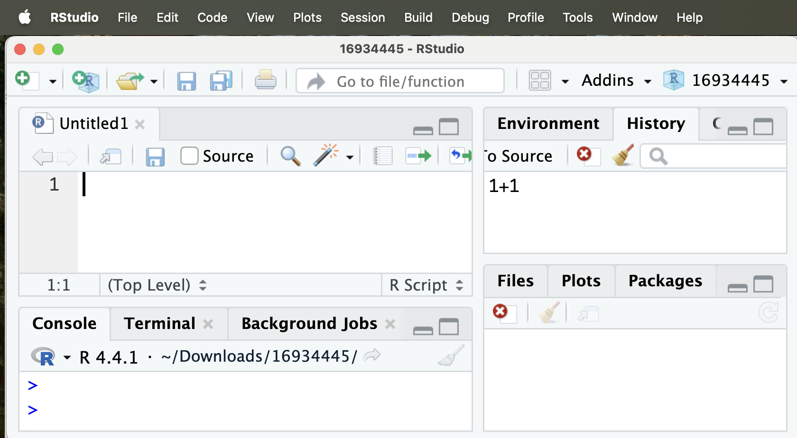

### • 1. R Scripts {.unnumbered #Rscripts}


::: {.motivation style="background-color: #ffe6f7; padding: 10px; border: 1px solid #ddd; border-radius: 5px;"}


**Motivating scenario:**  You can do a bit in R. But you have heard a major benefit of R is that it can make your work reproducible, and don't see how to do it.

**Learning goals: By the end of this sub-chapter you should be able to**  

1. Know how to write an R script
2. Evaluate what should and should not go into an R script
3. Know how to prepare for and conclude an R scripting session.

:::     

---  

```{r}
#| echo: false
library(knitr)
library(praise)
```

## The idea behind R scripts


In the [introduction to this chapter](#getting_started), I said that the major advantage of `R` -- as opposed to say Excel -- is that you can save and share your work as a reproducible script. But so far, we have just been banging away at the console, without keeping a clear record of what we have done. An R script is that record.


## Opening a Script


To open a new R script in RStudio:

:::aside
Or as a shortcut, you can open an R script with: 

- `Cmd + Shift + N` (Mac).  
- `Ctrl + Shift + N` (PC).  
::: 


`File` → `New File` → `R Script`


This opens a fourth pane (usually top left) titled `Untitled1`.

```{r}
#| echo: false
#| label:  fig-script1
#| fig-cap: "A new, blank R script opens in a fourth pane (top left) titled Untitled1."
#| fig-alt: "Screenshot of RStudio showing a new, blank R script opened in the top-left pane titled Untitled1, with the Console below and Environment, Files, Plots, and Packages panes on the right."

```


## Writing an R Script

Writing a computer script is more than just keeping a record of your terminal commands. Writing a good script requires planning, evaluation, and clarity. Here are my high-level tips:

### Before you begin

Weirdly, the success of your scripting session is often influenced by what you do before writing a line of code. Having a clear goal and a plan for how to achieve it can make your scripting efforts much more effective. So, before starting  to write an R script, pause and consider: 

- **What is the goal of this script?** How can it be broken down into smaller bits? 
- **What data will you use?** What format are the data in? Where are the data?
- **What packages might you need?** Are they already installed? 
- **Where should this file live?** If this script is part of a larger project, save it in that project folder. If not, create a new folder to house it.   


:::protip
**What  goes in an R script?**

When you are coding you might try a bunch of things. You might do simple calculations to help you think. You might do some basic quality control to ensure that your code is working. You might do some debugging. You may want to know the types of variables in each column to diagnose code errors etc. You may need to install a  new R package. None of this should go in your script. 

**Your R script should be a record of the code that is required to generate the final products** (e.g. data summaries, statistical analyses, and figures). Adventures and side quests  you took along the way should not be saved in your script -- they should either be executed in the terminal or removed from the script. While they were likely important for you to get to your working code, they are not needed for someone to get your code to work. Such excess code distracts you (or anyone else looking at your code) with extraneous information. 
:::


### Structuring an R Script 

There are long-standing conventions for writing clear R scripts. A simple, effective structure looks like this:

1. **Header comments** including your name, the date, and the goal of this script. If there is still work to do on the script, I often include the to-do list here as well. This practice means that when we next open or share our script, we will know what we have done, when and why we did it, and what else needs doing.    
2. **Load packages and data you will use**
3. **Main code sections**  I usually add strong differentiation and comments between distinct sections (either those asking different questions), or between e.g. making figures and doing stats. 


To see this in action, check out my example, below:

```{r}
#| eval: false
#| column: page-right
# Yaniv Brandvain
# Feb 8 2026 (last updated March 1 2026)
# The goal of the script is to record, and show-off our intro to R learning

# NOTE: I need to come back and verify:
   # That these are all prime numbers and 
   # That I did not miss any prime numbers

####################
# Loading packages #
####################
library(conflicted)
library(praise)

####################
#   Starting Code  #
####################

# Goal one make a vector of the first ten prime numbers, and assign it to the variable, primes
primes <- c(2, 3, 5, 7, 11, 13, 17, 19, 23, 29)
length(primes) == 10  # Is this of length 10


# Let's give ourselves a hand
praise(template = "This script is ${adjective}!") 
```

### While you write


Like all things in life -- writing a computer script is best when broken into small manageable bits. So, wou will almost never write a script start-to-finish in one go. Rather, you will usually:  

1. **Write a few lines of code** On a piece of paper, break the project into small sequential tasks. Set about to solve one of them, and note that immediate goal in a "comment" in R. 

2. **Run those few lines of code** often one line at a time - to see if it works. If it does work save the script! If it doesn't work, debug!   

3. **Keep going!** Until you achieve your goal or are running out of time.  

Save early, save often!!!!!!

:::aside
**How to run a line from your script.** I suggest highlight the code you hope to run and then clicking the "Run" button on the top right of the script window
:::

### Finishing a scripting session 

So you finished your scripting goal (or perhaps, more realistically you ran out of time). While you will probably want to just save your work, close R and move on, there is a bit more work to do.  So leave yourself five to ten minutes to work through this checklist before saving your R script and closing your computer.

:::aside
**To empty  R's memory type `rm(list=ls())` in the console not your script.** Never include `rm(list = ls())` in your script because it could cause you -- or anyone using your script -- to empty R's memory by accident.
:::


- **Does your script work?** Empty R's memory, and then run all of your code from the top to make sure it works. If it does not work go through it line by line to debug and find the error. A common thing that goes wrong is that code is either in a different order than it should be, or something that was needed in your script was only entered in the terminal.  

-  **Is your script clear?** Can you quickly look over the code and know what each part does? This is solved by having reasonable names for variables, and clear code. Someone should be able to look at your code and see how it relates to your science questions. Can you (or a peer) run your code and rapidly identify and interpret the key results of this scripting session? 

- **Is your script free from unnecessary distractions?** Make sure that all code in your script is both necessary and sufficient for your code to produce its results.

- **Is your script complete (i.e. did you fully accomplish your goal)?** If so, congrats! If not add comments at the top of the code about what was achieved, what remains, and any plan you had to make forward. You might also note any code that needs double checking. 


:::protip
**Installing and loading packages.** People will often run your previous R code all at once. While they will certainly need to load the packages you used to reproduce your results, they will only need to install the packages you used if they are not yet installed. What's more, installing a package that is already installed is time consuming and unnecessary. It is for that reason that we do not include `install.packages("<PACKAGE NAME>")` in our R script. Although you may want to include `#install.packages("<PACKAGE NAME>")` so that someone can easily install any packages they are missing by removing the `#`.
:::

--- 

**BONUS ENDING SUGGESTION:** I find rituals helpful. Coding can be hard and occasionally demoralizing. One small habit I’ve adopted is ending a session with entering the `praise()` function from the praise package into the console:

```{r}
#| eval: false
praise()
```


```{r}
#| echo: false
"You are kickass"
```


