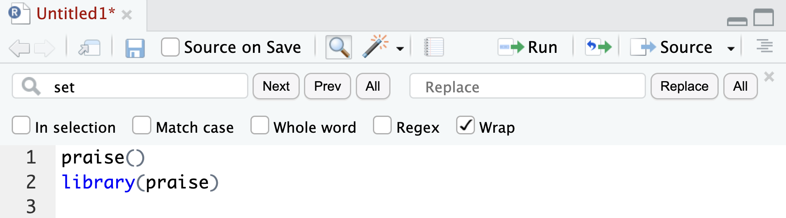
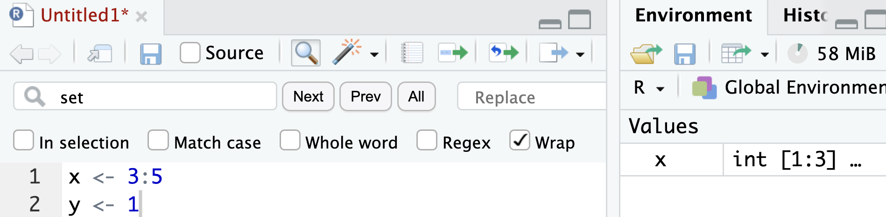

### • 1. Getting started summary {.unnumbered #getting_started_summary}

---
webr:
  packages: ['dplyr', 'readr']
  autoload-packages: false
---


```{r}
#| echo: false
#| column: margin
library(knitr)
library(webexercises)
```


```{r}
#| echo: false
#| eval: true
#| column: margin
#| fig-cap: "Some pretty R from [Allison Horst](https://allisonhorst.com/r-slack-emoji)."
#| fig-alt: "Animated gif of the R logo with magenta and red hearts moving upward in a loop to the left of the \"R.\""
#| label: fig-Rheart

```

Links to: [Summary](#getting_started_summarySummary). [Chatbot tutor](#getting_started_summaryChatbot). [Questions](#getting_started_summaryPractice_questions). [Glossary](#getting_started_summaryGlossary_of_terms). [R functions](#getting_started_summaryNew_r_functions). [R packages](#getting_started_summaryR_packages_introduced). [Additional resources](#getting_started_summaryAdditional_resources).


### Chapter summary {#getting_started_summarySummary}


More than a simple calculator, R can keep track of variables, and has functions to make plots, summarize data, and build statistical models. R also has many packages that can extend its capabilities. But getting started in R can be tricky. Developing good practices and a healthy outlook is more important to your success as a programmer than is raw intelligence and coding talent.  Now that we are familiar with R, RStudio, vectors, functions, data types and packages, we are ready to build our R skills even further to work with data!

### Chatbot tutor {#getting_started_summaryChatbot}
 
:::tutor   
Please interact with this custom chatbot ([**link here**](https://chatgpt.com/g/g-680a5b27740c8191b9cb63d729dc29fe-getting-started-with-r-tutor)) I have made to help you with this chapter. I suggest interacting with at least ten back-and-forths to ramp up  and then stopping when you feel like you got what you needed from it.   
:::

### Practice Questions {#getting_started_summaryPractice_questions}


```{r}
#| echo: false
#| eval: true
#| column: margin
#| fig-cap: "Some encouragement from [Allison Horst](https://allisonhorst.com/r-slack-emoji)."
#| fig-alt: "Animated gif with pastel lines in the background. The words \"CODE HERO\" in bold black text scroll across repeatedly."
#| label: fig-encouragement

```


The interactive R environment below allows you to work without switching tabs.  


```{webr-r}
# work here 

```  


:::exercises

**Q1)** Entering *\"p\"^2* into R produces which error? `r longmcq(c("What error? It works great?", "Error: object p not found", "Error: object of type closure is not subsettable",answer = "Error in \"p\"^2 : non-numeric argument to binary operator"))`   


---

**Q2)** Which logical question provides an unexpected answer? `r longmcq(c("(2.0 + 1.0) == 3.0", answer = "(0.2 + 0.1) == 0.3", "2^2 > 8", "(1/0) == (10 * 1/0)"))` 

`r hide("Click here for an explanation")`

This is a [floating-point precision issue](https://en.wikipedia.org/wiki/Floating-point_arithmetic#Accuracy_problems). In R (and most programming languages), some decimal values cannot be represented exactly in the binary code that they use under the hood. To see this, try *(0.2 + 0.1) - 0.3*:

```{r}
(0.2 + 0.1) - 0.3
```

If you are worried about floating point errors, use the  [*all.equal()*](https://stat.ethz.ch/R-manual/R-devel/library/base/html/all.equal.html) function instead of ==, or round to 10 decimal places before asking logical questions.

`r unhide()`

:::

---

Use the data in the table below for the next question (each column is a leaf). For your convinience I have included a web-r workspace: 

```{r}
#| echo: false
kable(data.frame(length = c(5, 6.1, 5.8, 4.9, 6),
                 width = c(3.2, 3, 4.1, 2.9, 4.5)) |>t())
```

```{webr-r}
          # Code here

```

:::exercises

**Q3)** You collected five leaves of the wild grape (*Vitis riparia*) and measured their length and width. You have a table of lengths and widths of each leaf and a formula for grape leaf area (below). 


The area of a grape leaf is: 
$$\text{leaf area } = 0.851 \times \text{ leaf length } \times \text{ leaf width}$$


The mean leaf area is `r fitb(16.8916, tol = .15)`


`r hide("Click here for a hint")`


-   First make vectors for length and width   
   - length = c(5, 6.1, 5.8, 4.9, 6)
   - width = c(3.2, 3, 4.1, 2.9, 4.5)

- Then multiply these vectors by each other and 0.851.
- Finally find the mean

`r unhide()`

`r hide("Click here for the solution")`

```{r}
# Create length and width vectors
length <- c(5, 6.1, 5.8, 4.9, 6)
width <- c(3.2, 3, 4.1, 2.9, 4.5)
```

```{r}
leaf_areas <- 0.851 * length * width # find area
mean(leaf_areas)                     # find mean

# or in one step:
(0.851 * length * width) |>
  mean()
```

`r unhide()`

:::

---


```{r}
#| echo: false
#| label: fig-praise
#| fig-cap: "Refer to this for question 4"
#| fig-alt: "Screenshot of an RStudio script pane titled. The code shows two lines: praise() on the first line and library(praise) on the second line."

```

:::exercises

**Q4)** How will running the script in @fig-praise (above) make you feel?   `r mcq(c("Amazing, I love being praised", answer = "Not good it wont work :("))`

:::


---

```{r}
#| echo: false
#| label: fig-a
#| fig-cap: "Refer to this for questions 5 and 6."
#| fig-alt: "RStudio screenshot showing x <- 3:5 and y <- 1 in a script. The Global Environment lists only x as an integer vector of length 3."

```

:::exercises

**Q5)** Consider the R environment in @fig-a. What will happen if you enter `x^2` in the console?    `r mcq(c("Error: object x not found", "1 4 9" , answer = "9 16 25"))`

---


**Q6)** Consider the R environment in @fig-a. What will happen if you enter `x* y` in the console?    `r mcq(c("Error: object x not found", answer = "Error: object y not found", "1 2 3" ,  "3 4 5"))`
:::

---

:::exercises
**Q7)** You spend 30 minutes debugging something, and at the end the mistake was so obvious. What is the most accurate interpretation? `r longmcq(c("You're bad at R",  "You wasted time", answer = "Good job! You learned something and solved a problem.", "R is stupid"))`
::: 

--- 

::: columns
::: column

**Script A**
```{r}
a<-c(1,2,3)
b<-a*2
```

:::

::: column
**Script B**
```{r}
leaf_length <- c(1,2,3)
double_length <- leaf_length * 2
```
:::
:::

:::exercises
**Q8)** While neither script above is perfect, which is better? `r longmcq(c("They both work - so they are equally good",  "It depends on who is reading it","Script A, it's shorter",answer =  "Script B, it's easier to understand"))`
::: 

---


a) `x <- 4`    
b) `class(x)`  
c) `install.packages("ggplot2")` 
d) `library(ggplot2)` 

:::exercises
**Q10)** Consider the lines of  code above, which two are best to include in your saved R script (assuming you are using functions from ggplot2)? `r longmcq(c("a & b",  "a & c", answer = "a & d", "b & c", "b & d", "c & d"))`


`r hide("Explanation")`

* **a** and **d** are required for your code to work, so they must be included.    
* **b) `class(x)`** checks the type of an object.   This is useful while exploring or debugging, but it is not required to reproduce the analysis. Scripts should focus on the steps needed to recreate results.
* **c) `install.package("ggplot2")`** installs a package.  Installing packages is a one-time setup step, not part of a reproducible workflow.
`r unhide()`


::: 


:::exercises
**Q11)** Which of the following is the best long-term strategy for improving in R?

`r longmcq(c("Memorize as many functions as possible", "Avoid errors", answer = "Write code regularly and reflect on mistakes", "Ask AI to solve all your R problems and copy and paste its answers"))`
:::

----


### Glossary of Terms {#getting_started_summaryGlossary_of_terms}
:::glossary


- **R**: A programming language designed for statistical computing and data analysis.

- **RStudio**: An Integrated Development Environment (IDE) that makes using R more user-friendly.

- **Vector**: An ordered sequence of values of the same data type in R.

- **Assignment Operator (<-)**: Used to store a value in a variable.


- **Logical Operator**: A symbol used to compare values and return *TRUE* or *FALSE* (e.g., *==*, *!=*, *\>*, *\<*).

- **Numeric Variable**: A variable that represents numbers, either as whole numbers (integers) or decimals (doubles).

- **Character Variable**: A variable that stores text (e.g., \"Clarkia xantiana\").


- **Package**: A collection of R functions and data sets that extend R’s capabilities.


:::

---

### New R functions  {#getting_started_summaryNew_r_functions}


:::functions


- **[`c()`](https://stat.ethz.ch/R-manual/R-devel/library/base/html/c.html)**: Combines values into a vector.


- **[`install.packages()`](https://stat.ethz.ch/R-manual/R-devel/library/utils/html/install.packages.html)**: Installs an R package.

- **[`library()`](https://stat.ethz.ch/R-manual/R-devel/library/base/html/library.html)**: Loads an installed R package for use.

- **[`log()`](https://stat.ethz.ch/R-manual/R-devel/library/base/html/Log.html)**: Computes the logarithm of a number, with an optional base.

- **[`mean()`](https://stat.ethz.ch/R-manual/R-devel/library/base/html/mean.html)**: Calculates the average (mean) of a numeric vector.
:::

---


### R Packages Introduced {#getting_started_summaryR_packages_introduced}

:::packages


- **[`base`](https://stat.ethz.ch/R-manual/R-devel/library/base/html/00Index.html)**: The core R package that provides fundamental functions like `c()`, `log()`, `sqrt()`, and `round()`.

- **[`conflicted`](https://conflicted.r-lib.org/)**: Helps resolve function name conflicts when multiple packages have functions with the same name.


- **[`praise`](https://github.com/rladies/praise)**: Provides ecouragement and kind words.

:::


### Additional resources    {#getting_started_summaryAdditional_resources}

These optional resources reinforce or go beyond what we have learned. 

:::learnmore
**R Recipes:**    

- [Doing math in R](https://posit.cloud/learn/recipes/basics/BasicB1).   
- [Using R functions](https://posit.cloud/learn/recipes/basics/BasicB4).   


**Videos:**   

- [Coding your Data Analysis for Success](https://www.youtube.com/watch?v=91LmBj29-Sc) (From Stat454).
- [Why use R?](https://vimeo.com/745909809) (Yaniv Talking).   
- [Accessing R and RStudio](https://vimeo.com/746738789) (Yaniv Talking).   
- [RStudio orientation](https://vimeo.com/746907243) (Yaniv Talking).   
- [R functions](https://vimeo.com/999280671)  (Yaniv Talking).   
- [R packages](https://vimeo.com/746968343) (Yaniv Talking).   
- [Data types](https://vimeo.com/747009618) (Yaniv Talking).  Uses [compression data](https://raw.githubusercontent.com/ybrandvain/datasets/master/compensation.csv) as an example.     

::: 
