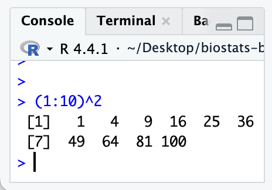

### • 1. Vectors and other objects {.unnumbered #robjects}  


::: {.motivation style="background-color: #ffe6f7; padding: 10px; border: 1px solid #ddd; border-radius: 5px;"}


**Motivating scenario:** You want R to be more than just a calculator dealing with one number at a time, but to deal with many measurements of the same thing (plants, traits, individuals) at one go.     

**Learning goals: By the end of this sub-chapter you should be able to**  

1. Create numeric vectors in R.  
2. Apply functions and arithmetic to vectors.  
3. Know that not all vectors are made of numbers. 
4. Use the [`class()`](https://stat.ethz.ch/R-manual/R-devel/library/base/html/class.html) function to see the kind of vector you're working with. 

:::     


```{r}
#| message: false
#| echo: false
library(knitr)
```

---   

## Vectors 

```{r}
#| echo: false
#| label: fig-vec_a
#| column: margin
#| fig-cap: "A vector with ten numbers"
#| fig-alt: "A vector of each number one through ten, squared. The first line starts with [1], indicating that is the first element in the vector. The second line starts with [7], indicating that we are starting the second line of the console with the seventh element in our vector."

```

We noted previously that when using R as a calculator it returns `[1]` followed by the answer. This does not mean the answer is in brackets. Instead, `[1]` indicates the position (index) of the first element in the output vector. This is because `1 + 1` returns  a vector of length one, with its first (and only) element equal to 2. The `[1]` tells us that the value being printed is the first element of that vector.

You can see this more clearly in @fig-vec_a, which shows a vector containing the numbers one through ten, each squared. The first line of output begins with `[1]`. The second line begins with `[7]`, indicating that the first value on that line is the seventh element of the vector. The line breaks are just for printing—they do not change the structure of the vector.


### Making vectors in `R`


Vectors are the primary way that data is stored in `R`. Vectors are handy, because rather than storing each observation individually (e.g., twenty different records of petal length), we can keep them together in one collection (e.g., a vector of petal lengths). 

There are many ways to make vectors in R. Below we go through three common ways we do this:   


::: aside
```{r}
# Making  vectors with c()
c(8, 1, 2)
# Making  vectors with :
1:3 
# Making  vectors with seq
seq(from=-1, to=11, by=3)
```
:::


- If we want a vector of integers in increments of one, we can use a colon. E.g. `4:7` returns `r 4:7`   </br> </br>


- For more flexibility, we can use the [`seq()`](https://stat.ethz.ch/R-manual/R-devel/library/base/html/seq.html) function to specify not just where the vector starts and ends, but the increase in each element. E.g. `seq(from = 1.5, to = 2, by = .25)` returns `r seq(from = 1.5, to = 2, by = .25)`   </br> </br>   

- For full flexibility, we use the combine function, [`c()`](https://stat.ethz.ch/R-manual/R-devel/library/base/html/c.html), which takes arguments that are the values in the vector.   E.g. `c(1, 10, -2)` returns `r c(1, 10, -2)`.   


### Using vectors


If we observed one *Clarkia* plant with one flower, a second with two flowers, a third with three flowers, and a fourth with two flowers, we could find the mean number of flowers as `(1 + 2 + 3 + 2)/4` = `r (1 + 2 + 3 + 2)/4`, but this would be tedious and error-prone. It would be easier to store these values in an ordered sequence of values (a **vector**) and then use the ([`mean()`](https://stat.ethz.ch/R-manual/R-devel/library/base/html/mean.html)) function, as follows:


:::aside
Note that the [`mean()`](https://stat.ethz.ch/R-manual/R-devel/library/base/html/mean.html) function returns a single value. Different functions return outputs of different lengths.  </br> </br>For example [`range()`](https://stat.ethz.ch/R-manual/R-devel/library/base/html/range.html) returns two values, the highest and lowest:

```{r}
range(x = c(1, 2, 3, 2))
```

:::

```{r}
mean(x = c(1, 2, 3, 2)) # Taking the mean number of flowers per plant.
```


#### Mathematical operations

We can also apply some simple mathematical functions to vectors, with R applying the operation to each element automatically. 

- For example you can take each element in a vector and add (or multiply or divide by) a constant. So, if each flower has four petals we can find total petals per plant by multiplying the number of flowers by four. 

```{r}
# Multiplying a vector of flower numbers 
# by a constant petal number 
5 * c(1, 2, 3, 2)  
```

- Or you can take each element in a vector and add (or multiply or divide by) a corresponding value in another vector (of the same length). For example, if plant one had three seeds per flower, plant two had half a seed per flower, and plants three and four each had one seed per flower, we could find the total seeds for each plant as follows:  

```{r}
# Element-wise  vector  multiplication
c(3, 0.5, 1, 1) * c(1, 2, 3, 2)   
```


### Other types of vectors 

**R handles different types of data in specific ways**. Understanding these data types is crucial because what you can do with your data depends on how R interprets it. For example, although you know that `1 + "two"` equals `3`, R cannot add a number and a word.  Understanding this will help you understand `R`'s error messages and confusing results when things don't work as expected. 

Other common types of vectors are:  

- **Numeric:** Numbers, including **doubles** (`<dbl>`) and **integers** (`<int>`).  Integers keep track of whole numbers, while doubles keep track of decimals (but R often stores whole numbers as doubles). 
- **Character:** Text, such as letters, words, and phrases (`<chr>`, e.g., `"pink"` or `"Clarkia xantiana"`).  
- **Logical:** Boolean values—`TRUE` or `FALSE` (`<logi>`), often used for comparisons and conditional statements.  We saw this in the first section when we asked logical questions. 
- **Factors:** Categorical variables that store predefined levels, often used in statistical modeling. While they resemble character data, they behave differently in analyses. We will ignore them in this chapter but revisit them later.  

Note that R only allows one type of element per vector, and if you make a vector with more than one kind of element, R will make them all of the same type. The [`class()`](https://stat.ethz.ch/R-manual/R-devel/library/base/html/class.html) function reveals the kind of vector you're dealing with. **This is important, because R will act weird if the vector you give it is not of the type it expects.** 

```{r}
class(c(1, "two"))
```

### Other R objects


We  will later see that R has many very useful objects (e.g. matrices, tibbles, lists etc), that are simply ways of organizing vectors. 


