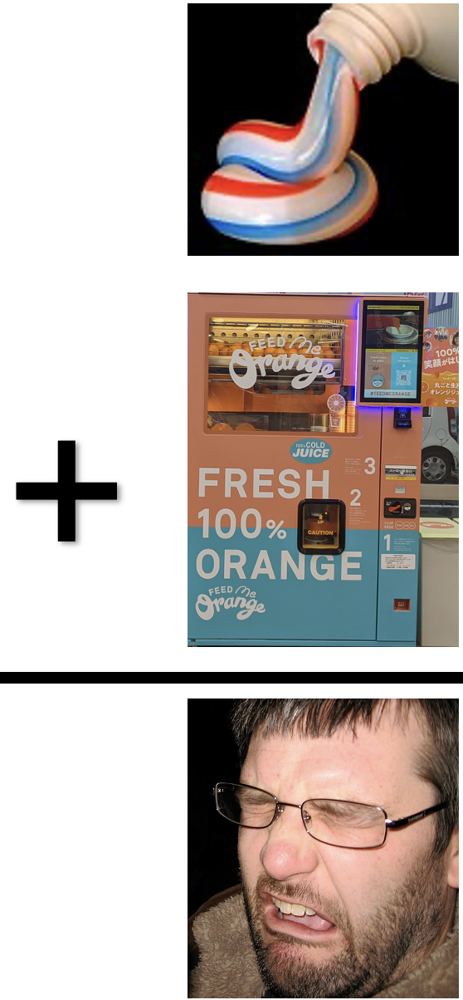

# 21. Interactions {.unnumbered #interactions}


```{r}
#| echo: false
#| message: false
#| warning: false
library(knitr)
library(dplyr)
library(readr)
library(stringr)
library(DT)
library(webexercises)
library(ggplot2)
library(tidyr)
library(janitor)
library(forcats)
library(tufte)
source("../_common.R") 


### Maybe for later
hz_link <- "https://raw.githubusercontent.com/ybrandvain/datasets/refs/heads/master/zones_df_admix_weight_cutoff0.9_gps_dist2het_phenos_excl_GC.csv"

clarkia_hz <- read_csv(hz_link)|> 
  select(-weighted)|>
  rename(admix_proportion = `cutoff0.9`) |>
  filter(!is.na(admix_proportion))|>
  clean_names() |>
  mutate(site = if_else(site == "SAW", "SR", site)) |>
  filter(subsp=="P")|>
  mutate(site = fct_reorder(site, mean_petal_area_sq_cm))

```


```{r}
#| label: fig-oj
#| echo: false
#| message: false
#| warning: false
#| column: margin
#| fig-cap: "An interaction:  Toothpaste and orange juice may each be pleasant on their own, but orange juice consumed immediately after brushing often is gross. So the combined taste cannot be predicted by simply adding the separate effects of toothpaste and orange juice."
#| fig-alt: "Toothpaste and a fresh-orange-juice vending machine are shown above a plus sign. Below them, a man grimaces in disgust, illustrating that two individually pleasant experiences can produce an unpleasant result when combined."

```

::: {.motivation style="background-color: #ffe6f7; padding: 10px; border: 1px solid #ddd; border-radius: 5px;"}


**Motivating Scenario:**   

In multiple regression, we asked if each floral trait was associated with hybrid seed set after accounting for other traits. But biological traits do not always combine additively. A small white flower and a large white flower may not differ from pink flowers in the same way. Likewise, the relationship between petal area and hybrid seed set may depend on petal color, location, or another trait. In this chapter, we ask whether combinations of explanatory variables tell us something that each variable alone cannot.


**Learning Goals: By the end of this chapter, you should be able to:**   

- Explain what a statistical interaction means in words and in a figure.  
- Distinguish additive models from models with interactions.   
- Fit and interpret linear models with interaction terms.    
- Use plots and predicted values to understand interactions.  
- Evaluate whether an interaction improves a model.  

:::     

---

```{r}
#| code-fold: true
#| code-summary: "Loading and cleaning data"
ril_link <- "https://raw.githubusercontent.com/ybrandvain/datasets/refs/heads/master/clarkia_rils.csv"
rils <- readr::read_csv(ril_link) |>
  dplyr::select( ril, prop_hybrid, petal_area_mm, asd_mm, location, petal_color)|>
  na.omit()
```


---


<article class="drop-cap">To me, almost nothing is better than the fresh feeling after brushing with minty toothpaste each morning, except perhaps a large glass of freshly squeezed orange juice. The problem is that, although each is pleasant on its own, orange juice immediately after toothpaste is disgusting. Of course, it is not that two foods are always worse when combined, sometimes they are better. Think of classic combinations like peanut butter and jelly, wine and cheese, or the idea of food "pairings" more generally. </article></br>  


> What does toothpaste + OJ have to do with Clarkia speciation?
>
> `r tufte::quote_footer("— You (probably)")`


In statistical terms, an interaction occurs when the association between one explanatory variable and the reponse depends on the value of another explanatory variable.  


### Interactions and the Origin of Species


It turns out that interactions play a key role in the origin of species. For example, the "[Dobzhansky Muller Model](https://en.wikipedia.org/wiki/Bateson%E2%80%93Dobzhansky%E2%80%93Muller_model)" (@fig-DMI) argues that hybrid unfitness is due not to a "bad allele" in either species, but to mismatched combinations (aka DMIs) of alleles that have diverged since the initial population split. 


In the context of our Clarkia floral phenotypes, we might want to know whether the extent of hybrid seed formation is better predicted by particular combinations of traits than by simply adding the effect of each trait in isolation.


```{r}
#| echo: false
#| label: fig-DMI
#| cap-location: margin
#| fig-alt: "A diagram of the Bateson–Dobzhansky–Muller model. An ancestral AABB genotype splits into two isolated populations. One evolves allele a and the other evolves allele b. When the populations hybridize, alleles a and b occur together for the first time and may be incompatible."
#| fig-cap: "*In the ancestral population the genotype is AABB. When two populations become isolated from each other, new mutations can arise. In one population A evolves into a, and in the other B evolves into b. When the two populations hybridise it is the first time a and b interact with each other. When these alleles are incompatible, we speak of DMIs.*</br></br> Both the figure and caption are adapted from User:OrientationEB’s contribution to [Wikipemedia commons](https://en.wikipedia.org/wiki/Bateson%E2%80%93Dobzhansky%E2%80%93Muller_model#/media/File:Bateson-Dobzhansky-Muller_model._.jpg) and are licensed under [CC BY-SA 4.0](https://creativecommons.org/licenses/by-sa/4.0/) attribution."
include_graphics("https://upload.wikimedia.org/wikipedia/commons/thumb/5/58/Bateson-Dobzhansky-Muller_model._.jpg/960px-Bateson-Dobzhansky-Muller_model._.jpg")

```

---


:::fyi
Although biological interactions like DMIs underlie the statistical interactions we study in this chapter, detecting a statistical interaction does not by itself reveal the underlying biological mechanism. Neither does the absence or a statistical interaction imply the absence of an interaction -- for example we see no evidence of an interaction if only one allele is found at one locus. Reda more on statistical vs physiological epistasis [here](https://pmc.ncbi.nlm.nih.gov/articles/PMC2845349/).
:::

---
### Envisioning interactions

@fig-interact shows cases in which Y is not (A and B), or is (C and D) associated with interactions between variables A and B. To make this less abstract, consider how this could relate to our *Clarkia* data. For example, *Y* could represent the proportion of hybrid seed, *A* could represent petal color, and *B* could represent flower size, simplified into "small" and "large." If the lines are parallel (e.g. @fig-interact A and B), the association between petal color and the response is the same for small and large flowers. We might still see a main effect of petal color, a main effect of flower size, or both, but there is no interaction. If the lines are not parallel, the association between petal color and the response depends on flower size. For example, pink flowers might receive more visits than white flowers when flowers are large, but show little difference when flowers are small.

```{r}
#| echo: false
#| label: fig-interact
#| message: false
#| warning: false
#| fig-width: 12
#| fig-height: 3.2
#| column: page-right
#| fig-cap: "Main effects and interactions between two categorical explanatory variables for four different statistical patterns."
#| fig-alt: "Four line plots show the response Y across two levels of A for two levels of B. In panel A, the two nearly overlapping lines both slope downward, showing a main effect of A. In panel B, two nearly horizontal parallel lines are separated vertically, showing a main effect of B. In panel C, one line rises while the other falls, with one level of B generally higher, showing both a main effect of B and an interaction. In panel D, the two lines cross, showing an interaction but no overall main effect."
library(ggplot2)
library(dplyr)
library(tidyr)
library(patchwork)


make_interaction_panel <- function(data, title, label_positions) {
  
  ggplot(
    data,
    aes(x = A, y = Y, color = B, group = B)
  ) +
    geom_line(
      linewidth = 2,
      lineend = "round"
    ) +
    geom_text(
      data = label_positions,
      aes(x = x, y = y, label = label, color = B),
      inherit.aes = FALSE,
      parse = TRUE,
      hjust = 0,
      size = 6
    ) +
    scale_x_continuous(
      breaks = c(1, 2),
      labels = c(expression(A[1]), expression(A[2])),
      limits = c(0.74, 2.27),
      expand = c(0, 0)
    ) +
    scale_y_continuous(
      limits = c(0, 10),
      breaks = NULL,
      expand = expansion(mult = c(0.04, 0.04))
    ) +
    labs(
      x = NULL,
      y = "Y",
      title = title
    ) +
    coord_cartesian(clip = "off") +
    theme_classic(base_size = 20) +
    theme(
      axis.line = element_line(
        linewidth = 0.8,
        colour = "black"
      ),
      axis.ticks = element_blank(),
      axis.text.x = element_text(
        size = 18,
        margin = margin(t = 10)
      ),
      axis.title.y = element_text(
        size = 22,
        margin = margin(r = 18)
      ),
      plot.title = element_text(
        size = 15,
        hjust = 0.5,
        lineheight = 1.05,
        margin = margin(b = 15)
      ),
      legend.position = "none",
      plot.margin = margin(8, 14, 8, 8)
    )
}

data_a <- tribble(
  ~A, ~B,   ~Y,
   1, "B1", 8.0,
   2, "B1", 2.1,
   1, "B2", 7.8,
   2, "B2", 2.2
)

labels_a <- tribble(
  ~x,   ~y,  ~B,   ~label,
  0.93, 9.75, "B1", "B[1]",
  0.93, 6.25, "B2", "B[2]"
)

plot_a <- make_interaction_panel(
  data_a,
  "A) Main effect of A",
  labels_a
)

data_b <- tribble(
  ~A, ~B,   ~Y,
   1, "B1", 8.6,
   2, "B1", 7.7,
   1, "B2", 2.3,
   2, "B2", 2.1
)

labels_b <- tribble(
  ~x,   ~y,  ~B,   ~label,
  0.93, 9.6, "B1", "B[1]",
  0.93, 0.85, "B2", "B[2]"
)

plot_b <- make_interaction_panel(
  data_b,
  "B) Main effect of B",
  labels_b
)

data_b_interaction <- tribble(
  ~A, ~B,   ~Y,
   1, "B1", 5.9,
   2, "B1", 9.0,
   1, "B2", 4.3,
   2, "B2", 1.3
)

labels_b_interaction <- tribble(
  ~x,   ~y,  ~B,   ~label,
  0.93, 7.05, "B1", "B[1]",
  0.93, 2.95, "B2", "B[2]"
)

plot_b_interaction <- make_interaction_panel(
  data_b_interaction,
  "C) Main effect of B\nInteraction between A & B",
  labels_b_interaction
)

data_interaction <- tribble(
  ~A, ~B,   ~Y,
   1, "B1", 7.5,
   2, "B1", 0.9,
   1, "B2", 2.7,
   2, "B2", 9.1
)

labels_interaction <- tribble(
  ~x,   ~y,  ~B,   ~label,
  0.93, 8.65, "B1", "B[1]",
  0.93, 0.95, "B2", "B[2]"
)

plot_interaction <- make_interaction_panel(
  data_interaction,
  "D) No main effect\nInteraction between A & B",
  labels_interaction
)

(plot_a | plot_b  | plot_b_interaction | plot_interaction) +
  plot_layout(axis_titles = "collect")&
  theme(
    axis.title.y = element_text(
      size = 22,
      margin = margin(r = 18)
    )
  )
```


## Looking forward

Let's go from these hypothetical plots to our actual data to see how main effects and interactions between our floral traits influence the proportion of hybrid seeds on a RIL. 

This question could influence our interpretation of and expectations for floral phenotype evolving "to prevent hybridization." For example, if white petals only decrease hybridization risk of large-petaled flowers we may see relatively weak selection favoring white flowers if petals are already small. 

I am particularly interested in the interactions between petal color and petal area. But, I will also examine the interaction between petal color and location to provide an example of an interaction between two categorical variables. I will also explore the interaction between petal area and anther-stigma distance -- but I  honestly think anther stigma distance does not matter causally, and this is just a noisy stand in for petal color (see previous chapter).
