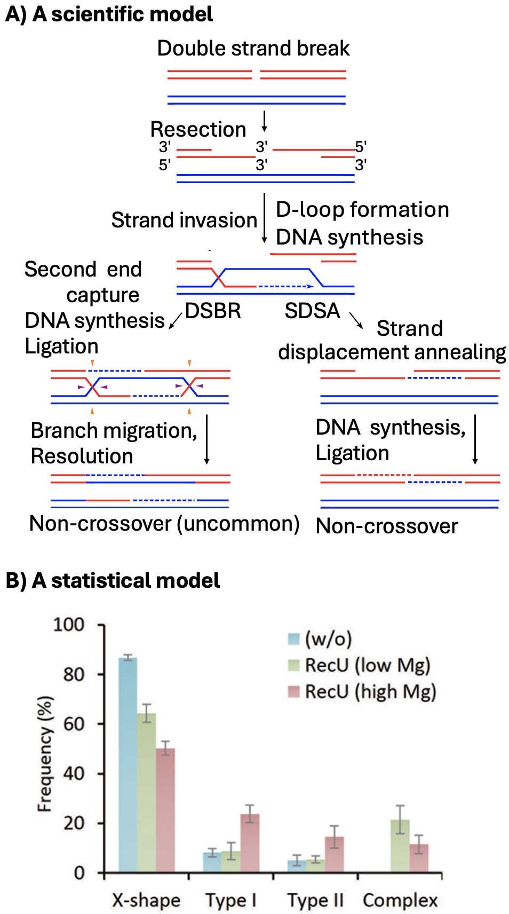

# 12. Linear Models {#linear_models}


```{r}
#| echo: false
#| message: false
#| warning: false
library(knitr)
library(dplyr)
library(readr)
library(stringr)
library(DT)
library(webexercises)
library(ggplot2)
library(tidyr)
source("../_common.R") 

ril_link <- "https://raw.githubusercontent.com/ybrandvain/datasets/refs/heads/master/clarkia_rils.csv"
ril_data <- readr::read_csv(ril_link) |>
  dplyr::mutate(growth_rate = case_when(growth_rate =="1.8O" ~ "1.80",
                                          .default = growth_rate),  
                growth_rate = as.numeric(growth_rate),
                visited = mean_visits > 0)
gc_rils <- ril_data |>
  filter(location == "GC", !is.na(prop_hybrid), ! is.na(mean_visits))|>
  select(petal_color, petal_area_mm, num_hybrid, offspring_genotyped, prop_hybrid, mean_visits , asd_mm )
```


::: {.motivation style="background-color: #ffe6f7; padding: 10px; border: 1px solid #ddd; border-radius: 5px;"}

**Motivating Scenario:** 
You want to move beyond simply plotting and summarizing associations and start modeling relationships between variables.    

**Learning Goals: By the end of this chapter, you should be able to:**  

1. **Explain what a linear model is and what it does**.    
   - Understand a linear model as a way of estimating the conditional mean of a response variable.  

2. **Interpret the components of a linear model**    
   - Find a conditional mean, $\hat{Y_i}$, from a linear model.    
   - Define and interpret residuals and the residual standard deviation.   


:::     

---


<article class="drop-cap">Reality is messy. There's too much going on to notice everything at once. That's why we make models — simplified, abstract descriptions of the world — that help us focus on patterns we care about. Models aren't perfect copies of reality — they leave things out — and that's the point. A good model keeps what's important and ignores the rest. In statistics, models help us summarize what we observe, understand relationships,  make predictions, and even allow us to test hypotheses.</br></br></article>


In this section, we'll introduce statistical models as simplified descriptions of the world. You'll notice that you're already familiar with some simple models. For example, the mean and variance provide a basic model for a single numeric variable, while a conditional mean and pooled variance describe a numeric response variable with a categorical explanatory variable. 

```{r}
#| echo: false
#| column: margin
#| label: fig-holiday
#| fig-cap: "The Holiday Junction -- one of my favorite scientific models, and an associated  statistical model.  (A) A scientific model of the idealized process of double-strand break repair (DSBR) and synthesis-dependent strand annealing (SDSA) pathways, leading to crossover or non-crossover products. From [wikipedia](https://en.wikipedia.org/wiki/Holliday_junction). (B) A statistical model of the observed frequencies of different DNA joint molecule types (X-shape, Type I, Type II, Complex) under different biochemical conditions (with or without RecU protein, and varying magnesium concentrations). From @suzuki2014"
#| fig-alt: "A two-panel figure. Panel A shows a diagram of double-strand break repair: broken DNA strands undergo resection, strand invasion, and DNA synthesis, leading to either double-strand break repair (DSBR) or synthesis-dependent strand annealing (SDSA) pathways, resulting in crossover or non-crossover products. Panel B is a bar graph showing frequencies of different DNA joint molecule types (X-shape, Type I, Type II, Complex) across three conditions (without RecU, RecU with low magnesium, and RecU with high magnesium). The X-shape structure is most common, with lower frequencies of other types."

```

## Statistical models are not scientific models 

This is a **BIO**statistics book. It is written by and for biologists interested in biological ideas. We are inspired by biological questions generated by scientific understanding and scientific models of the world. However, a major way in which we evaluate such scientific models is via statistical models and hypotheses. Confusing a statistical model for a scientific model is a common and understandable mistake  that we should avoid. Scientific models and statistical models are different: 

- **Scientific models** are based on our understanding of the science -- in this case biology. Biological models come from us making simplified  abstractions of complex systems (like considering predator-prey interactions, plant pollination, cancer progression, or meiosis (@fig-holiday A)). Great scientific models explain what we see, make interesting predictions, and  are consistent with our broader scientific understanding.    


- **Statistical models** on the other hand, are mathematical ways to describe patterns in data (e.g. @fig-holiday B). Statistical models know nothing about Lotka-Voltera, pollination or human physiology. 

Because statistical models know nothing about science it is our job to build scientific studies  best suited for clean statistical interpretation, build statistical models that best represent our biological questions, and interpret statistical results as statistical. We must always recenter biology in interpreting any statistical outcome. 


### Scientific & statistical models: The *Clarkia* case study

In our *Clarkia* example, the big-picture scientific model is that when *parviflora* came back into contact with its close relative, *xantiana*, it evolved traits — such as smaller petals — to avoid producing hybrids.  No single statistical model or study fully captures this scientific model. Instead, we design experiments to evaluate pieces of the model. For example, we:

1. **Compare petal area** between *parviflora* plants from populations that occur with *xantiana* (sympatric populations) and those from populations far away from *xantiana* (allopatric populations).

2. **Conduct an experiment** by planting individuals from sympatric and allopatric *parviflora* populations in the same environment as *xantiana*, and comparing the amount of hybrid seed set by plants from each origin.

3. **Generate Recombinant Inbred Lines (RILs)** between sympatric and allopatric *parviflora* populations, and examine whether petal area is associated with the proportion of hybrid seeds produced.

As you can see, statistical models don’t "know" anything about biology — they simply describe patterns in data.   It’s up to us, as biologists, to design experiments carefully, choose the right statistical models, and interpret results in light of our biological hypotheses.


## Linear models 

Linear models are among the most common types of statistical model. Linear models estimate the conditional mean of the $i^{th}$ observation, given its predictor values, ($\text{explanatory variables}_i$): 


\begin{equation} 
\hat{Y}_i = f(\text{explanatory variables}_i)
\end{equation} 


:::aside
**Conditional mean:** The expected value of a response variable given specific values of the explanatory variables (i.e., the model’s best guess for the response based on the explanatory variables).  
:::


These models are "linear" because we get this estimate of the conditional mean, $\hat{Y}_i$, by adding up all components of the model. That is, value of the $j^{th}$ explanatory variable in the $i^{th}$ individual  $y_{j,i}$ is multiplied by its effect size $b_j$.   So, for example, $\hat{Y}_i$ equals the parameter estimate for the "intercept", $a$ plus its value for the first explanatory variable, $x_{1,i}$, times the effect of this variable, $b_1$, plus its value for the second explanatory variable, $x_{2,i}$ times the effect of this variable, $b_2$, and so on for all included predictors.

\begin{equation} 
\hat{Y}_i = a + b_1  x_{1,i} + b_2 x_{2,i} + \dots{}
\end{equation}

To make this more concrete, we may aim to predict the number of pollinator visits of a pink flower with a petal area of 70 $mm^2$. We would find this by starting at some intercept, adding the effect of pink flowers on visitation, and then adding the increase in visitation per $mm^2$ times seventy. 

## Assumptions, Caveats and our limited ambitions 

In this section, we focus on building and interpreting linear models as descriptions of data. This is to set up our dive into linear models. So we will avoid a formal discussion of what makes a linear model reasonable — and how to diagnose whether a model fits its assumptions rro now. However, this foundation will leave us well positioned to evaluate the uncertainty about estimates from linear models, test the null that these parameters are meaningless, and evaluate if a model is appropriate.


## Let's get started introducing linear models!    

Throughout this chapter we will model a single response variable -- the proportion of hybrids that a mom produced. As you see below, much of this chapter recasts concepts you have already learned in the framework of a linear model. 

- We will start with the simplest linear model -- [the mean](#mean). While we have already [introduced the mean](#summarizing_center), presenting it in the context of a linear model helps us prepare for our next steps!   Specifically, we will use the mean to introduce: 

   - **`R`'s [`lm()`]() function** that builds a linear model, and    
   - **Residuals** -- The difference between an individual data point, $Y_i$, and its value predicted from a linear model, $\hat{Y_i}$. In this section we will also learn how to   
      - Identify residuals on a plot, and 
      - Use the [`augment()`](https://broom.tidymodels.org/reference/augment.lm.html) function from the [`broom`](https://broom.tidymodels.org/reference/augment.lm.html) package find residuals in R.  

- We will then briefly introduce a few more involved linear models -- including one to model two groups, one  to model a continuous explanatory variable, and a third with a continuous and categorical predictor. The point of these models is to get you ready for what is to come in the following chapters! 

We conclude (as usual) with a [chapter summary](https://ybrandvain.quarto.pub/applied-biostatistics-summarizingdata/book_sections/linear_models/lm_summary.html), [practice questions](https://ybrandvain.quarto.pub/applied-biostatistics-summarizingdata/book_sections/linear_models/lm_summary.html#practice-questions), a [glossary](https://ybrandvain.quarto.pub/applied-biostatistics-summarizingdata/book_sections/linear_models/lm_summary.html#glossary-of-terms), a review of [R functions](https://ybrandvain.quarto.pub/applied-biostatistics-summarizingdata/book_sections/linear_models/lm_summary.html#key-r-functions) and [R packages](https://ybrandvain.quarto.pub/applied-biostatistics-summarizingdata/book_sections/linear_models/lm_summary.html#r-packages-introduced) introduced, and [present additional resources](https://ybrandvain.quarto.pub/applied-biostatistics-summarizingdata/book_sections/linear_models/lm_summary.html#additional-resources).  

---


:::learnmore
**OPTIONAL / ADVANCED, FOR MATH NERDS:**.  If you have a background in linear algebra, it might help to see a linear model in matrix notation. 

The first matrix below is known as the  *design matrix*. Each row corresponds to an individual, and each entry in the $i$th row corresponds to that individual's value for a given explanatory variable. We take the dot product of this matrix and our estimated parameters to get the predictions for each individual. The equation below has $n$ individuals and $k$ explanatory variables. Note that every individual has a value of 1 for the intercept.


\begin{equation} 
\begin{pmatrix}
    1 & y_{1,1} & y_{2,1} & \dots  & y_{k,1} \\
    1 & y_{1,2} & y_{2,2} & \dots  & y_{k,2} \\
    \vdots & \vdots & \vdots & \ddots & \vdots \\
    1 & y_{1,n} & y_{2,n} & \dots  & y_{k,n}
\end{pmatrix}
\cdot 
\begin{pmatrix}
    a \\
    b_{1}\\
    b_{2}\\
    \vdots  \\
     b_{k}
\end{pmatrix}
=
\begin{pmatrix}
    \hat{Y}_1 \\
    \hat{Y}_2\\
    \vdots  \\
    \hat{Y}_n
\end{pmatrix}
\end{equation}
:::
 
 