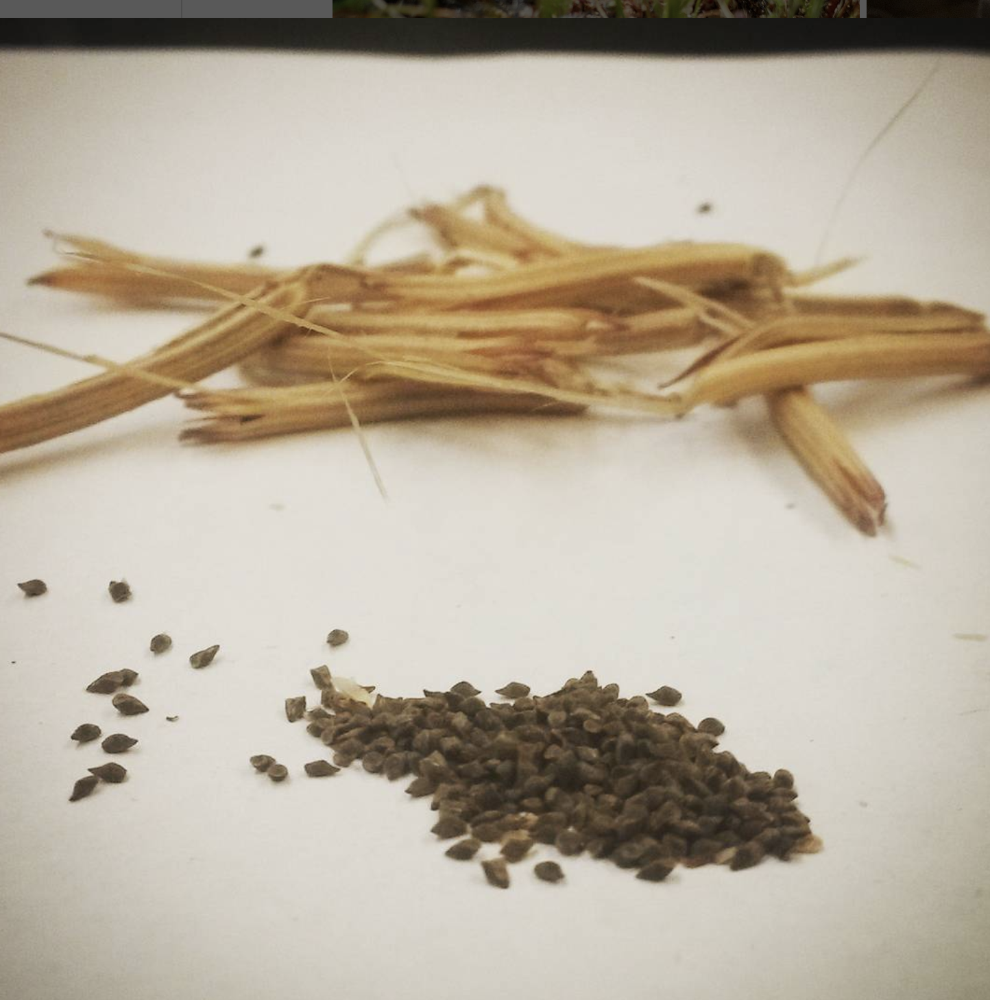

## • 12. The Mean as `lm(y ~ 1)` {.unnumbered #mean}


```{r}
#| echo: false
#| message: false
#| warning: false
library(knitr)
library(dplyr)
library(readr)
library(stringr)
library(DT)
library(webexercises)
library(kableExtra)
library(ggplot2)
library(tidyr)
source("../../_common.R") 
ril_link <- "https://raw.githubusercontent.com/ybrandvain/datasets/refs/heads/master/clarkia_rils.csv"
ril_data <- readr::read_csv(ril_link) |>
  dplyr::mutate(growth_rate = case_when(growth_rate =="1.8O" ~ "1.80",
                                          .default = growth_rate),  
                growth_rate = as.numeric(growth_rate),
                visited = mean_visits > 0)
```


```{r}
#| code-fold: true
#| message: false
#| warning: false
#| code-summary: "Code for selecting data from a few columns from RILs planted at GC"
ril_link <- "https://raw.githubusercontent.com/ybrandvain/datasets/refs/heads/master/clarkia_rils.csv"
ril_data <- readr::read_csv(ril_link) |>
  dplyr::mutate(growth_rate = case_when(growth_rate =="1.8O" ~ "1.80",
                                          .default = growth_rate),  
                growth_rate = as.numeric(growth_rate),
                visited = mean_visits > 0)
gc_rils <- ril_data |>
  filter(location == "GC", !is.na(prop_hybrid), ! is.na(mean_visits))|>
  select(petal_color, petal_area_mm, num_hybrid, offspring_genotyped, prop_hybrid, mean_visits , asd_mm,visited )|>
  mutate(log10_petal_area_mm = log10(petal_area_mm))
```

--- 


::: {.motivation style="background-color: #ffe6f7; padding: 10px; border: 1px solid #ddd; border-radius: 5px;"}


**Motivating Scenario:**  
You are beginning to think about statistical models, and want to use something you understand well to ramp you up to more complex models.

**Learning Goals: By the end of this subchapter, you should be able to:**

1. **Understand the mean as a linear model.**  
   - Recognize that modeling a variable with just its mean is fitting a simple linear model with no predictors.

2. **Use `R`s [`lm()`](https://stat.ethz.ch/R-manual/R-devel/library/stats/html/lm.html) function to build a simple model**     
   - Fit a mean-only model using [`lm()`](https://stat.ethz.ch/R-manual/R-devel/library/stats/html/lm.html).
   - Interpret the output of this simple, mean-only  [`lm()`](https://stat.ethz.ch/R-manual/R-devel/library/stats/html/lm.html). 
   


::: 

---  

## The mean again?

> "But we already had a section on the mean, and besides I've known what a mean was for years. Why another section on this?" 
> 
> - You, probably.  


We are beginning our tour of interpreting linear models with the mean. We start with the mean, not because I doubt that you understand what a mean ais. I know that you know how to calculate the mean as $\overline{y} = \frac{\sum y_i}{n}$.  Instead, we are starting here because your solid understanding of these concepts will help you better understand linear models.

In a simple linear model with no predictors, the intercept is the mean and the only other term is the residual variation (see next section on residuals). So we predict the $i^{th}$ individual's value of the response variable to be: 

$$\hat{y}_i = b_0$$

Where $b_0$ is the intercept (i.e. the sample mean). This means that the model predicts the same value for every observation: the mean.

## The [`lm()`](https://stat.ethz.ch/R-manual/R-devel/library/stats/html/lm.html) function in `R`

In `R` you build linear models with the [`lm()`](https://stat.ethz.ch/R-manual/R-devel/library/stats/html/lm.html) syntax:   
`lm(response ~ explanatory1 + explanatory2 + ..., data = data_set)`. 
In a simple model with no predictors you type:
`lm(response ~ 1, data = data_set)`.  
So to model the proportion of hybrid seed in GC with no explanatory variables, type:


```{r}
#| echo: false
#| column: margin  
#| label: fig-clarkia_seeds
#| fig-cap: "A bunch of Clarkia seeds. How many do you think are hybrids?"
#| fig-alt: "Photograph of Clarkia seeds and dried fruits on a white background. A pile of small, dark seeds is in the foreground, while several light brown, dried fruit pods are scattered behind them. The focus is on the seeds, with the fruits slightly blurred in the background."

```


```{r}
lm(prop_hybrid ~ 1, data = gc_rils)
```

The output gives us the estimated intercept — which, in this case with no predictors, is simply the mean (see above). The code below verifies this (except that R provides a different number of digits).

```{r}
gc_rils |>
  summarise(mean_p_hyb = mean(prop_hybrid, na.rm=TRUE))
```


**Interpretation** This means that we model the $i^{th}$ individual's proportion of hybrid seed as the sample mean, 0.1506.

$$\hat{y}_i = 0.1506$$
