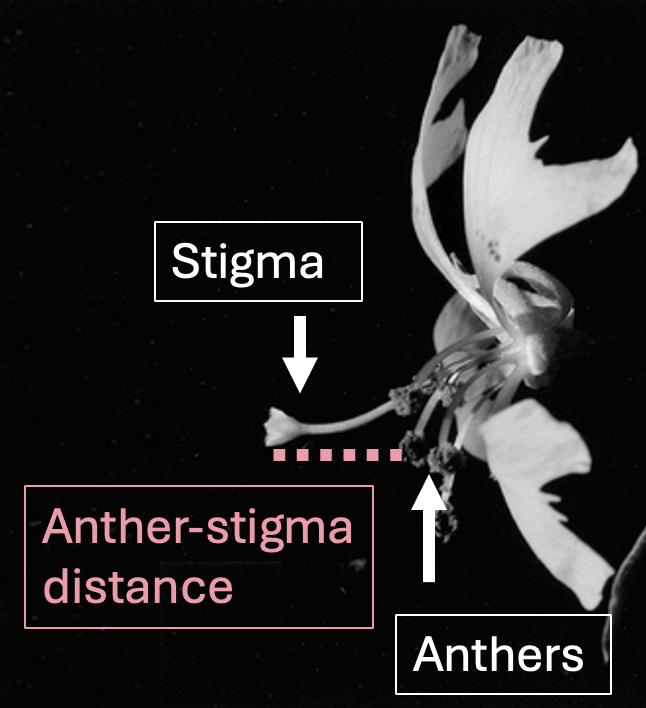

# 20. Multiple Predictors {.unnumbered #multiple_regression}


```{r}
#| echo: false
#| message: false
#| warning: false
library(knitr)
library(dplyr)
library(readr)
library(stringr)
library(DT)
library(webexercises)
library(ggplot2)
library(tidyr)
library(janitor)
library(forcats)
source("../_common.R") 


### Maybe for later
hz_link <- "https://raw.githubusercontent.com/ybrandvain/datasets/refs/heads/master/zones_df_admix_weight_cutoff0.9_gps_dist2het_phenos_excl_GC.csv"

clarkia_hz <- read_csv(hz_link)|> 
  select(-weighted)|>
  rename(admix_proportion = `cutoff0.9`) |>
  filter(!is.na(admix_proportion))|>
  clean_names() |>
  mutate(site = if_else(site == "SAW", "SR", site)) |>
  filter(subsp=="P")|>
  mutate(site = fct_reorder(site, mean_petal_area_sq_cm))

```


::: {.motivation style="background-color: #ffe6f7; padding: 10px; border: 1px solid #ddd; border-radius: 5px;"}


**Motivating Scenario:**   


**Learning Goals: By the end of this chapter, you should be able to:**   

:::     

---

```{r}
#| code-fold: true
#| code-summary: "Loading and cleaning data"
ril_link <- "https://raw.githubusercontent.com/ybrandvain/datasets/refs/heads/master/clarkia_rils.csv"
rils <- readr::read_csv(ril_link) |>
  dplyr::select( ril, prop_hybrid, petal_area_mm, asd_mm, location, petal_color)|>
  na.omit()
```


---


<article class="drop-cap">We are motivated to understand what influences the extent of hybridization and introgression between *xantiana* and *parviflora*.  In the previous four chapters, we examined how petal color, petal area, and field site influence the extent of hybridization or introgression. But these variables were not individually modified in isolation. Rather, we put out RILs that differed in numerous traits, in different locations and we observed pollinator visitation. Here, we consider how multiple floral traits and planting location influence the proportion of hybrid seed set on a *parviflora* RIL. </br> </br> </article>   


Treating these separate models as our final analysis is awkward and potentially misleading because:

1. *Biology does not change one variable at a time.* Say we were curious about the effect of eating pork on heart attack risk. Simply comparing people who do and do not eat pork would likely drag along many other explanatory variables, because following religious dietary rules of  حلال or כַּשְׁרוּת will likely be associated with other practices (e.g., ritualistic prayer) which may decrease stress and increase well-being. So, simply comparing outcomes of people in the pork eating and non-pork eating groups without considering these other variables might miss the actual story. We will see that a similar issue arises in our understanding of traits associated with hybrid seed set in *parviflora* RILs, below.</br></br>

2. *Unexplained variation can dampen signal.* Although multiple comparisons can give us undeserved confidence in rejecting a null hypothesis, variation that is not accounted for can also decrease our ability to find a real signal. For example, if student scores on standardized tests differ strongly by school, accounting for school can make it easier to detect the effect of participating in a sport. In our example, we do not particularly care about differences in hybrid seed formation by location. But including location in our model can help better estimate the associations between hybrid seed set and the floral traits that matter to us.</br></br>


3. *Lots of separate tests create a multiple-comparisons problem.* If we keep asking many related questions one at a time, some small p-values will appear by chance. Thus, we are risking a false positive at a level greater than our advertised  $\alpha$.</br>  

Multiple regression -- the focus of this section -- addresses these shortcomings by considering simultaneously multiple explanatory variables in one model.

### Focal traits for this section

```{r}
#| column: margin
#| echo: false
#| message: false
#| warning: false
#| label: fig-asd
#| fig-cap: "An image of a Clarkia flower to illustrate what \"anther stigma distance\" means. This is image of a Clarkia xantiana subspecies xantiana flower, as the large anther stigma distance of this species makes this trait easier to see. Figure adapted from and [Moeller and Geber 2005](https://pubmed.ncbi.nlm.nih.gov/15926689/)." 
library(knitr)

```


To work through these ideas, I model hybrid seed set as a function of (some combination of) petal area, petal color, anther-stigma distance (ASD), and planting location.  The (new to us) variable, ASD, quantifies the distance between the pollen-producing anther and the ovule-bearing stigma parts of a flower (@fig-asd). The logic of this hypothesis is that having male and female parts close to one another can encourage self-fertilization before there is an opportunity for hybridization. 


### Pairwise associations

In our example, we wanted to know which floral traits were associated with setting more hybrid seed. **Individually, each of the three focal explanatory variables is strongly associated with the proportion of hybrid seed set (@fig-pairwise, panels A-C).** 

But, because biology does not change one variable at a time, any individual pairwise association between one floral trait and hybrid seed set might not mean that this trait itself is directly associated with hybrid seed set. Instead, that trait might be associated with another floral trait, and that other trait might be the one more closely related to hybrid seed set. This holds even in our RIL study. Despite our best efforts to shuffle these traits while constructing our RILs, **anther-stigma distance is associated with petal area and petal color (@fig-pairwise, panels D-F).**


So, for example, the association between proportion hybrid seed set and petal color (@fig-pairwise, panel A) could arise simply as a consequence of the fact that plants with greater anther-stigma distance are more likely to be pink, and greater anther-stigma distance is associated with lower hybrid seed set, even if petal color itself was unrelated to hybrid seed set. Multiple regression helps separate this knotty tangle of overlapping associations.

With multiple regression, we ask, "Which trait(s) remain associated with proportion hybrid seed set after accounting for the relationships among them?" Or, put another way, "Is petal color associated with hybrid seed set among plants that are similar in petal area and anther-stigma distance, and after accounting for location?"


--- 


```{r}
#| echo: false
#| column: page-right
#| fig-height: 4.5
#| fig-cap: "Proportion of hybrid seed set in parviflora RILs as a function of petal color, petal area, and anther-stigma distance (A-C), as well as relationships among the explanatory variables (D-F). In individual pairwise comparisons, all explanatory variables are associated with proportion hybrid seed. Petal color and petal area are also associated with anther-stigma distance, but are not associated with one another." 
#| label: fig-pairwise
library(ggplot2)
library(ggforce)
library(patchwork)

small_theme <- 
    theme(
        legend.position = "none",
        axis.title = element_text(size = 9),
        axis.text  = element_text(size = 8),
        plot.title = element_text(size = 9),
        plot.subtitle = element_text(size = 8, face = "italic")
    )

violin_summary <- function() {
    list(
        geom_violin(alpha = .5),
        geom_sina(alpha = .3),
        stat_summary(
            fun.data = mean_se,
            color = "red",
            geom = "errorbar",
            width = .25,
            linewidth = 1.2
        ),
        scale_fill_manual(values = c("pink", "white"))
    )
}

a <- ggplot(rils, aes(x = petal_color, y = prop_hybrid, fill = petal_color)) +
    violin_summary() +
    labs(
        title = "A) hybrid seed ~ petal color",
        subtitle = expression(R^2 == 0.150*"," ~ italic(P) < 1 %*% 10^-15),
        x = "Petal color",
        y = "Proportion hybrid seed"
    ) +
    small_theme

b <- ggplot(rils, aes(x = petal_area_mm, y = prop_hybrid)) +
    geom_point(alpha = .5) +
    geom_smooth(method = "lm", formula = y ~ x) +
    labs(
        title = "B) hybrid seed ~ petal area",
        subtitle = expression(R^2 == 0.051*"," ~ italic(P) == 4.44 %*% 10^-6),
        x = expression("Petal area"~(mm^2)),
        y = NULL
    ) +
    small_theme

c <- ggplot(rils, aes(x = asd_mm, y = prop_hybrid)) +
    geom_point( alpha = .5) +
    geom_smooth(method = "lm", formula = y ~ x) +
    labs(
        title = "C) hybrid seed ~ ASD",
        subtitle = expression(R^2 == 0.040*"," ~ italic(P) == 5.61 %*% 10^-5),
        x = "Anther-stigma distance (mm)",
        y = NULL
    ) +
    small_theme

d <- ggplot(rils, aes(x = petal_color, y = asd_mm, fill = petal_color)) +
    violin_summary() +
    labs(
        title = "D) ASD ~ petal color",
        subtitle = expression(R^2 == 0.079*"," ~ italic(P) == 1.01 %*% 10^-8),
        x = "Petal color",
        y = "Anther-stigma distance (mm)"
    ) +
    small_theme

e <- ggplot(rils, aes(x = petal_area_mm, y = asd_mm)) +
    geom_point( alpha = .5) +
    geom_smooth(method = "lm", formula = y ~ x) +
    labs(
        title = "E) ASD ~ petal area",
        subtitle = expression(R^2 == 0.051*"," ~ italic(P) == 5.02 %*% 10^-6),
        x = expression("Petal area"~(mm^2)),
        y = "Anther-stigma distance (mm)"
    ) +
    small_theme

f <- ggplot(rils, aes(x = petal_color, y = petal_area_mm, fill = petal_color)) +
    violin_summary() +
    labs(
        title = "F) petal area ~ petal color",
        subtitle = expression(R^2 == 0.0001*"," ~ italic(P) == 0.839),
        x = "Petal color",
        y = expression("Petal area"~(mm^2))
    ) +
    small_theme

((a | b | c) / (d | e | f)) 
```


---


### Multiple regression as a statistical adjustment

Multiple regression asks this question by introducing a statistical adjustment. Specifically, it aims to estimate the association between one focal explanatory variable and a response variable, after accounting for the other explanatory variables in the model.

In our case, we want to know if e.g. anther-stigma distance is associated with the proportion of hybrid seed set **after accounting** for petal area, petal color, and planting location. That is, rather than asking whether pink and white flowers differ overall, we ask whether pink and white flowers differ among plants that are similar in these other ways. So we do not just compare all pink flowers to all white flowers. Instead, we compare pink and white flowers while statistically adjusting for other variables that might be tangled up with petal color.

::: warning
## Multiple regression is not a "control" 

Often people say they "controlled for" some variable when they mean they included it in their model. This wording can be misleading.

- **An experimental control** is part of a study design. In a controlled experiment, we try to change one variable while holding other relevant variables constant.

- **A statistical adjustment** is part of an analysis. When we include a variable in a regression model, we try to compare observations that are similar with respect to that variable.

Because we did not experimentally manipulate traits independently, multiple regression cannot by itself identify cause. 

:::


### Adding a "nuisance variable" can sharpen signal

Unless there is something particularly important about our field sites that I don't know, I do not care if they differ in hybrid seed set. But this does not mean I should not include field site in my linear model. 

In this case, location is a "nuisance variable" -- something we do not care about, but which may explain variation in our response variable. Including nuisance variables  can  sharpen the signal associated with the variables we care about most. By including location in the model, we ask whether petal color, petal area, and anther-stigma distance are associated with hybrid seed set among plants from similar locations.


## Looking forward

We are now ready to begin our tour of more complex linear models. To understand why this approach may matter, we will focus on one specific question:

> Does anther-stigma distance (ASD) still predict the proportion of hybrid seed after we account for the fact that ASD is also associated with petal area and petal color?


---

Multiple regression is lots of fun! When first learning about it, it's easy to get carried away and put every variable in the data set into the model. **BUT PLEASE DON'T**. In the best case modeling $y$ as a function of a grab bag of all explanatory variables that come to mind, generates results that are hard to interpret, and that are statistically under-powered. What's worse, is that a kitchen sink of explanatory variables can yield surprising or unstable regression coefficients, and may mistakenly attribute patterns to the wrong variable.  

There is an art to building an informative multivariate model. For now, err on the side of "less is more." We will revisit these ideas later in this chapter and in future chapters.