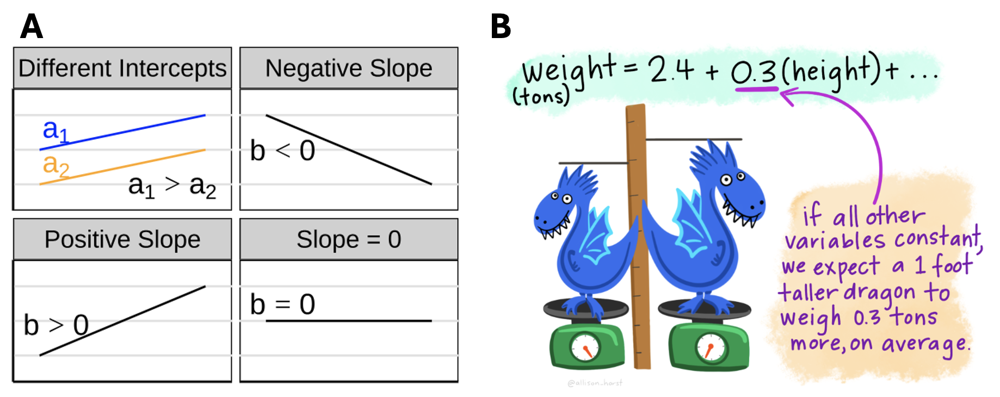

## • 18. Regression: a linear model {.unnumbered #regression_linear_model}


```{r}
#| message: false
#| warning: false
#| echo: false
library(dplyr)
library(ggplot2)
library(knitr)
library(broom)
library(DT)
```


::: {.motivation style="background-color: #ffe6f7; padding: 10px; border: 1px solid #ddd; border-radius: 5px;"}

**Motivating example:**  We have learned a few linear models (a two-sample t-test and an ANOVA), and now we want to see how linear regression fits in this linear model framework. Here, we connect linear regression to the models we have already seen by showing how an intercept and slope generate predicted values, how residuals measure prediction error, and how to build this model in R with the  [`lm()`](https://stat.ethz.ch/R-manual/R-devel/library/stats/help/lm.html) function.  

**Learning goals: By the end of this section, you should be able to:**  

1. Explain how a regression model predicts $\hat{Y}$ from an intercept and slope.    
2. Calculate and interpret fitted values and residuals.     
3. Explain how the slope and intercept are found from summaries of $X$ and $Y$.     
4. Fit a simple linear regression in R using [`lm()`](https://stat.ethz.ch/R-manual/R-devel/library/stats/help/lm.html).   
5. Use  [`augment()`](https://broom.tidymodels.org/reference/augment.lm.html) to extract fitted values and residuals from a regression model.   

:::

---


```{r}
#| code-fold: true
#| code-summary: "Loading and formatting data"
#| message: false
#| warning: false


ril_link <- "https://raw.githubusercontent.com/ybrandvain/datasets/refs/heads/master/clarkia_rils.csv"

gc_rils <- readr::read_csv(ril_link) |>
  dplyr::mutate(visited = mean_visits > 0) |>
  filter(location == "GC", !is.na(prop_hybrid), ! is.na(petal_area_mm))|>
  dplyr::select(ril, location, prop_hybrid, petal_area_mm)|>
  mutate(petal_area_quartile = cut( petal_area_mm,
                                    breaks = quantile(petal_area_mm, probs = seq(0, 1, 0.25), na.rm = TRUE),
                                    include.lowest = TRUE))
```


Linear models predict (or "model") each response value by starting with an intercept and then adding each coefficient multiplied by the corresponding explanatory-variable value.

- **In a two-sample t-test,** each individual starts with the reference group mean, represented by the intercept ($a$). We then add the difference between group means ($b_1$) for individuals in the non-reference group. For individuals in the reference group, the indicator variable equals 0, so we add nothing (@eq-indicator-means).

::: aside 
$$
\hat{y}_i =
\begin{cases}
a + 1 \times b_1 = a + b_1, & \text{if } x_i = 1 \text{ (non-ref. group)} \\
a + 0 \times b_1 = a, & \text{if } x_i = 0 \text{ (ref. group)}
\end{cases}
$$ {#eq-indicator-means}
:::


- **In a one-way ANOVA (with three groups),** each individual starts with the reference group mean, represented by the intercept ($a$). We then add the appropriate difference between group means for individuals in each non-reference group. For individuals in the reference group, all indicator variables equal 0, so we add nothing (@eq-anova-indicator-means).

::: aside 

$$
\hat{y}_i =
\begin{cases}
a + 0 \times b_1 + 0 \times b_2 = a, & \text{if } x_i = 0 \text{ (ref. group)} \\
a + 1 \times b_1 + 0 \times b_2 = a + b_1, & \text{if } x_i = 1 \text{ (group 1)}\\
a + 0 \times b_1 + 1 \times b_2 = a + b_2, & \text{if } x_i = 2 \text{ ( group 2)}
\end{cases}
$$ {#eq-anova-indicator-means}
:::

- **In a linear regression,** each individual starts with the intercept ($a$), corresponding to the value of $Y$ predicted by the model when $X$ equals zero. We then add the product of the individual's value of the explanatory variable ($X_i$) and the slope ($b$) to find an individual's predicted value for the response variable  (@eq-linear-regression).


::: aside 

$$
\hat{Y}_i = a + X_i \times b
$$ {#eq-linear-regression}
:::

In all linear models, the residual ($e_i$) is the difference between an individual's observed and predicted  value. 


::: aside 

$$
e_i = Y_i -  \hat{Y}_i
$$ {#eq-resid}
:::


---

::: fyi


Understanding linear regression is easier if you have the basic notation down. Here is a reference table of this notation to help you get familiar with this:     

### A table of standard notation in a linear model

| Notation                  | Name                                 |
| ------------------------- | ------------------------------------ |
| $Y$                       | Response variable                    | 
| $X$                       | Explanatory variable                 | 
| $Y_i$                     | Value of $Y$ for individual $i$        | 
| $X_i$                     | Value of $X$ for individual $i$   | 
| $\hat{Y}_i$               | Predicted value of $Y$ for individual $i$     | 
| $e_i$                     | Residual  for individual $i$                |
| $\bar{Y}$                 | Mean of $Y$                          |
| $\bar{X}$                 | Mean of $X$                          |
| $a$ (sometimes $b_0$)  | Intercept                            |
| $b$   (sometimes $b_1$)   | Slope                                |

:::

---         


## Finding the slope and intercept

Predicting $\hat{Y}$ requires finding the equation for the linear regression, which consists of both a slope and intercept (@fig-drag): 

- **The slope** equals the covariance divided by the variance in $X$, $\sigma_x^2$ (@eq-slope), as introduced [previously](#regression_summaries). 

::: aside 

$$
\operatorname{b} = \frac{\operatorname{Cov}}{s_x^2}
$$ {#eq-slope}
:::

- **The intercept** equals the mean of $Y$, minus the product of the slope ($b$) and the mean of $X$ (@eq-intercept).

::: aside 

$$
a = \overline{Y} - b \times \overline{X}
$$ {#eq-intercept}
:::


```{r}
#| fig-height: 4
#| fig-width: 9  
#| echo: false
#| label: fig-drag
#| fig-alt: "**A** Visualizing different slopes in a regression. **B** Two blue dragons stand on scales next to a vertical yardstick showing one slightly taller than the other. Regression estimates are shown at the top as an equation: weight (tons) = 2.4 + 0.3 x height, with explanatory text reading If all other variables are constant, we expect a 1 foot taller dragon to weigh 0.3 tons more, on average."
#| fig-cap: "**A)** The intercept shifts a line up or down, while the slope describes the direction and steepness of the relationship between two variables. A positive slope means predicted values increase as the predictor increases, a negative slope means predicted values decrease, and a slope of zero means the predicted value does not change with the predictor. **B)** In a regression model, the slope tells us the expected change in the response variable for a one-unit increase in a predictor, holding other variables constant. In this example, a dragon that is one foot taller is expected to weigh 0.3 tons more, on average, assuming all other variables stay the same. From [Allison Horst](https://allisonhorst.com/linear-regression-dragons)."



```

## Linear regression in R 

Like all linear models, we fit a linear regression in R with the linear modeling function:  [`lm(y ~ x)`](https://stat.ethz.ch/R-manual/R-devel/library/stats/help/lm.html), which generates an `lm` object. We can see a quick summary of this model by just running the code as follows: 


```{r}
lm(prop_hybrid ~ petal_area_mm, data = gc_rils)
```


We now have our linear regression equation as 

$$\text{PROP HYBRID} = `r coef(lm(prop_hybrid ~ petal_area_mm, data = gc_rils))[[1]]|>round(digits = 3)` + `r coef(lm(prop_hybrid ~ petal_area_mm, data = gc_rils))[[2]]|>round(digits = 5)` \times \text{PETAL AREA}$$

> So, we expect a 0.57 percentage point increase in proportion hybrid seeds for each $1\text{ mm}^2$ increase in petal area.  

---

### Finding $\hat{Y}_i$ from the regression equation

Now that we have our linear regression equation, we can find $\hat{Y}_i$ by simply plugging in numbers. Say we wanted to predict the proportion of hybrid seeds for a plant with a petal area of $103\text{ mm}^2$: 

$$\text{PROP HYBRID} = `r coef(lm(prop_hybrid ~ petal_area_mm, data = gc_rils))[[1]]|>round(digits = 3)` + `r coef(lm(prop_hybrid ~ petal_area_mm, data = gc_rils))[[2]]|>round(digits = 5)` \times \text{PETAL AREA}$$

$$\text{PROP HYBRID | Petal area of 103 mm}^2 = `r coef(lm(prop_hybrid ~ petal_area_mm, data = gc_rils))[[1]]|>round(digits = 3)` + `r coef(lm(prop_hybrid ~ petal_area_mm, data = gc_rils))[[2]]|>round(digits = 5)` \times 103$$


$$\text{PROP HYBRID | Petal area of 103 mm}^2 = `r coef(lm(prop_hybrid ~ petal_area_mm, data = gc_rils))[[1]]|>round(digits = 3)` + `r (coef(lm(prop_hybrid ~ petal_area_mm, data = gc_rils))[[2]] * 103)|>round(digits = 5)`$$


$$\text{PROP HYBRID | Petal area of 103 mm}^2 = `r (coef(lm(prop_hybrid ~ petal_area_mm, data = gc_rils))[[1]]|>round(digits = 3) +  coef(lm(prop_hybrid ~ petal_area_mm, data = gc_rils))[[2]] * 103)|>round(digits = 5)`$$


---

### Residuals 

The actual RIL with a petal area of $103 \text{ mm}^2$ had a hybrid seed proportion of 0.625. So the residual for this sample is $0.625 - 0.383 = `r 0.625 - 0.383`$. 

The [`augment()`](https://broom.tidymodels.org/reference/augment.lm.html) function in the [`broom`](https://broom.tidymodels.org/) package shows $X$ and $Y$, as well as the predicted value, $\hat{Y}$ (with column heading, `.fitted`), and the residual value (`.resid`).


--- 

```{r}
#| eval: false 
library(broom)

lm(prop_hybrid ~ petal_area_mm, data = gc_rils) |>
  augment()
```

```{r}
#| echo: false 
library(broom)

lm(prop_hybrid ~ petal_area_mm, data = gc_rils) |>
  augment() |>
  select(prop_hybrid, petal_area_mm, .fitted,  .resid)|>
  mutate_all(round, digits = 3)|>
  datatable( options = list(pageLength = 5))
```

---

::: warning
**Remember: the intercept is often the value needed to place the regression line correctly, not a biological claim.**  


To see this, consider this example, where the intercept of negative $0.2$ is the proportion of hybrid seeds predicted by the model for a RIL with a petal area of zero. Of course neither a flower with zero petal area nor a negative proportion of hybrid seeds are biologically meaningful, so this is a nonsensical biological prediction. But it does allow for reasonable predictions for our actual data. 
:::
