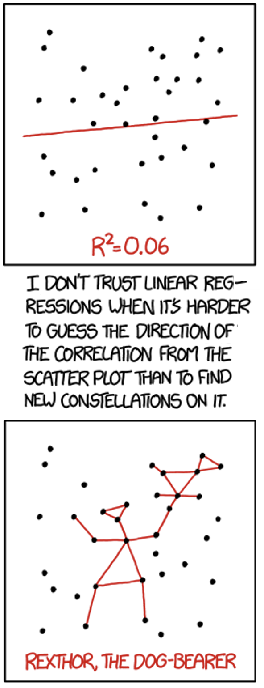

## • 19. Regression Summary {.unnumbered #regression_summary}


```{r}
#| echo: false
#| message: false
#| warning: false
library(webexercises)
library(tidyr)
library(dplyr)
library(knitr)
library(infer)
library(ggplot2)
ril_link <- "https://raw.githubusercontent.com/ybrandvain/datasets/refs/heads/master/clarkia_rils.csv"
rils <- readr::read_csv(ril_link) |>
  dplyr::filter(!is.na(prop_hybrid), !is.na(mean_visits))|>
  dplyr::select( ril,   location, prop_hybrid, visits = mean_visits, petal_color)
```

```{r}
#| echo: false
#| label: fig-linear_regression
#| column: margin
#| fig-alt: "Two-panel xkcd comic. The top panel shows a scatterplot of black points with a very shallow upward red regression line and the label R squared equals 0.06. The points are widely scattered, so the trend is weak. The bottom panel shows the same scatterplot, but red lines connect selected points into a made-up constellation labeled REXTHOR, THE DOG-BEARER. Caption below the panel: \"I don't trust linear regressions when it's harder to guess the direction of the correlation from the scatterplot than to find new constellations on it.\""
#| fig-cap: "[This cartoon is adapted from xkcd](https://xkcd.com/1725/). The original rollover text says: \" The 95% confidence interval suggests Rexthor's dog could also be a cat, or possibly a teapot.\". See [this link](https://www.explainxkcd.com/wiki/index.php/1725:_Linear_Regression) for a more detailed explanation."

```

---
format: html
webr:
  packages: ['dplyr', 'readr' ,'ggplot2', 'broom', 'stringr']
  autoload-packages: true
---


Links to: [Summary](#regression_summary_chapter-summary). [Chatbot tutor](#regression_summary_chatbot_tutor).  [Questions](#regression_summary_practice-questions). [Glossary](#regression_summary_glossary-of-terms). [R functions](#regression_summary_key-r-functions). [More resources](#regression_summary_additional-resources).


---


## Chapter summary {#regression_summary_chapter-summary}    
A linear regression is a linear model that describes a numeric response variable as a function of a numeric explanatory variable. It estimates the intercept, $a$, and the slope, $b$. Together with an individual’s value for the explanatory variable, $X_i$, these parameters give the model’s expected value for that individual’s response: $\hat{Y_i} = a + bX_i$. The difference between what we observed and what the model predicted is called the residual.

The slope tells us how much we expect $Y$ to change for a one-unit increase in $X$. Correlation answers a slightly different question: how tightly do $X$ and $Y$ move together along a straight-line trend? This chapter works through these ideas, shows how to fit linear regressions in R, and,  how to interpret regression results.


### Chatbot tutor  {#regression_summary_chatbot_tutor} 

:::tutor


Please interact with this custom chatbot ([**ChatGPT**](https://chatgpt.com/g/g-6a290644b64c819194505dbe42cc5a15-linear-regression-tutorbot), or [Gemini](https://gemini.google.com/gem/14mQu0I8MO9uNLyUXpZPN9VOOQrhB8l9n?usp=sharing)). I have made it to help you with this chapter. I suggest interacting with at least ten back-and-forths to ramp up  and then stopping when you feel like you got what you needed from it. 

:::


## Practice Questions {#regression_summary_practice-questions}


Try these questions! By using the R environment you can work without leaving this "book". I even pre-loaded all the packages you need! 


### Setup 

I got to wondering how reliably the observed number of pollinator visits that we observe for a RIL predicts the proportion of hybrid seed it sets. So I had a look. I will present these results for different subsets of the data below. I keep these subsets vague and unlabeled to better focus our stats skills.

```{r}
#| echo: false
#| message: false
#| warning: false
#| fig-cap: "Relationship between pollinator visits and proportion hybrid seed for one subset of the Clarkia RIL data. Each point represents one RIL. Points are jittered slightly to reduce overlap. The blue line shows the fitted linear regression, Think... what does the grey band mean... Then check out the questions below."
#| fig-alt: "The proportion hybrid seed on the y-axis and observed pollinator visits on the x-axis for a subset of Clarkia RILs. Black points are jittered slightly, with many observations near zero hybrid seed and others spread upward. A blue linear regression line slopes upward, suggesting that RILs with more pollinator visits tend to have a higher proportion of hybrid seed."
#| label: fig-questplot
data1 <- rils|>filter(petal_color == "pink",location == "GC")

ggplot(data1, aes(x = visits, y = prop_hybrid))+
  geom_jitter(height = .015, width  = .015,size = 2.5,alpha = .4)+
  geom_smooth(method = "lm")+
  theme_light()+
  labs(title = "Data 1")
```

::: exercises

**Q1)** The grey band in the @fig-questplot is a 95% ____ interval. `r mcq(c("Prediction","Correlation","Regression", "Credible",answer = "Confidence" ))`


**Q2)** This grey band means ___. `r longmcq(c( "95% of data points should fall in that region",  answer = "The true mean proportion hybrid seed, conditional on visits, is plausibly within this region.", "95% of future observations should fall in that region","There is a 95% chance that the true mean proportion hybrid seed, conditional on visits, is within this region."))`


**Q3)** Visually estimate the intercept from @fig-questplot. `r fitb(.2,num = TRUE, tol = .011)`  

**Q4)** Visually estimate the slope from @fig-questplot. `r fitb(.27,num = TRUE, tol = .031)`

:::


**Data summary**    

These data come from a sample of size `r data1 |> dplyr::select(prop_hybrid, visits)|> tally()|>pull()`. The covariance between pollinator visits and proportion hybrid seed is `r data1 |>  summarise(cov(prop_hybrid, visits))|>pull()|>round(digits = 3)`. The means, variances, and standard deviations are:  

```{r}
#| echo: false
data1 |> 
  dplyr::select(prop_hybrid, visits)|>
  pivot_longer(cols = 1:2,names_to = "variable")|>
  group_by(variable)|> 
  summarise(mean = mean(value),
            var  = var(value), 
            sd   = sd(value))|>
  mutate_at(-1, round, digits =3)|>
  kable()
```


```{webr-r}
# space for you to do some calculations

```

::: exercises 

**Q5)** We expect an additional pollinator visit per observation time to increase the proportion hybrid seeds by ___ `r fitb(0.2617, num = TRUE, tol = 0.002)`.

`r hide("Click for answer")`

This question is asking about the slope -- $b = cov_{xy}/var(x)$. 

```{r}
#covariance / var_x 
0.039      / 0.149
```

`r unhide()`

**Q6)** After putting visits and hybrid seed on the same scale, the strength of their linear association is closest to ___.   `r mcq(c(".04", ".26", answer = ".36", ".78"))`

`r hide("Click for answer")`

This question is asking about the correlation -- $r = \frac{cov_{xy}}{s_xs_y}$. 

```{r}
#covariance / (sd_x  * sd_y)
0.039      / (0.386 * 0.280)
```

`r unhide()`
:::

```{r}
#| echo: false
library(broom)
data_1_lm <- lm(prop_hybrid ~ visits, data1)
data_1_lm |>
  tidy()|> 
  slice(1)|> 
  mutate_at(2:4, round, digits = 3)|> 
  mutate_at(5, round, digits= 6)|>
  kable()
```

::: exercises 

**Q7)** We find the intercept of `r tidy(data_1_lm )|> slice(1)|> pull(estimate)|>round(digits = 3)`. The associated p-value is very small (`r tidy(data_1_lm)|> slice(1)|> pull(p.value)|>round(digits = 5)`). Why do not we care about this p-value?   `r longmcq(c("Because this p-value is so small, that it is probably wrong.",answer = "Because we cannot have negative visits, the fact that we have some RILs with no visits and some hybrids already destroys the implied biological null hypothesis."," Because p-values are the probability of the data given a model, and we want to know about the probability of the model given the data.", "Tricked you, we do care."))`

**Q8)** Imagine we observed a RIL that received half a visit (on average) per an observation session. Predict its proportion hybrid seeds (include four places past the decimal, or type NO if you are not comfortable making a prediction). `r fitb(0.33887, num = TRUE, tol = .00021)`

`r hide()`

```{r}
# Intercept + slope  * x_i
0.208       + 0.2617 * .5
```

`r unhide()`

**Q9)** Imagine we observed a RIL that three visits (on average) per an observation session. Predict its proportion hybrid seeds (include four places past the decimal, or type NO if you are not comfortable making a prediction). `r fitb("NO")`

`r hide()`

::: warning
Do not predict out of range!
:::

`r unhide()`
:::


```{r}
#| echo: false
#| label: fig-diag
#| message: false
#| warning: false
#| fig-cap: "Diagnostic plots for the linear model of proportion hybrid seed as a function of pollinator visits."
#| fig-alt: "A four-panel diagnostic plot for a linear regression model. The panels show residuals versus fitted values, a normal Q-Q plot of standardized residuals, a scale-location plot, and residuals versus leverage."
library(ggfortify)
autoplot(data_1_lm, label.size = 5, alpha = .6, label.repel = TRUE)
```


::: exercises 

**Q10)** Consider @fig-diag. Which assumption(s) of linear regression seems like the biggest problem here?   `r longmcq(c(  answer =  "Normality of residuals and equal variance", "Perfect independence, because the diagnostic plots directly prove that nearby plants influenced each other.",  "The existence of an intercept, because the intercept p-value is small.",  "Random sampling of X, because linear regression requires visits to be normally distributed."))`

**Q11)** How would you move forward?  `r longmcq(c(  "Delete extreme data points.",  "Ignore the diagnostic plots because the result makes sense.",  "Only report the intercept, because the slope is now invalid.",  answer = "Treat the linear model as a useful first summary, but check whether the conclusion is robust with bootstrap/permutation and by refitting the model without influential points."))`

**Q12)** Consider @fig-diag. Which data point is the greatest outlier? Refer to it by its number.   `r fitb("34")`

**Q13)** Consider @fig-diag. Which data point has the most influence? Refer to it by its number.  `r fitb("13")`

**Q14)** How would you see if influential points are undermining your conclusions?   `r longmcq(c( "Remove every point with a large residual and keep only points close to the regression line.",  "Check whether the intercept p-value is still small.",  "Use only the plot with the nicest-looking regression line.",  answer = "Refit the model after removing the influential point or points, then compare the slope, confidence interval, and biological conclusion to the original model."))`

:::


```{r}
#| column: page-right
#| fig-width: 12
#| fig-height: 3.5
#| echo: false
#| label: fig-decomp
#| fig-cap: "Partitioning variation in a linear regression. Reflect on the meaning of these panels for the questions, below!"
#| fig-alt: "Three side-by-side scatterplots show proportion hybrid seed as a function of pollinator visits. Panel A shows vertical line segments from each observed point to the overall mean proportion hybrid seed. Panel B shows vertical line segments from each observed point to the fitted regression line. Panel C shows vertical line segments from each fitted value on the regression line to the overall mean. The figure illustrates how total variation is partitioned into model variation and residual variation in a linear regression."
library(patchwork)
a <- ggplot(mutate(data1, mean_hyb = mean(prop_hybrid)) , 
            aes(x = visits, y = prop_hybrid)) +
  geom_point(alpha = .8, size = 2) +
  geom_hline(aes(yintercept = mean_hyb)) +
  geom_segment(aes(xend = visits, yend = mean_hyb), color = "black", alpha = .5) +
  labs( y = "Prop hybrid", x = "visits")+
  theme(axis.text = element_text(size = 18),
        axis.title = element_text(size = 25),
        plot.title = element_text(size = 28))

b <- ggplot(mutate(augment(data_1_lm), mean_hyb = mean(prop_hybrid)), 
            aes(x = visits, y = prop_hybrid)) +
  geom_point(alpha = .8, size = 2) +
  geom_hline(aes(yintercept = mean_hyb)) +
  geom_segment(aes(xend = visits, y = .fitted, yend = mean_hyb), color = "black", alpha = .5) +
  geom_line(aes(y = .fitted),  color = "blue") + 
  labs( y = "Prop hybrid", x = "visits")+
  theme(axis.text = element_text(size = 18),
        axis.title = element_text(size = 25),
        plot.title = element_text(size = 28))

c <- ggplot(augment(data_1_lm), 
            aes(x = visits, y = prop_hybrid)) +
  geom_point(alpha = .8, size = 2) +
  geom_segment(aes(xend = visits, yend = .fitted), color = "black", alpha = .5) +
  geom_line(aes(y = .fitted), color = "blue") + 
  labs(y = "Prop hybrid", x = "visits")+
  theme(axis.text = element_text(size = 18),
        axis.title = element_text(size = 25),
        plot.title = element_text(size = 28))

a+c+b + plot_annotation(tag_levels = "A",) +plot_layout(axis_titles = "collect", axes = "collect_y") &
  theme(plot.tag = element_text(size =25))
```

::: exercises 

**Q15)** Which panel in @fig-decomp   shows the model deviation?   `r mcq(c("A","B",answer = "C"))`

**Q16)** Which panel in @fig-decomp   shows the total deviation?   `r mcq(c(answer = "A","B","C"))`


**Q17)** Which panel in @fig-decomp   shows the residual deviation?   `r mcq(c("A",answer = "B","C"))`

:::

```{r}
lm(prop_hybrid ~ visits, data1) |>
  augment()|>
  summarise( ssa = sum((prop_hybrid - .fitted)^2) , 
             ssb = sum((.fitted     - mean(prop_hybrid))^2), 
             ssc = sum((prop_hybrid - mean(prop_hybrid))^2))|>
  mutate_all(round, digits = 3)
```
::: exercises 

**Q18)** What does this line of code calculate? </br> `ssa = sum((prop_hybrid - .fitted)^2)` `r mcq(c( answer = "SS_error", "SS_model", "SS_total" ))`

**Q19)** What does this line of code calculate?</br> `ssb = sum((.fitted - mean(prop_hybrid))^2)` `r mcq(c( "SS_error", answer = "SS_model", "SS_total" ))`

**Q20)** What does this line of code calculate? </br> `ssc = sum((prop_hybrid - mean(prop_hybrid))^2)` `r mcq(c( "SS_error", "SS_model", answer = "SS_total" ))`

**Q21)** Which equation summarizes the relationship among these three sums of squares in this linear regression? `r mcq(c( answer = "SS_total = SS_model + SS_error", "SS_error = SS_model + SS_total", "SS_model = SS_total + SS_error", "SS_total = SS_model / SS_error" ))`


**Q22)** Which equation defines $R^2$ from the sums of squares in a linear regression?   `r mcq(c(answer = "R² = SS_model / SS_total", "R² = SS_error / SS_total", "R² = SS_total / SS_model", "R² = SS_model / SS_error"))`

`r hide("Hint")`


```{r}
#| echo: false
lm(prop_hybrid ~ visits, data1) |>
  augment()|>
  summarise( ssa = sum((prop_hybrid - .fitted)^2) , 
             ssb = sum((.fitted     - mean(prop_hybrid))^2), 
             ssc = sum((prop_hybrid - mean(prop_hybrid))^2))|>
  mutate_all(round, digits = 3)|>
  kable()
```

See which equals the squared correlation coefficient from above. 


```{r}
data1|> 
  summarise(r = cor(prop_hybrid , visits),
            r2 = r^2) 
```


```{webr-r}
# space for you to do some calculations

```

`r unhide()`
:::


**Let's test the null hypothesis**


::: exercises 

**Q23)** The null hypothesis is:   `r longmcq(c(  answer = "The true slope relating pollinator visits to proportion hybrid seed is zero.",  "The true intercept relating pollinator visits to proportion hybrid seed is zero.",  "The observed number of pollinator visits is zero.",  "The model explains all variation in proportion hybrid seed.",  "The residuals are all equal to zero."))`


**Q24)** N = 49. So, the F value is `r fitb(7.1,num=TRUE, tol = .11)`

`r hide("Answer")`
**From above**   

- SS_model = 0.493.      
- SS_error = 3.26.   

**So ...**   

- MS_model = 0.493/1 = 0.493.       
- MS_error = 3.26/47 = 0.069.    
- F = 0.493/0.069 = 7.1.  
`r unhide()`

**Q25)** The p-value is: `r fitb(0.01, num=TRUE, tol = .001)`


`r hide("Answer")`
**From above**   

```{r}
pf(7.1,1,47,lower.tail = FALSE)
```
`r unhide()`


**Q26)** What do we do to the null hypothesis? `r mcq(c(answer = "Reject it" , "Fail to reject it" , "Fail to accept it", "Accept it"))`

**Q27)** What does rejecting this null hypothesis mean in this context?  `r longmcq(c(  "Pollinator visits definitely cause hybrid seed production.",  "The model explains all variation in proportion hybrid seed.","The intercept is biologically meaningful.",   answer = "The data provide evidence that RILs with more pollinator visits tend to have different expected proportions of hybrid seed."))`

:::

## 📊 Glossary of Terms {#regression_summary_glossary-of-terms} 

::: glossary

### Concepts    

* **Linear regression**: A linear model that predicts a numeric response variable, $Y_i$, from an intercept, $a$, a slope, $b$, and the value of a numeric explanatory variable, $X_i$: $\hat{Y_i} = a + bX_i$.

* **Slope, $b$**: The expected change in $Y$ for every one-unit increase in $X$. In simple linear regression, $b = \frac{\text{cov}_{xy}}{s^2_x}$.

* **Intercept, $a$**: The predicted value of $Y$ when $X = 0$. This prediction is not always biologically or scientifically meaningful. Often, the intercept is simply the anchor needed to place the regression line correctly. The intercept is $a = \bar{Y} - b\bar{X}$.

* **Correlation, $r$**: A standardized summary of the strength and direction of a linear association between two numeric variables. Correlation ranges from -1 to 1 and is unitless, so it is easier to compare across variables measured on different scales.

* **Covariance**: A summary of the extent to which two variables vary together. Covariance is positive when high values of $X$ tend to occur with high values of $Y$, negative when high values of $X$ tend to occur with low values of $Y$, and near zero when there is little linear association.

* **Fitted value, $\hat{Y_i}$**: The value predicted by the regression model for observation $i$: $\hat{Y_i} = a + bX_i$.

* **Residual, $e_i$**: The difference between an observed value and its fitted value: $e_i = Y_i - \hat{Y_i}$. Residuals tell us how far each observation is from the regression line.

### t-based approach to linear regression

* **Standard error of the slope, $SE_b$**: A measure of uncertainty in the estimated slope. In simple linear regression, $SE_b = \frac{s_e / s_x}{\sqrt{n - 2}}$, where $s_e$ is the standard deviation of the residuals and $s_x$ is the standard deviation of the explanatory variable.

* **t-statistic for a slope**: A test statistic that measures how many standard errors the estimated slope is from the null value of zero: $t = \frac{b}{SE_b}$.

### ANOVA approach to linear regression

* **Model sum of squares, $SS_\text{model}$**: The amount of variation in $Y$ explained by the regression model: $SS_\text{model} = \sum(\hat{Y_i} - \bar{Y})^2$.

* **Error sum of squares, $SS_\text{error}$**: The amount of variation in $Y$ left unexplained by the regression model: $SS_\text{error} = \sum(Y_i - \hat{Y_i})^2 = \sum e_i^2$.

* **Total sum of squares, $SS_\text{total}$**: The total variation in the response variable around its mean: $SS_\text{total} = \sum(Y_i - \bar{Y})^2$.

* **Proportion of variance explained, $R^2$**: The proportion of total variation in $Y$ explained by the regression model: $R^2 = \frac{SS_\text{model}}{SS_\text{total}}$. In simple linear regression, $R^2 = r^2$.

### Assumptions & how to evaluate them  

* **Linearity**: The assumption that the expected value of the response variable can be reasonably modeled as a straight-line function of the explanatory variable.

* **Homoscedasticity**: The assumption that the residuals have roughly equal variance across the range of fitted values or explanatory-variable values.

* **Normality of residuals**: The assumption that residuals are approximately normally distributed. This matters most for standard errors, confidence intervals, and p-values based on the t- and F-distributions.

* **Diagnostic plots**: Plots used to evaluate whether a linear model is a reasonable summary of the data. Common diagnostic plots include residuals vs. fitted values, Q-Q plots, scale-location plots, and residuals vs. leverage plots.

* **Leverage**: A measure of how unusual an observation is in its explanatory-variable value. Points with high leverage have the potential to strongly affect the fitted regression line.

* **Influence**: A measure of how much a fitted model would change if a particular observation were removed. Cook’s distance is a common measure of influence.

### Prediction caveats

* **Extrapolation**: Using a regression model to make predictions outside the range of the data used to fit the model. Extrapolated predictions can be unreliable, even when the model fits the observed data well.

* **Prediction out of context**: Using a regression model in a biological or experimental context different from the one in which the data were collected. This can be risky even when the new values of $X$ are within the original range.

* **Attenuation**: The weakening of an estimated association caused by measurement error. In regression, measurement error in the explanatory variable can make the estimated slope and correlation smaller than the true relationship.

:::


---


## 💻 Key R Functions {#regression_summary_key-r-functions}

::: functions


### Plotting regression relationships

* [`geom_smooth(method = "lm")`](https://ggplot2.tidyverse.org/reference/geom_smooth.html): Adds a fitted linear regression line to a plot. The shaded region shows uncertainty in the fitted mean trend unless `se = FALSE`.

### Fitting and summarizing linear models

* [`lm()`](https://stat.ethz.ch/R-manual/R-devel/library/stats/html/lm.html): Fits a linear model. For simple linear regression, use `lm(y ~ x, data = my_data)`.

* [`coef()`](https://stat.ethz.ch/R-manual/R-devel/library/stats/html/coef.html): Extracts model coefficients from a fitted model. For simple linear regression, these are the intercept and slope.

* [`summary()`](https://stat.ethz.ch/R-manual/R-devel/library/stats/html/summary.lm.html): Gives a detailed base R summary of a fitted model, including estimates, standard errors, t-statistics, p-values, residual summaries, and $R^2$.

* [`confint()`](https://stat.ethz.ch/R-manual/R-devel/library/stats/html/confint.html): Calculates confidence intervals for model parameters, such as the intercept and slope.

* [`anova()`](https://stat.ethz.ch/R-manual/R-devel/library/stats/html/anova.lm.html): Produces an ANOVA table for a fitted linear model, partitioning variation into model and error sums of squares.

### Working with model output

* [`broom::tidy()`](https://generics.r-lib.org/reference/tidy.html): Converts model output into a tidy table with one row per model term. Useful for extracting estimates, standard errors, test statistics, p-values, and confidence intervals.

* [`broom::augment()`](https://generics.r-lib.org/reference/augment.html): Adds model information back to the original data, including fitted values, residuals, standardized residuals, leverage, and Cook’s distance.

* [`broom::glance()`](https://generics.r-lib.org/reference/glance.html): Produces a one-row summary of a model, including values such as $R^2$, adjusted $R^2$, the F-statistic, and model-level p-values.

### Model diagnostics

* [`plot()`](https://stat.ethz.ch/R-manual/R-devel/library/stats/html/plot.lm.html): When applied to an `lm` object, produces standard diagnostic plots for evaluating linear model assumptions.

### Summaries of association

* [`cor()`](https://stat.ethz.ch/R-manual/R-patched/library/stats/html/cor.html): Calculates the correlation between two numeric variables.

* [`cov()`](https://stat.ethz.ch/R-manual/R-patched/library/stats/html/cor.html): Calculates the covariance between two numeric variables.

* [`var()`](https://stat.ethz.ch/R-manual/R-patched/library/stats/html/cor.html): Calculates the variance of a numeric variable. In simple linear regression, the slope can be calculated as covariance divided by the variance of $X$.

* [`sd()`](https://stat.ethz.ch/R-manual/R-patched/library/stats/html/sd.html): Calculates the standard deviation of a numeric variable. Used in formulas for standard errors and Z-transformations.


:::


## Additional resources   {#regression_summary_additional-resources}

:::learnmore 

**Videos:**         

- [Simple Linear Regression](https://www.youtube.com/watch?v=WWqE7YHR4Jc), a video introduction to fitting and interpreting a regression line from Crash Course Statistics.  

**Interactive resources:**  

- [Least-Squares Regression](https://phet.colorado.edu/sims/html/least-squares-regression/latest/least-squares-regression_all.html), from PhET Interactive Simulations. Drag points around and watch how the fitted line, residuals, and least-squares criterion change.  

**Readings:**  

- [Inference for linear regression with a single predictor](https://openintro-ims.netlify.app/inf-model-slr), from OpenIntro Introduction to Modern Statistics (@cetinkayarundel2024). This is a useful follow-up for reviewing confidence intervals, hypothesis tests, and assumptions for simple linear regression.

- [Basic Regression](https://moderndive.com/5-regression.html), from *ModernDive* (@ismay2019). This chapter gives a tidyverse-friendly introduction to regression using `ggplot2`, `lm()`, and model interpretation.

- [Regression II: Linear Regression](https://datasciencebook.ca/regression2.html#overview-7), from *Data Science: A First Introduction*. This chapter frames regression as a prediction tool and discusses model fit, outliers, and interpretation.

- [Simple Linear Regression](https://psyteachr.github.io/handyworkbook/simple-linear-regression.html), from *A Handy Workbook for Research Methods & Statistics*. This is a hands-on R-based walk-through of fitting and interpreting simple linear models.

- [Multiple Linear Regression Model](https://www.kellerbiostat.com/introregression/mlr), from Keller Biostat. This resource looks ahead to regression models with more than one explanatory variable.

**Cautionary tales:**  

- [Statistical cognition in the media](https://languagelog.ldc.upenn.edu/nll/?p=20433), from Language Log. A useful example of why statistical claims in public writing need careful interpretation.

:::
