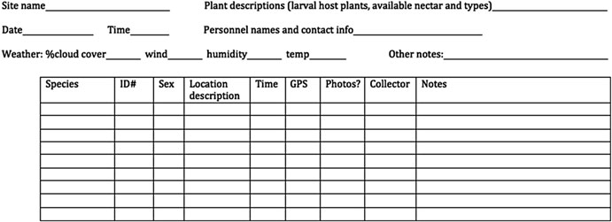
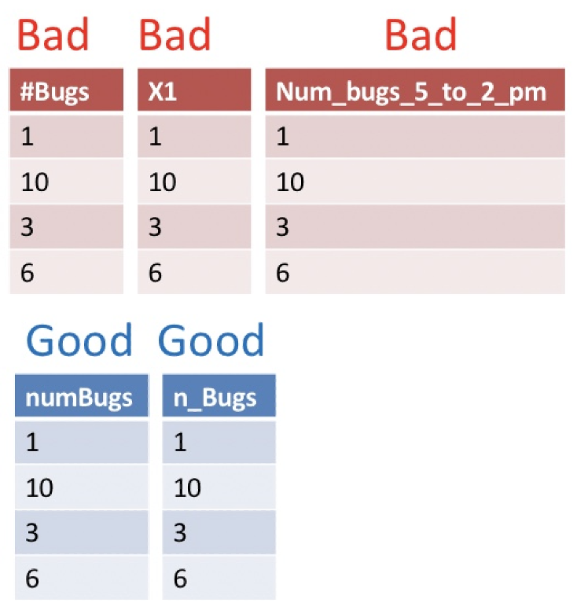
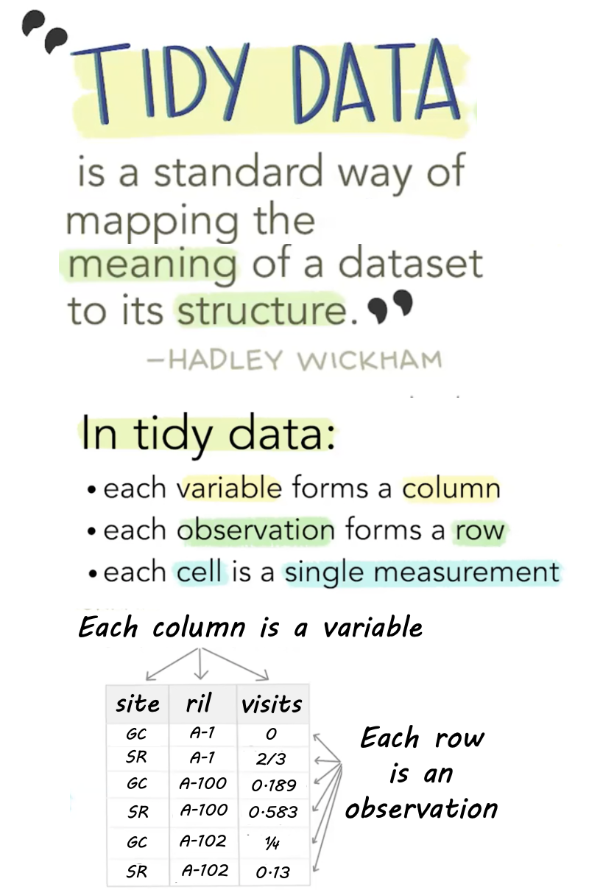
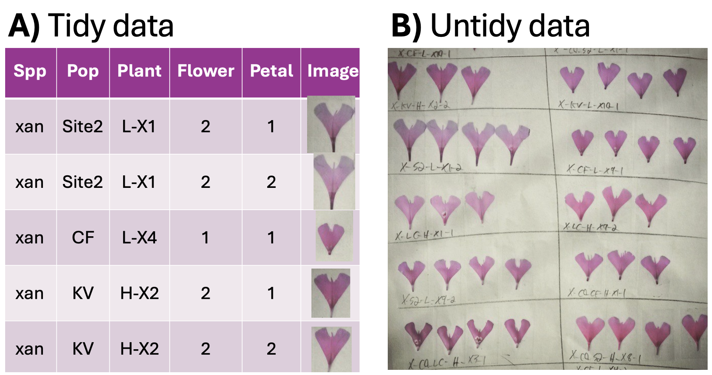

## • 3. Collecting data {.unnumbered #collecting_data}  

**This section includes background on:** [Making rules for data collection](#making-rules-for-data-collection), [Making a spreadsheet for data entry](#making-a-spreadsheet-for-data-entry), [Making data (field) sheets](#making-data-field-sheets),  [A checklist for data collection](#data-collection-and-data-entry-checklist), and [Making a README and/or data dictionary](#making-a-readme-andor-data-dictionary)

::: {.motivation style="background-color: #ffe6f7; padding: 10px; border: 1px solid #ddd; border-radius: 5px;"}


**Motivating scenario:** You are getting ready to collect, enter, store, and analyze data. 

**Learning goals: By the end of this subsection you should be able to**  

1. Make a data sheet. 
2. Label samples.  
3. Describe best practices for collecting and maintaining data.    
4. Explain the tidy data format and differentiate between tidy and untidy data.     

:::

```{r}
#| echo: false
#| message: false
#| warning: false
library(knitr)
library(dplyr)
library(readr)
library(stringr)
library(webexercises)
library(ggplot2)
library(tidyr)
source("../../_common.R") 
```

---

```{r}
#| echo: false
#| label: fig-data_collection
#| fig-cap: "Researchers collecting data on *Clarkia* pollinator visitation."
#| fig-alt: "Researchers conducting fieldwork on a steep hillside covered in blooming *Clarkia xantiana* flowers. One researcher in the foreground, wearing a blue beanie and dark clothing, is seated among the flowers, writing on a clipboard. Another researcher in a red jacket is also recording data, while a third person in a hat is partially visible. The background features rolling, dry, shrub-covered hills under an overcast sky."

```

--- 

Sometimes, data come from running a sample through a machine, resulting in a computer readout of our data (e.g., genotypes, gene expression, mass spectrometer, spectrophotometer, etc.). Other times, we collect data through counting, observing, and similar methods, and we enter our data by hand. Either way, there is likely some key data or metadata for which we are responsible (e.g., information about our sample). Below, we focus on how we collect and store our data, assuming that our study and sampling scheme have already been designed. Issues in study design and sampling will be discussed in later chapters.


:::aside
>*On two occasions I have been asked, "Pray, Mr. Babbage, if you put into the machine wrong figures, will the right answers come out?" ... I am not able rightly to apprehend the kind of confusion of ideas that could provoke such a question.*<br><br>
>
>Page 64 of "Passages from the Life of a Philosopher" @babbage1864. 

:::

## Making rules for data collection  {#making-rules-for-data-collection}

Before we collect data, we need to decide what data to collect. Even in a well-designed study where we want to observe flower color at a field site, we must consider, "What are my options?", for example:    

- Should the options be "white" and "pink," or should we distinguish between darker and lighter shades?   
- If we're measuring tree diameter, at what height on the tree should we measure the diameter?  
- When measuring something quantitative, what units are we reporting?  

Some of these questions have answers that are more correct, while for others, it's crucial to agree on a consistent approach and ensure each team member uses the same method.  

Similarly, it's important to have consistent and unique names -- for example, my collaborators and I study *Clarkia* plants at numerous sites -- include **S**quirrel **M**ountain and **S**aw**M**ill -- which one should we call SM (there is a similar issue in state abbreviation -- we live in **M**i**N**nesota (MN), not **MI**nnesota, to differentiate our state from **MI**chigan (MI)).  These questions highlight the need for thoughtful data planning, ensuring that every variable is measured consistently.

Once you have figured out what you want to measure, how you will measure and report it, and other useful info (e.g., date, time, collector), you are ready to make a data sheet for field collection, a database for analysis, and a README or data dictionary.


## Making a spreadsheet for data entry  {#making-a-spreadsheet-for-data-entry}

After deciding on consistent rules for data collection, we need a standardized format to enter the data. This is especially important when numerous people and/or teams are collecting data at different sites or years. Spreadsheets for data entry should be structured similarly to field sheets (described below) so that it is easy to enter data without needing too much thought.

Some information (e.g., year, person, field site) might be the same for an entire field sheet, so it can either be written once at the top or  explicitly added to each observation in the spreadsheet (copy-pasting can help here).


## Making Data (field) sheets {#making-data-field-sheets}

*When collecting data or samples, you need a well-designed  data (field) sheet*.  The field sheet should closely resemble your spreadsheet but with a few extra considerations for readability and usability. Ask yourself: How easy is this to read? How easy is it to fill out? Each column and row should be clearly defined so it’s obvious what goes where. Consider the physical layout too—does the sheet fit on one piece of paper? Should it be printed in landscape or portrait orientation? Print a draft to see if there’s enough space for writing. A "notes" column can be useful but should remain empty for most entries, used only for unusual or exceptional cases that might need attention during analysis.


It’s also smart to include metadata at the top—things like the date, location, and who collected the data. Whether this metadata gets its own column or is written at the top depends on practical needs—if one person is responsible for an entire sheet, maybe it belongs at the top, not repeated for every sample (contrary to the example in @fig-datasheet).

```{r}
#| fig-cap: "Example field data sheet designed for recording ecological and biological observations. The form includes sections for site information, environmental conditions, personnel details, and a structured table for recording species, individual IDs, sex, location descriptions, time, GPS coordinates, photos, collector name, and additional notes."
#| fig-alt: "A black-and-white field data sheet template with blank spaces for entering site name, date, time, weather conditions (cloud cover, wind, humidity, temperature), plant descriptions, personnel contact information, and other notes. Below these fields is a structured table with column headers: Species, ID#, Sex, Location Description, Time, GPS, Photos?, Collector, and Notes, with multiple empty rows for data entry."
#| label: fig-datasheet
#| out-width: "200%"
#| echo: false

```


### Data collection and data entry checklist:  {#data-collection-and-data-entry-checklist}

-  *Be consistent and deliberate:* You should refer to a thing in the same thoughtful way throughout a column. Take, for example, gender as a nominal variable. Data validation  approaches, above, can help.

:::aside
<span style="color: red;">A bad organization would be:</span> male, female, Male, M, Non-binary, Female.    
<span style="color: blue;">A good organization would be:</span> male, female, male, male, non-binary, female.  
<span style="color: blue;">A just as good organization would be:</span> Male, Female, Male, Male, Non-binary, Female. 
:::  

-  *Use good names for things:*  Names should be concise and descriptive. They need not tell the entire story. For example, units are better kept in a data dictionary (See the table below) than in a column name.  This makes downstream analyses easier.  Avoiding spaces and special characters makes column names easier to work with in R.


```{r}
#| column: margin
#| echo: false
#| label: fig-good_names
#| fig-cap: "A comparison of bad and good variable naming conventions in a dataset. The top section (labeled \"Bad\" in red) displays poor naming choices, including spaces, special characters, unclear abbreviations, and inconsistent formatting. The bottom section (labeled \"Good\" in blue) demonstrates improved naming conventions with consistent formatting, clear descriptions, and no special characters."
#| fig-alt: "A table comparing bad and good variable naming practices. The top section, labeled \"Bad\" in red, contains three tables with problematic variable names such as \"#Bugs,\" \"X1,\" and \"Num_bugs_5_to_2_pm.\" These names include special characters, unclear abbreviations, or excessive detail. The bottom section, labeled \"Good\" in blue, presents two tables with improved names like \"numBugs\" and \"n_Bugs,\" which follow consistent, clear, and readable naming conventions."


```

- **Save in a good place.** Make a folder for your project. Keep your data sheet (and data dictionary) there. Try to keep all that you need for the project in this folder, but try not to let it get too complex. Some people like to add more order with additional subfolders for larger projects.   </br></br>     

- **Save early and often.** You are welcome.    </br></br>     

- **Backup your data, do not touch the original data file and do not perform calculations on it.** In addition to scans of your data (if collected on paper) also save your data on both your computer and a locked, un-editable location on the cloud (e.g. google docs, dropbox, etc.). When you want to do something to your data do it in R, and keep the code that did it. This will ensure that you know every step of data manipulation, QC etc.   </br></br>     

- **Do Not Use Font Color or Highlighting as Data.** You may be tempted to encode information with bolded text, highlighting, or text color. Don’t do this! Be sure that all information is in a readable column. These extra markings will either be lost or add an extra degree of difficulty to your analysis. Reserve such markings for the presentation of data.       </br></br>     

- **No values should be implied.** Never leave an entry blank as "shorthand for same as above". Similarly, never denote the first replicate (or treatment, or whatever) by its order in a spreadsheet, but rather make this explicit with a value in a column. Data order could get jumbled and besides it would take quite a bit of effort to go from implied order to a statistical analysis. It is ok to skip this while taking data in the field, but make sure no values are implied when entering data into a computer.       </br></br>     


- **Use data validation approaches.**  When making a spreadsheet, think about future-you (or your collaborator) who will analyze the data. Typos and inconsistencies in values (e.g., "Male," "male," and "M" for "male") create unnecessary headaches. Accidentally inputting the wrong measure (e.g., putting height where weight should be, or reporting values in kg rather than lb) sucks.       
    - Both Excel and Google Sheets (and likely most spreadsheet programs) have a simple solution: use the "Data validation" feature in the "Data" drop-down menu to limit the potential categorical values or set a range for continuous values that users can enter into your spreadsheet. This helps ensure the data are correct.        </br> 


- **Data should be tidy  (aka rectangular).** Ideally data should be entered as tidy (Each variable must have its own column. Each observation must have its own row.  Each value must have its own cell). However, you must balance two practical considerations -- "*What is the best/easiest/fastest way to collect and enter data?*" vs "*What is the easiest way to analyze data?*"

#### Tidy data {#tidy}


```{r}
#| label: fig-tidy
#| fig-cap: "A visual explanation of tidy data. Modified from @wickham2014."
#| fig-alt: "Illustration of tidy data principles. The image features a quote from Hadley Wickham: 'Tidy data is a standard way of mapping the meaning of a dataset to its structure.' The text explains that in tidy data, each variable forms a column, each observation forms a row, and each cell is a single measurement. A small table is included as an example, where column headers ('site,' 'ril,' 'visits') represent variables, and each row represents an observation. Emphasized text and highlighting visually reinforce key concepts."
#| column: margin
#| echo: false

```


> Like families, tidy datasets are all alike but every messy dataset is messy in its own way. Tidy datasets provide a standardized way to link the structure of a dataset (its physical layout) with its semantics (its meaning).
>
> Hadley Wickham. *Tidy data*. @wickham2014.

Data can be structured in different ways: in a tidy format, each variable has its own column, and each row represents an observation. In contrast, messy data might combine multiple variables into a single column or store observations in a less structured format.  @fig-tidy A  shows "long" data with one variable per column. @fig-tidy B contains boxes (rather than rows or columns) with petals from a given flower laid  out neatly, and information about the flower and plant written beneath it. Both formats have their costs and benefits:   

- **@fig-tidy A is  "tidy":** Each row is an observation (a petal), and each column is a variable related to that observation. Because this style is so predictable, this format simplifies computational analyses.  
- **@fig-tidy B is  not "tidy":** There are not simple rows and columns, and variables are combined in a long string. This format is useful in many ways: e.g., humans can easily identify patterns, and data can be stored compactly, but it is not tidy.   

So tidy data is not necessarily "prettier" or easier to read, or an efficient use of computer memory -- in fact, in visual presentation of data for people, we often choose an untidy format. But when analyzing data on our computer, a tidy format simplifies our work. For this reason we will work with tidy data when possible in this book. 

:::aside
Because all untidy data are different, there is no way to uniformly tidy an untidy dataset. However, the [tidyr package](https://tidyr.tidyverse.org/)  has many useful functions. Specifically, the [`pivot_longer()`](https://tidyr.tidyverse.org/reference/pivot_longer.html) function allows for converting data from wide format to long format.
:::

```{r}
#| label: fig-tidy_clarkia
#| out-width: "100%"
#| fig-cap: "An example of tidy versus untidy data. **A)** A table where each row is an observation (a petal), and each column is a variable (e.g. pop, plant, image etc...). **B)** A nicely arranged (but not tidy) sheet of *Clarkia xantiana* petals - arranged by flower."
#| fig-alt: "A. A table with images of Clarkia petals. Each row is a petal. Columns are: Spp; Pop; Plant; Flower; Petal; Image."
#| echo: false

```

### Making a README and/or "data dictionary" {#making-a-readme-andor-data-dictionary}

A data dictionary is a separate file (or sheet within a file, if you prefer) that explains all the variables in your dataset. It should include the exact variable names from the data file, a version of the variable name that you might use in visualizations, and a longer explanation of what each variable means. Additionally, it is important to list the measurement units and the expected minimum and maximum values for each variable, so anyone using the data knows what to expect.

Alongside your data dictionary, you should also create a README file that provides an overview of the project and dataset, explaining the purpose of the study and how the data were collected. The README should include a description of each row and column in the dataset. In some cases you may prefer to put the information in the data dictionary in the README - that is ok too. Just make sure this information is easy for a reader to spot. 

::: {.column-page-right}

**Table 1.** An example Data Dictionary.   

| name              | plot_name          | group        | description                                              |
|-------------------|-------------------|-------------|----------------------------------------------------------|
| mouse             | Mouse              | demographic  | Animal identifier                                        |
| sex               | Sex                | demographic  | Male (M) or Female (F)                                   |
| sac_date          | Date of sac        | demographic  | Date mouse was sacrificed                                |
| partial_inflation | Partial inflation  | clinical     | Indicates if mouse showed partial pancreatic inflation   |
| coat_color        | Coat color         | demographic  | Coat color, by visual inspection                         |
| crumblers         | Crumblers          | clinical     | Indicates if mouse stored food in their bedding          |
| diet_days         | Days on diet       | clinical     | Number of days on high–fat diet                          |
:::
