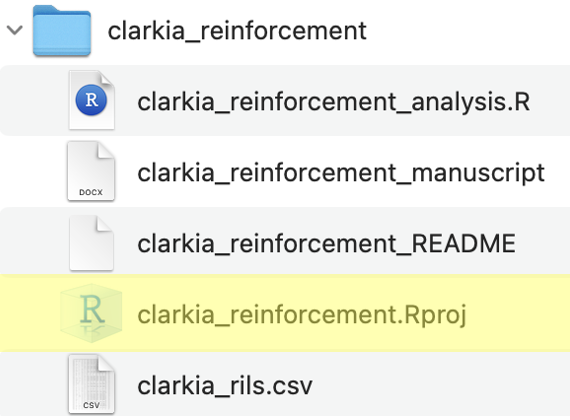

## • 3. Loading data {.unnumbered #loading_data}  

::: {.motivation style="background-color: #ffe6f7; padding: 10px; border: 1px solid #ddd; border-radius: 5px;"}


**Motivating scenario:** You want to load your data into R so that you can begin your analyses! 

**Learning goals: By the end of this chapter you should be able to**  

-  Load Excel and CSV files into R from a web link.    
- Make an R Project, and open up R Studio via an R Project.    
- Load data into R from your computer. 

:::

--- 

A tough part of `R` is that the first thing you need to do is not necessarily the easiest thing to do. This is clear with loading data. Getting data from a spreadsheet into `R` requires a bunch of `R` and computer skills. To load data into R, you must understand a few topics from the [first chapter of our intro to R](#getting_started) - specifically  the idea of [variable assignment](#assignment), and [using functions](#functions) from [packages](#packages). 

The even bigger challenge is knowing how to point `R` to your data. This can be a challenge as it (used to) involve understanding the structure of folders on your computer etc. Luckily, the best practices in reproducible analyses actually make it easier to tell R how to find the specified data on your computer.  Below, I introduce how to [read data into R](#loading-data) with the [`read_csv()`](https://readr.tidyverse.org/reference/read_delim.html) and [`read_excel()`](https://readxl.tidyverse.org/reference/read_excel.html) functions from the [`readr`](https://readr.tidyverse.org/) and  [`readxl`](https://readxl.tidyverse.org/index.html) packages, respectively.     


- **I start with the easiest case** of reading files from the internet.    
- **I then introduce the idea of folder organization and R projects** which makes it both easier to load data from your computer into R, and for your code to work on another person's computer.    
- **Finally, I introduce how to combine these tools** to load data into R from your computer.  

### Loading data   {#loading-data} 

The first step of loading data into R is knowing what kind of data file you're dealing with. There are many different types of files, that R can load, but most likely you're dealing with a .csv file or a .xlsx file:   
 
- *The simplest data file format is a `.csv`.* Load a `.csv` with the [`read_csv()`](https://readr.tidyverse.org/reference/read_delim.html) function in the [`readr`](https://readr.tidyverse.org/) package. To install, enter `install.packages("readr")` into the  console.      

- *The most common way we get data is an Excel `.xlsx` file.* Load a `.xlsx` file  with the [`read_excel()`](https://readxl.tidyverse.org/reference/read_excel.html) function in the [`readxl`](https://readxl.tidyverse.org/index.html) package. To install, enter `install.packages("readxl")` into the  console. You may see old material saying that R needs a `.csv`. That is wrong.       


So I would load data into R as follows:  


:::aside
**read_csv() is not the only way to load a csv file into R.** You will see many people use the base R function, [`read.csv()`](https://stat.ethz.ch/R-manual/R-devel/library/utils/html/read.table.html). I prefer [`readr`](https://readr.tidyverse.org/)'s because it loads data as  a tibble. This has numerous helpful features.  [Here's a quick introduction to tibbles](https://r4ds.had.co.nz/tibbles.html) if you want to know more and how they differ from traditional data frames.  
:::

:::::: panel-tabset
### load `.csv`

::: {.loadcsv style="background-color: #FDEFB5; padding: 10px; border: 1px solid #ddd; border-radius: 5px;"}

Use the code below as an example of how to load a `.csv`. Make sure the [`readr`](https://readr.tidyverse.org/) package is installed. 

```{r}
# Reading in .csv data from a web link

# Load packages
library(conflicted)
library(readr)

path     <- "https://raw.githubusercontent.com/ybrandvain/datasets/refs/heads/master/clarkia_rils.csv"
ril_data <- read_csv(path)
```

:::

### Load `.xlsx` 

::: {.loadxls style="background-color: #FDEFB5; padding: 10px; border: 1px solid #ddd; border-radius: 5px;"}


Use the code below as an example of how to load a `.xlsx`. Make sure the [`readxl`](https://readxl.tidyverse.org/) package is installed. 


```{r}
#| eval: false  
# Reading in .xlsx data from a web link

# Load packages
library(conflicted)
library(readxl)

path     <- "https://raw.githubusercontent.com/ybrandvain/datasets/refs/heads/master/clarkia_rils.xlsx"


ril_data <- read_excel(path)

```

:::fyi
[`read_excel()`](https://readxl.tidyverse.org/reference/read_excel.html) has an optional argument called `sheet`, which allows you to specify the sheet in the excel file you want to load. 
:::

:::

::::::


### R Projects {#making-an-r-project}

```{r}
#| echo: false
#| column: margin
#| label: fig-Rproject2
#| fig-cap: "Project folder showing an R project file (.Rproj) alongside scripts, data, and documents, illustrating a reproducible project structure. This is a slight modification of the figure from the previous subsection. Here, the .Rproj file is highlighted."
#| fig-alt: "Screenshot of a project folder named \"clarkia_reinforcement\" displaying files including an R script, manuscript document, README, R project file (.Rproj), and a CSV dataset. The .Rproj file is highlighted to emphasize its role in organizing the project and enabling reproducible analyses."
library(knitr)
source("../../_common.R") 

```


While data often exist online, in your actual analyses, the data are more likely to exist on your computer. Loading data from your computer presents both challenges and opportunities. The greatest opportunity is that it facilitates developing great habits for file organization and reproducibility. The best habit I have developed  is pairing [best practices for structuring folders](#storing_data) with the use of an `R` project.  


**What is an `R` project?** An R project makes it easy to recreate your analyses because it points `R` to this location. If you look closely at the folder structure presented in the previous section, you can see a `.Rproj` file, highlighted in @fig-Rproject2. 


**So the  first step towards reproducible analyses is making an R project.** I do this by clicking  "File" > "New Project" and I usually use an existing directory (Navigating to the folder with my data and data dictionary that we just made).    


>Now every time you use R to work on these data, open R by double clicking on this project (or if R is already open, navigate to "Open Project").   


#### Loading data from your computer  {#loading-data2} 


Now  your data live in a well organized folder (or subfolder) with an `R` project. This now makes loading data from your computer into `R` pretty simple! You simply change the "path" argument (that used to be the web address) to the (relative) path to your file:      

- If your folder looks like @fig-Rproject2, your path is `clarkia_rils.csv`, and you would load it as e.g., `ril_data <- read_csv("clarkia_rils.csv")`.    
- If your data are in a  `data` subfolder, type `data/<filename.filetype>` (e.g. `read_csv("data/mydata.csv")`).       
 
:::aside
Swap from `read_csv()`  to  `read_excel()`  if you have a .xlsx file.   
:::


:::fyi
**Use relative paths.** 

**A relative path** means we have a very short path to the data, and that path is relative to the `.Rproj` file. Importantly a relative path  will work on anyone's computer that has this folder. 


You may see people use an absolute path (e.g., "~/Users/ybrandvain/Desktop/clarkia_reinforcement/clarkia_rils.csv"). This will work on my computer but not yours. So it makes sharing difficult.

You may also run into code using the `setwd()` function. This is a way to navigate paths on your computer, but it can behave unpredictably on someone else’s machine. By contrast, the `.Rproj` framework essentially sets this path for you without the potentially bad side effects.

:::
