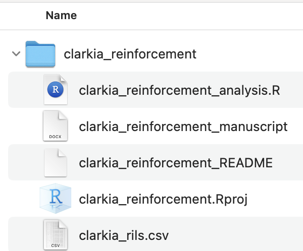

## • 3. Storing data {.unnumbered #storing_data}  


::: {.motivation style="background-color: #ffe6f7; padding: 10px; border: 1px solid #ddd; border-radius: 5px;"}


**Motivating scenario:** You  have collected data and want to take good care of it. 

**Learning goals: By the end of this subsection you should be able to**  

1. Safely store and back up data.      
2. Make folders to house all files for a project.     
3. Understand why and how to submit data for long-term storage. 

:::

```{r}
#| echo: false
#| message: false
#| warning: false
library(knitr)
library(dplyr)
library(readr)
library(stringr)
library(webexercises)
library(ggplot2)
library(tidyr)
source("../../_common.R") 
```

---


## Storing data

Collecting data is hard work. It is therefore important to make sure the data do not get lost or corrupted, and can be easily analyzed by us and others. We therefore must consider stable and convenient data storage over the short and long term. 

### Backing up data   

Computers can die, cloud storage can fail, and external hard drives can be lost or overwritten. So, I suggest using all three. Update each storage location every time you add data to your spreadsheet. Automatic syncing is even safer. Once you have entered data for the day, make sure those files are protected so that they are never altered.

:::warning
Do not edit data in a datasheet. Rather, you should process and filter data in a computer script so that you have a record of your process. 
:::

### Structuring your folders  

You likely have numerous things you're working on. To keep your work clean and reproducible, I suggest:  

```{r}
#| column: margin
#| echo: false
#| label: fig-folder
#| fig-cap: "A folder structure for a small project."
#| fig-alt: "Screenshot of a simple project folder named \"clarkia_reinforcement\" containing several files: an R script (clarkia_reinforcement_analysis.R), a manuscript document, a README file, an RStudio project file (.Rproj), and a CSV dataset (clarkia_rils.csv). The image illustrates keeping all project materials together in one organized folder."

```


1. **Keeping all aspects of a project in a single folder.**     
2. **Guarding this folder against unrelated material.**  

Exactly how you structure your folder for a project is up to you, and depends on the scope and scale of the project. For small projects (one script, one data file etc) like the ones in this course I suggest one folder with a small handful of files (@fig-folder). For larger projects with multiple scripts and multiple datasets  (e.g., an honors thesis, a scientific manuscript), it  is sometimes cleaner to have separate subfolders for each kind of file (e.g., all data sheets go in the data folder, all scripts go in the scripts folder etc).


### Long-term storage  

By sharing our data, we make our science more transparent and reproducible, and allow others to further investigate it (or combine with other studies). This makes our science even more useful.  As such, it is the expectation in most fields that data is  made available after publication. Repositories like [DRYAD](https://datadryad.org/stash), [figshare](https://figshare.com/) or [DRUM](https://conservancy.umn.edu/collections/6c548d8b-0f3a-4f6b-b16e-4154c88136c0) make this easy. 

This is perhaps most helpful for you - the author of the project. You are the one most likely to want to revisit your previous code and data, and as noted above, the long term survival of such data in your hands cannot be guaranteed. 