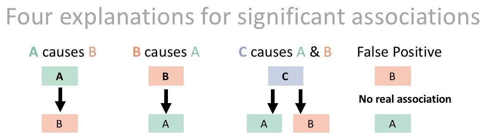

### • 12. Experimental Design {.unnumbered #experimental_design}

```{r}
#| echo: false
#| message: false
#| warning: false
library(knitr)
library(dplyr)
library(readr)
library(stringr)
library(DT)
library(webexercises)
library(ggplot2)
library(ggforce)
library(patchwork)
library(tidyr)
library(cowplot)
library(gridExtra)
library(janitor)
library(forcats)
library(broom)
library(tufte)
library(kableExtra)
library(pwr)
source("../../_common.R")

hz_link <- "https://raw.githubusercontent.com/ybrandvain/datasets/refs/heads/master/zones_df_admix_weight_cutoff0.9_gps_dist2het_phenos_excl_GC.csv"

clarkia_hz <- read_csv(hz_link)|> 
    select(-weighted)|>
    rename(admix_proportion = `cutoff0.9`) |>
    filter(!is.na(admix_proportion))|>
    clean_names() |>
    mutate(site = if_else(site == "SAW", "SR", site)) |>
    filter(subsp=="P")|>
    mutate(site = fct_reorder(site, mean_petal_area_sq_cm))

html_tag_audio <- function(file, type = c("mp3")) {
  type <- match.arg(type)
  htmltools::tags$audio(
    controls = "",
    htmltools::tags$source(
      src = file,
      type = glue::glue("audio/{type}", type = type)
    )
  )
}

```


::: {.motivation}

**Motivating Scenario:**

You know the magic trick that is an experiment and how a good experiment *could* teach us about causation. So you want to design an experiment that will answer the question you care about, not one that will reject or fail to reject the null for some other reason.

**Learning Goals: By the end of this chapter, you should be able to:**

- Explain why statistical significance doesn't necessarily mean that your pet idea is right. 
- Explain how random assignment can rule out confounds, and why random assignment is key to the experimental approach.
- Identify common sources of bias in experiments.  
- Describe how controls and blinding protect an experiment from these biases.
- Explain the ideas of ecological validity and why we must keep this in mind when interpreting experimental results. 
- Critically evaluate whether results from an experiment match the claims made about it.

:::

---

### Correlation Does Not Necessarily Imply Causation  

We found that the larger the petals of a *parviflora* RIL, the greater their proportion of hybrid seeds. This result was highly significant  ($\approx 4.4 \times 10^{-6}$), and the effect size was meaningful ($r = .227$). Additionally, our study included many good practices. We randomly placed plants in the field, we planted them at numerous field sites to increase external validity, etc etc. 


```{r} 
#| label: fig-field
#| fig-height: 12
#| column: margin
#| fig-cap: "In natural hybrid zones, pink-petaled *parviflora* plants tend to carry a greater proportion of *xantiana* ancestry (admixture) than white-petaled plants at the same site, though the size of this gap varies by site. Data from @sianta2026."
#| fig-alt: "A stack of scatter plots, one per field site, each showing individual wild parviflora plants' estimated xantiana admixture proportion on the y-axis, split by petal color (pink or white) on the x-axis. A dashed line connects the mean admixture proportion for pink versus white plants within each site, with error bars around each mean. At most sites the line slopes upward from white to pink, indicating pink-petaled plants carry more xantiana ancestry than white-petaled plants from the same site; sites are ordered from the largest such gap at the top to the smallest at the bottom."
#| echo: false
clarkia_hz |> 
    filter(subsp == "P", !is.na(petal_color))|>
    mutate(site = fct_reorder(.f = site, .x = -admix_proportion,.fun = mean))|>
    ggplot(aes(x = petal_color, y = admix_proportion, color = petal_color))+
    geom_jitter(height = 0, width = .15, size = 5, alpha = .5, show.legend = FALSE)+
    facet_wrap(~site, ncol=1, labeller = "label_both")+
    stat_summary(geom = "line", aes(group=1), color = "black", lty = 2, linewidth = 2)+
    stat_summary(geom = "errorbar", width = .15, color = "black", linewidth = 2)+
  theme(axis.title = element_text(size = 35),
        axis.text = element_text(size = 25),
        strip.text =  element_text(size = 30))
```

**But we still cannot say that greater petal area causes** ***parviflora***  **plants to make more hybrids.** This is because,  despite our best efforts in RIL construction, petal area is still associated with other traits in our RILs. So, we don't know if petal area or some associated trait (e.g. anther-stigma distance see the section on internal validity) caused the increase in proportion hybrid seeds with larger petal  area.  


More generally, a statistical association between two variables, A and B, does not necessarily mean that B caused A. Rather there are four possible explanations (@fig-poscause): 

- *A could cause B.* It is, of course, quite possible that larger petals do attract more pollinators, ultimately causing RILs with larger flowers to set more hybrid seed.
- *B could cause A.* In our case, it is impossible for setting more hybrid seed to cause plant petals to be larger. But such a worry is reasonable in a fully observational study. For example, @sianta2026 found that in naturally occurring hybrid zones (rather than RILs) pink-petaled *parviflora* plants had more *xantiana* ancestry than white-petaled *parviflora* plants (@fig-field). We were unsure if this meant that white-petaled plants escaped a history of hybridization with *xantiana* or if *parviflora* plants became pink because they inherited pink petal from *xantiana*.
- *Both A and B are caused by a third variable C.* This is a classic "confound" as described earlier. In our case it is possible that greater anther stigma-distance causes RILs to make more hybrids, and that this (or some master flower growth regulator) causes petals to be larger. 
- *Or the result could even be a false positive*.  Of course NHST just says that the null rarely generates data as extreme as what we observed. It does not directly evaluate whether the null is or is not true.


```{r} 
#| label: fig-poscause
#| fig-cap: "Possible causal relationships underlying significant associations. In this example, we would call C a **confounding variable**." 
#| fig-alt: "A diagram showing four possible explanations for an association between variables A and B: (1) A causes B, (2) B causes A, (3) a third variable C causes both A and B, making them correlated without either causing the other, and (4) the association is a chance false positive with no underlying causal link."
#| echo: false

```

---

### Experiments Can Reveal Causation

Our RIL study was highly controlled and well designed but not a completely randomized experiment. In contrast to our observational study (@sianta2026), using RILs randomly planted within and between field sites allowed us to conclude that the association between petal area and hybrid formation cannot be attributed to field site, location in the field, or by more hybridization causing larger petals. However, as stated above, we could not conclude that larger petals themselves caused more hybridization -- this would require randomly assigning petal area to different plants.

::: aside
Our RILs were an attempt to randomize traits across backgrounds. But the linkage and pleiotropy between traits prevented complete randomization.
:::

Experiments are magical because they can allow us to learn about causation. In an experiment we assign a treatment randomly to each experimental unit in the study. Because treatment is assigned at random, any confounding is due to chance rather than to the design itself. So if we could magically alter petal area (e.g. by hormone treatment or cutting and pasting petal bits, or genetic engineering) and then randomly assign petal area to plants we could establish causation. 

But experiments can only reveal causation when they are designed correctly. So, we must think about common challenges in experimental design, and make sure we don't fall into one of these classic traps. 

::: fyi
There is more to worry about when studying people or other organisms that can see, hear, and feel. So for many of the examples below I will step away from our wonderful world of *Clarkia* and provide examples from human subjects.
::: 


### Potential biases in experiments

Poorly executed experiments can introduce bias. This is bad because the whole point of an experiment is to remove confounds and bias. Here are some common ways in which experiments can introduce bias, and how to avoid these issues.


* **Experimental artifacts.** The experimental manipulation itself, rather than the treatment we care about, could be causing the result. Say we manipulated petal area by cutting petals to be smaller. It's possible that the stress of cutting flowers, rather than the smaller petals themselves, causes fewer hybrids. Or say we used a hormone or genetic engineering to manipulate petal area -- we would need a proper control to show that any change in hybridization could be attributed to the change in petal area itself, not some other direct or indirect effect of our manipulation.</br></br>


* **Time heals.** Whenever I feel terribly sick, I call the doctor, and usually get an appointment the following week. Most of the time I get better before seeing the doctor. I therefore joke that the best way for me to get better is to schedule a doctor appointment. Of course, calling the doctor didn't heal me -- I called when I felt my worst, and got better with time, because we tend to get better.</br></br>

* **Regression to the mean.** The most extreme observations in a study are biased estimates of the true parameter values. That's because being exceptional requires both an expectation of being exceptional, and a residual in the same direction (a large positive residual for high values, or a large negative residual for low ones). Because extreme values partly reflect random noise, that noise is unlikely to repeat in the same direction on a second measurement. As a result, extreme observations tend to move closer to the average, even without any experimental intervention.</br></br>

* **Known treatments.** Knowledge of the treatment, by either the experimental subject or the experimenter, can introduce a special kind of experimental artifact. People who think they've been treated might prime themselves for improvement -- a process known as a placebo effect. And if the researchers know the treatment, they may subconsciously bias their measurements or how they treat their subjects.


::: fyi

**Listen** to the 7-minute clip from [Radiolab](https://www.wnycstudios.org/podcasts/radiolab/segments/91540-pinpointing-the-placebo-effect), below, for examples of the placebo effect and how it may work.

```{r radiolabplacebo, echo = FALSE}
html_tag_audio("../../figs/stats_foundations/study_design/placebo.mp3", type = "mp3")
```

:::

### Designing to eliminate bias

To minimize bias and allow for causal interpretation of experimental results, strong experimental designs usually include:

- **Effective controls.** It's usually a good idea to have a "do nothing" treatment as a control, but this is not enough on its own. We should also include a "sham treatment," or placebo, that is identical to the treatment in every way except the treatment itself. In the hypothetical petal area manipulation example, we could perhaps cut all petals and manipulate area by where we paste them back.</br></br> 

- **Blinding.** If possible, we should do all we can to ensure that neither the experimenter nor the subject knows which treatment they received. A double-blind (neither researcher nor subject knows the treatment) randomized control experiment is the gold standard for inferring causation.


### Warning: Experimental Causation ≠ Real-World Causation 

A cause in experiment  $\neq$ cause in the real world. So, while experiments are amazing, and are among our best ways to demonstrate causation, we have to be careful in interpreting results from a controlled experiment. A causal relationship in an experiment does not imply a causal relationship in the real world, even for a true positive with a well-executed experiment. Here are some things to consider:

--- 

#### Treatment severity 

> Alle Dinge sind Gift, und nichts ist ohne Gift; allein die Dosis macht, dass ein Ding kein Gift ist.
> 
> All things are poison, and nothing is without poison; the dosage alone makes it so a thing is not a poison.
>
> -- Paracelsus, 1538

When conducting an experiment you should think carefully about the intensity of the treatment. Namely, the manipulation should be within the realm of what we could reasonably expect to encounter in the real world. 


For example, Red Dye No. 3 is known to cause thyroid tumors in male rats when given in extreme quantities. But this does not mean we should be worried about the Red Dye No. 3 in a bag of candy, which comes nowhere near such levels. Tobacco smoke, on the other hand, is a more realistic concern -- the doses people actually inhale when they smoke are the same doses linked to cancer.

Like  Red Dye No. 3, a treatment whose intensity falls outside the range organisms actually experience can be causal in an experiment and still not inform causality in the real world. Thus we should strive for **[ecological validity](https://en.wikipedia.org/wiki/Ecological_validity)** -- that is, our experimental treatment should be comparable to what is experienced in "nature", so that our results can be generalized to the "real world."

---

#### Comparable effect sizes: 

Say an experimental treatment had an effect – say in an experimental study we find that studying an extra hour for an exam increases test scores by 1.5%. This would show that studying can increase test scores, but would not explain a 15% difference in test scores for students who studied, on average, an hour longer than those in another group.

---

#### Different contexts (the world is not a greenhouse)

Most experiments happen in a controlled setting in a lab. Most published research studies WEIRD (Western, educated, industrialized, rich and democratic) populations etc. So, we might worry if an experimental study is used as causative evidence for a claim concerning a very different context. Similarly, an absence of a causal relationship in an experiment might be misleading if an interaction between the treatment and some other variable which was not studied was the true cause.

---

#### Multiple causes

For some reason, many scientists seem to want one answer to a question or one cause for an effect. But the world is more complex than that. Finding experimental evidence supporting one plausible cause should not be taken as evidence against another!  


### Take home 

Experiments can reveal causation -- but only if we actually do them well. Random assignment handles the confounds we never thought to measure. Controls and blinding rule out the ones baked into the manipulation itself. And even a well-executed experiment doesn't automatically tell you the effect size that matters in the real world, generalize beyond the population and context it was run in, or rule out other causes acting alongside the one we found -- ecological validity, comparable effect sizes, WEIRD contexts, and multiple causation are all needed to connect experimental results to the real world. 

We did a bunch of this right in our RIL. We placed RILs in the field randomly, replicated across sites etc...,  but because meiosis let us down, petal area was not randomly assigned to plants, but rather remained associated with numerous floral phenotypes, limiting our ability to make causal claims. 

Luckily, there are some statistical paths forward as we will see later in this and in forthcoming chapters. 
