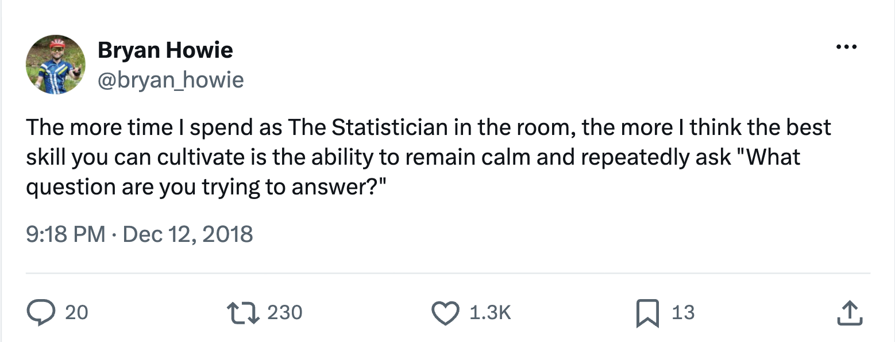
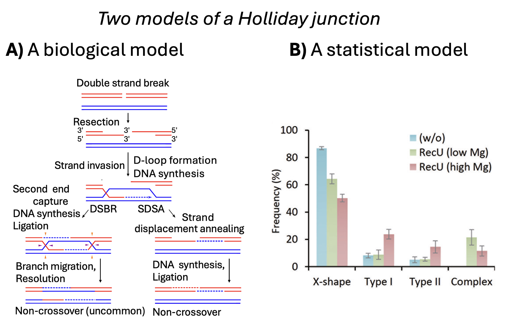
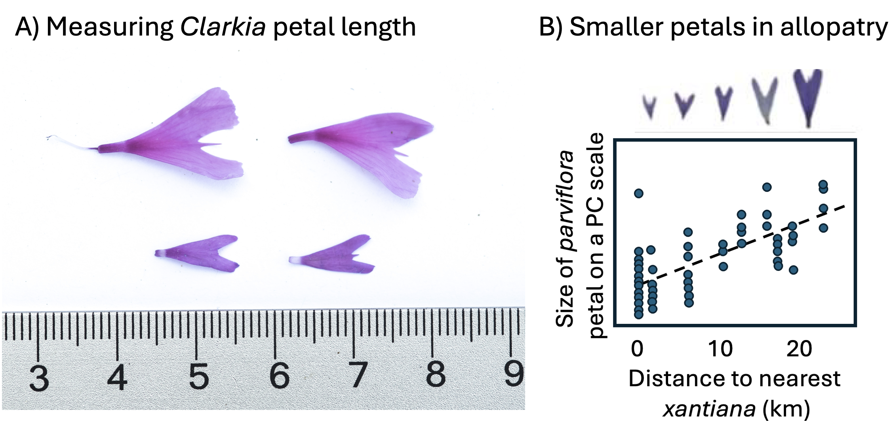

### • 12. What do you want to know? {.unnumbered #why_design_matters}

```{r}
#| echo: false
#| message: false
#| warning: false
library(knitr)
library(dplyr)
library(readr)
library(stringr)
library(DT)
library(webexercises)
library(ggplot2)
library(ggforce)
library(patchwork)
library(tidyr)
library(cowplot)
library(gridExtra)
library(janitor)
library(forcats)
library(broom)
library(knitr)
library(tufte)
library(kableExtra)
library(pwr)
source("../../_common.R")

html_tag_audio <- function(file, type = c("mp3")) {
  type <- match.arg(type)
  htmltools::tags$audio(
    controls = "",
    htmltools::tags$source(
      src = file,
      type = glue::glue("audio/{type}", type = type)
    )
  )
}
```


::: {.motivation}

**Motivating Scenario:**

You have a scientific idea that you want to turn into something that can be evaluated statistically.

**Learning Goals: By the end of this chapter, you should be able to:**

- Distinguish a scientific model from a statistical model.
- Transform a  scientific question into a study to answer it.
- Consider  your statistical model and its relationship to the biological model while making decisions about your study design.

:::
---  


```{r} 
#| label: fig-design
#| fig-cap: 'A key to design is to have a goal in mind.'
#| fig-alt: "A tweet from `@bryan_howie` which says: The more time I spend as The Statistician in the room, the more I think the best skill you can cultivate is the ability to remain calm and repeatedly ask \"What question are you trying to answer?\"."
#| echo: FALSE

``` 


--- 

## Statistical models are not scientific models 

This is a **BIO**statistics book. I wrote it as a biologist for biologists interested in biological ideas. We biologists ask biological questions generated by scientific understanding and scientific models of the world. However, we evaluate such scientific models by applying statistical models to experiments and observations. We must remember, though, that scientific and statistical models are different: 

- **Scientific models** are based on our understanding of the science -- in this case biology. Biological models come from us making simplified  abstractions of complex systems (like considering predator-prey interactions, plant pollination, cancer progression, or meiosis (@fig-holiday A)). Great scientific models explain what we see, make interesting predictions, and  are consistent with our broader scientific understanding.</br></br>    


- **Statistical models**, on the other hand, are mathematical ways to describe patterns in data (e.g. @fig-holiday B). Statistical models know nothing about Lotka-Volterra, pollination or human physiology. </br>   

The [next section](#stats_4_linear_models) introduces linear models -- a standard class of statistical models. As we introduce these models I will point out how they intersect with questions in experimental design. 


---


```{r}
#| echo: false
#| label: fig-holiday
#| fig-cap: "The Holliday Junction -- one of my favorite scientific models, and an associated  statistical model.  (A) A scientific model of the idealized process of double-strand break repair (DSBR) and synthesis-dependent strand annealing (SDSA) pathways, leading to crossover or non-crossover products. From [wikipedia](https://en.wikipedia.org/wiki/Holliday_junction). (B) A statistical model of the observed frequencies of different DNA joint molecule types (X-shape, Type I, Type II, Complex) under different biochemical conditions (with or without RecU protein, and varying magnesium concentrations). From @suzuki2014"
#| fig-alt: "A two-panel figure. Panel A shows a diagram of double-strand break repair: broken DNA strands undergo resection, strand invasion, and DNA synthesis, leading to either double-strand break repair (DSBR) or synthesis-dependent strand annealing (SDSA) pathways, resulting in crossover or non-crossover products. Panel B is a bar graph showing frequencies of different DNA joint molecule types (X-shape, Type I, Type II, Complex) across three conditions (without RecU, RecU with low magnesium, and RecU with high magnesium). The X-shape structure is most common, with lower frequencies of other types."

```


---

## Good studies connect scientific models to statistical inquiry


YOU, THE SCIENTIST, have a scientific question. Your job is to sharpen this: What is it you want to know? The more specifically you can answer that question, the better positioned you'll be for a smoother statistical experience. That is, because statistical models know nothing about science, it is our job to build scientific studies  best suited for clean statistical interpretation, build statistical models that best represent our biological questions, and interpret statistical results in light of our scientific questions. 

---

```{r} 
#| label: fig-motivation
#| fig-cap: '**(A)** Measuring petal size in *Clarkia xantiana subspecies xantiana* (top) and subspecies *parviflora* (bottom). **(B)** Petal size of subspecies parviflora decreases in populations geographically closer to subspecies *xantiana*.'
#| fig-alt: "A two-panel figure. Panel A shows two photographs demonstrating how petal size is measured with calipers or a ruler on flowers of Clarkia xantiana subspecies xantiana (top) and subspecies parviflora (bottom), illustrating that xantiana flowers are noticeably larger than parviflora flowers. Panel B is a scatterplot showing parviflora petal size on the y-axis against geographic distance to the nearest xantiana population on the x-axis, with a downward-sloping trend line indicating that parviflora petal size is smaller in populations located closer to xantiana (sympatric) and larger in populations located farther away (allopatric)."
#| echo: FALSE

``` 

---

### Example: Petal size and hybridization


::: aside
Biological refresher:   

- **Sympatric:** Living in the same location.

- **Allopatric:** Living in a different location. 

- **[Reinforcement](https://en.wikipedia.org/wiki/Reinforcement_(speciation)):** An increase in reproductive isolation that has evolved by natural selection to prevent hybridization.
:::


Our *parviflora* study was motivated by the observation that plants from populations **sympatric** with *xantiana* tend to have smaller flowers than plants in **allopatry** (@fig-motivation). We were curious if this could have been an adaptation by *parviflora* to avoid pollination by *xantiana* so they would minimize the chance of making unfit hybrids. 

This biological hypothesis rests on the idea that smaller *parviflora* flowers make fewer hybrids than larger *parviflora* flowers. This seems plausible, but science requires evidence, not mere plausibility. So we designed a study. 

"Study Design" consists of many different kinds of decisions. Before any statistics happen, we have to decide *who or what* gets into the study (sampling), *how* we characterize each individual once they're in it (measurement), and *who gets which treatment* (assignment) etc.  Our study required many decisions including: 

- *Who to measure?* We had some options. We could have taken seeds from  allopatric and sympatric parviflora populations, grown them with *xantiana* and measured the proportion of hybrid seeds (we did that but I don't report it here). Or we could have artificially lengthened and/or shortened  flowers. Or we could have generated RILs (this is our focus). etc. etc.

- *What to measure?* We could have (and did) measured pollinator visitation  as a proxy for hybridization. Or we could have estimated the probability of hybridization by genotyping some number of seeds per mom.  
- *How many replicates?* These experiments are hard and expensive. We had to decide how many individuals to measure. 
- *Where to measure?* We could have put these plants anywhere. But, we decided to plant them in four locations where these plants grow naturally.  
- *and more...* There are many decisions to make with any such study.


### From design to analysis 

Throughout this chapter we will work through these decisions, why we made them, and consider the potential alternatives. 

But now I will reflect on the relationship between our design and the downstream statistical analysis. In doing so, I will: 

- Show why you must consider statistics when designing a study,  
- Briefly introduce some concepts in study design, and   
- Remind you that good enough is better than perfect 

---

#### The statistical model    

We have yet to learn enough stats to analyze these data with the full sophistication they require. In fact, we may not introduce all of these ideas by the end of this book. But that's ok. We can get started on these ideas, anyway, and consider any potential roadblocks and how to deal with them. Before starting an experiment you don't need a perfect plan -- just a viable one.

For this question, our key response variable is the proportion of hybrid seeds on a RIL, and our key explanatory variable is petal area. Because we are using RILs we will need to adjust our analysis for associations between petal area and other variables (e.g. petal color). We will also want to account for differences in hybridization rates at different locations. This is all feasible, and we will introduce these techniques in the coming section on linear models. We don't have all the answers now, but we do want to ensure there is a viable path we could take to find answers.

:::fyi
## Advanced stats 
 
- **Non-independence:** Because we have numerous observations per RIL, we will need to model this non-independence. This can be done by a "mixed effect model." This common technique is about one step further than we will get in this book. But our answers here will be a good start! 

- **Non-normality:** Proportions do not perfectly meet assumptions of the linear models we work through in this book. That's ok. Good enough is good enough. But to do even better, we would model the response as a proportion, with a type of "Generalized linear model" known as a logistic regression. 

:::

