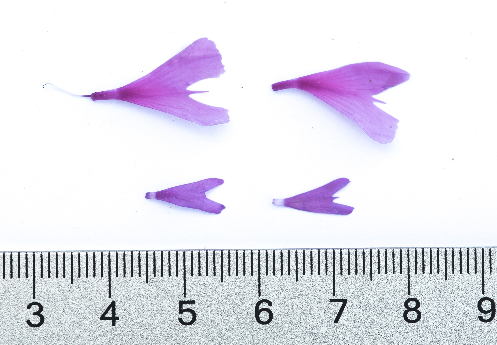

# 16. Comparing two means {.unnumbered #two_ts}


```{r}
#| echo: false
#| message: false
#| warning: false
library(knitr)
library(dplyr)
library(readr)
library(stringr)
library(DT)
library(webexercises)
library(ggplot2)
library(tidyr)
source("../_common.R") 

ril_link <- "https://raw.githubusercontent.com/ybrandvain/datasets/refs/heads/master/clarkia_rils.csv"
ril_data <- readr::read_csv(ril_link) |>
  dplyr::mutate(growth_rate = case_when(growth_rate =="1.8O" ~ "1.80",
                                          .default = growth_rate),  
                growth_rate = as.numeric(growth_rate),
                visited = mean_visits > 0)
gc_rils <- ril_data |>
  filter(location == "GC", !is.na(prop_hybrid), ! is.na(mean_visits))|>
  select(petal_color, petal_area_mm, num_hybrid, offspring_genotyped, prop_hybrid, mean_visits , asd_mm )
```


::: {.motivation style="background-color: #ffe6f7; padding: 10px; border: 1px solid #ddd; border-radius: 5px;"}


**Motivating scenario:** We often want to quantify the difference between sample means but cannot design an experiment that allows a paired t-test (e.g. how do pink- and white- flowered RILs differ in their pollinator visitation?). We want to estimate the difference between group means, quantify the uncertainty in that estimate, describe the size of the effect, and test the null hypothesis that the two samples come from the same population. It's time for a two-sample t comparison!  

**Learning goals: By the end of this chapter you should be able to:**    


1. **Describe the assumptions** underlying a two-sample t-test, and know what to do when they don't match our data.    
2. **Visualize two samples** and their uncertainty using ggplot2.
3. **Calculate and Interpret a t-value** from a two-sample comparison.   
4. **Interpret Cohen's D** as a measure of effect size in a two-sample comparison.     
5. **Use the $t$ distribution to calculate a 95% confidence interval** for the difference in sample means.        
6. **Test the null hypothesis** that two samples come from the same population with 
    - Standard calculations, the [`pt()`](https://stat.ethz.ch/R-manual/R-devel/library/stats/html/TDist.html) function.    
    - The [`t.test()`](https://stat.ethz.ch/R-manual/R-devel/library/stats/html/t.test.html) function.   
    - The [`lm()`](https://stat.ethz.ch/R-manual/R-devel/library/stats/html/lm.html) pipeline.   
:::


--- 

<article class="drop-cap">One of the most common questions is *“What’s the difference?”* We often want to know: </article>     

* *What’s the difference between the vaccinated and the unvaccinated?*
* *What’s the difference in children’s mental health before and after the advent of social media?*
* *What’s the difference in hybridization rate between pink and white plants?*

:::aside
**Remember, correlation is not causation!**  We usually want to know the cause (e.g., “Will a vaccine help or hurt?”), but we're often stuck with associations (e.g., “What’s the difference between vaccinated and unvaccinated people?”). Causal claims require careful experiments or other formal approaches to causal inference.
:::


## Comparing two means with the t-distribution

We can use the *t*-distribution to evaluate the null hypothesis that two samples come from the same statistical population.

* **Paired comparisons:** When data are naturally paired, we can use a one-sample *t*-test on the differences between members of each pair. This design has more statistical power because pairs "soak up" variability unrelated to the treatment, decreasing the noise in our estimate of between group difference.  

* **Unpaired comparisons:** In many cases, natural pairing is impractical or impossible. For example, there is no natural "pairing" in comparisons between pink and white *parviflora* RILs. In these situations, we test whether the means of two independent samples are different.  

---

```{r}
#| echo: false
#| fig-cap: "A visual comparison of Clarkia petals. The top two are xantiana, and the bottom two are parviflora. Picture by Chris Winchell [posted on CalPhotos](https://calphotos.berkeley.edu/cgi/img_query?enlarge=0000+0000+0620+1970)."
#| fig-alt: "Two photos of Clarkia xantiana flowers above two photos of Clarkia parviflora flowers, illustrating the visible differences between the species."
#| label: fig-petals

```


## Our Path  

We will return to our *Clarkia* RILs and compare pollinator visitation to pink and white flowered RILs at site Sawmill Road. We might think that pink flowers attract more pollinator visits than white flowers (our scientific hypothesis). Recasting this idea as a null hypothesis and a (two-tailed) alternative statistical hypothesis:   

- **Null hypothesis:** The mean number of pollinator visits to pink and white flowered *parviflora* RILs is the same.   
- **Alternative hypothesis:** The mean number of pollinator visits to pink and white flowered *parviflora* RILs  differ.   