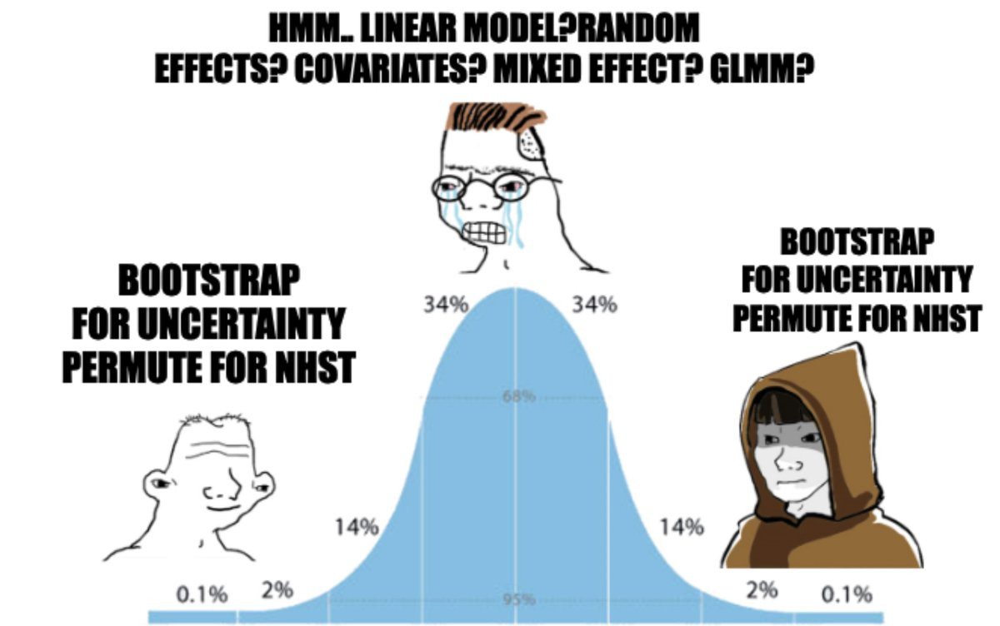

## • 16. Two-t Assumptions {.unnumbered #2t_assumptions}


```{r}
#| echo: false
#| message: false
#| warning: false
library(knitr)
library(dplyr)
library(readr)
library(stringr)
library(DT)
library(webexercises)
library(ggplot2)
library(tidyr)
source("../../_common.R") 
```


::: {.motivation style="background-color: #ffe6f7; padding: 10px; border: 1px solid #ddd; border-radius: 5px;"}

**Motivating scenario:** We're getting ready to compare means of two samples. We have some understanding that statistical models make assumptions, and we know that sometimes violating assumptions is a big deal, while in other cases analyses are robust to such violations. Here we explore the assumptions of the two sample t-test, and what to do when data do not meet these assumptions.  

**Learning goals:** By the end of this section, you should be able to:

1.  **List and explain** the assumptions of a "two-sample t-test".    

    - Independence.   
    - Unbiased.  
    - Mean is a good summary.    
    - Normal residuals.  
    - Equal variance.  

2. **Consider** what to do when data fail to meet these assumptions.  
:::

---

## Assumptions of linear models

We’ve already seen the basic assumptions for modeling a single continuous variable with a t-distribution: data should be 

1. Independent. 
2. Collected without bias.  
3. Summarized appropriately by the mean, and   
4. Approximately normal. 

For comparing two samples, we clarify that:

4.  *Normality* refers specifically to normality of residuals -- that is, the differences between observations and their predicted values. 

   - For a one sample analysis, the predicted value was simply the overall mean so normality of the raw data implied that residuals were normal. 
   
   - For a two sample analysis, each group has its own mean. As such, normality of residuals simply requires that data are approximately normal within each group. So long as data within each group are roughly normal, it's ok if the combined data are non-normal.   
   
   

Lastly,  two-sample t-tests (and all linear models) also assume: 

5. *Homoscedasticity:* This is a fancy way of saying that variance is independent of the predicted value, $\hat{Y}$.  In a two-sample case, this simply means both groups have similar variance.  


## Evaluating assumptions for our data set

```{r}
#| code-fold: true
#| code-summary: "Loading and processing data"
ril_link <- "https://raw.githubusercontent.com/ybrandvain/datasets/refs/heads/master/clarkia_rils.csv"
SR_visits <- readr::read_csv(ril_link) |>
  dplyr::rename(visits = mean_visits)  |>
  dplyr::filter(location == "SR",
                !is.na(petal_color),
                !is.na(visits))        |>
  dplyr::select(petal_color, visits)
```

These data are independent (we use only one value per RIL -- the mean across plants of a given RIL genotype), collected without bias (nice job Brooke!), and the mean seems like a good summary. So let's look into the assumptions of normality and equal variance: 

### 4. Data are not normal, but transformation helps.

A look at the raw data shows that pollinator visits are not normal for RILs with either petal color. As seen in the [previous section](#2groupviz) -- many RILs have nearly no visits, while some have many visits (@fig-colohist A). The data become closer to normal after log-transformation $^*$ (@fig-colohist B).  Still the many white flowers receiving no pollinator visits **$^\$$** remain, so the skew is not fully removed.  

:::aside
**$^*$ or more specifically** log(x+0.2) transformation. <br><br>

**$^\$$ this is called "zero inflation"** -- a common challenge for some types of statistical analyses. 
:::

```{r}
#| code-fold: true
#| code-summary: "Code for log-transformed plots."
#| label: fig-colohist 
#| fig-height: 3.5
#| fig-width: 10
#| column: page-right
#| fig-cap: "Evaluating the normality assumptions for the raw (A), and log transformed (B) data. The \"log\" transform is actually  log(+0.2) transformation because the data contain zeros, and adding one does not make the data particularly normal. This transformation makes the data more consistent with the normality assumption."
#| fig-alt: "Two panels compare histograms of mean visits to pink and white flowers. Panel A (raw data) shows both pink and white distributions with most values near zero and long right tails, creating skewed shapes. Panel B (log-transformed data) shows the same groups after applying a log(+0.2) transformation. The pink distribution becomes symmetric and bell-like, while the white distribution is less skewed but still uneven. Bars are outlined in black, with pink fill for pink flowers and white fill for white flowers."
library(patchwork)
a <- ggplot(SR_visits, aes(x = visits, fill = petal_color))+
  geom_histogram(color = "black", bins =8)+
  theme(legend.position = "none")+
  scale_fill_manual(values = c("pink", "white"))+
  labs(title ="Raw data (linear scale)", x = "visits")+
  facet_wrap(~petal_color)+
  coord_cartesian(ylim = c(0,30))

b <- ggplot(SR_visits, aes(x = log(.2+visits), fill = petal_color))+
  geom_histogram(color = "black", bins =8)+
  theme(legend.position = "none")+
  scale_fill_manual(values = c("pink", "white"))+
  labs(title ="Transformed data (log+.2 scale)", x = "log(.2 + visits)")+
  facet_wrap(~petal_color)+
  coord_cartesian(ylim = c(0,30))

a+b+plot_layout(axis_titles = "collect_y") + plot_annotation(tag_levels = "A")
```


### 5. Variance is similar among groups
 
:::note
**When to worry about unequal variance.**   

Linear models are remarkably robust to the assumption of equal variance. You can feel confident that differences in variance will have limited influence on your results until the larger variance is more than four times larger than the smaller variance.
:::

While the untransformed data has a noticeable difference in variance in pollinator visitation by petal-color morph ($s^2_{pink} = 2.71$, $s^2_\text{white} = 0.833$), the variance in (`log (x+.2)` transformed)  pollinator visits is remarkably similar. Thus we satisfy the equal variance assumption of linear models for the transformed data. However, even the noticeable difference in variances in the untransformed data is tolerable, as this difference is less than four-fold.  

```{r}
#| echo: false
#| column: margin
# Transform data
SR_visits  <- SR_visits                      |> 
  mutate(log_visits = log(.2 + visits))

# Compare variance
SR_visits                                    |> 
  group_by(petal_color)                      |>
  summarise(var_visits = var(visits),
            var_log_visits = var(log_visits))    |>
  mutate(var_visits = round(var_visits , digits = 3),
         var_log_visits = round(var_log_visits , digits = 3))|>
  gt()
```

```{r}
#| eval: false
# Transform data
SR_visits  <- SR_visits                      |> 
  mutate(log_visits = log(.2 + visits))

# Compare variance
SR_visits                                    |> 
  group_by(petal_color)                      |>
  summarise(var_visits     = var(visits),
            var_log_visits = var(log_visits))
```


### Residual thinking      

Above we looked within each group. An equivalent way to think about assumptions of a linear model is to consider the residuals -- that is the deviation between model predictions and the actual data. For a two-sample analysis (or any case with a single categorical explanatory variable) model predictions are simply the means of each group.  

To build some intuition about residual thinking, I will first calculate and visualize residuals from this linear model. We will then use these residuals to consider the assumptions of normality and equal variance as above. For simplicity I will focus on the "raw" untransformed data, but we could do the exact same thing on transformed data.

Let's first build a model with the [`lm()`](https://stat.ethz.ch/R-manual/R-devel/library/stats/html/lm.html) function, and then use [`broom`](https://broom.tidymodels.org/)'s [`augment()`](https://generics.r-lib.org/reference/augment.html) function to find predictions and residuals:  

```{r}
library(broom)
petal_color_model   <- lm(visits ~ petal_color, data = SR_visits)
petal_color_details <- augment(petal_color_model)  
```

```{r}
#| column: margin
SR_visits |> 
  group_by(petal_color) |>
  summarise(Y = mean(visits))
```

```{r}
#| echo: false
petal_color_details |>
    dplyr::select(visits, petal_color, .fitted, .resid ) |>
    mutate(.fitted = round(.fitted, digits = 2),
           .resid = round(.resid, digits = 2))|>
    datatable(options = list(pageLength = 5))
```

---

The `.fitted` values are simply group means (see code in margin), as we expect. The residuals equal the observed value, $Y_i$ (`visits`), minus the value predicted from the model, $\hat{Y_i}$, (`.fitted`).    

With predictions and residuals in-hand, we can now evaluate the fit of data to modeling assumptions from the point of view of residuals. There is nothing here that is different than above. However, by thinking about residuals, we are better prepared to evaluate more general linear models. 

Let's start by looking at each residual value separately for each petal color:    


```{r}
#| code-fold: true
#| fig-height: 3.5
#| label: fig-resids
#| code-summary: "Click to reveal the code for plotting the residuals."
#| fig-cap: "Residual values for each pink- (left facet) and white- (right facet) petaled parviflora RIL. The red horizontal line at zero, and the black lines connecting each data point to zero are meant to guide the eye. The data are ordered within each petal color from lowest  to greatest residual value within each petal color (again to guide the eye)."
#| fig-alt: "A plot showing the residual pollinator visits for pink- and white- flowered parviflora RILs."
petal_color_details  |>
    arrange(petal_color, visits)|>
    mutate(n = 1:n()) |>
    ggplot(aes( x = n, y = .resid))+
    geom_point()+
    facet_wrap(~petal_color, scales = "free_x", labeller = "label_both")+
    geom_hline(aes(yintercept = 0), color = "red")+
    geom_segment(aes(y = .resid, yend =0, x = n, xend = n))+
    labs(x = "Rank within color morph. This makes results easier to visualize.")+
    theme(axis.text.x = element_blank())
```

@fig-resids reveals wider variation in residuals for pink- than for white- flowered RILs. It also shows that many residuals for white-petaled RILs have an identical value  (-0.73), corresponding to zero pollinator visits. 

While @fig-resids suggests slight differences in the variance between petal color morphs, it does not clearly illuminate the distribution of the data. @fig-density below displays the distribution of residuals as two overlaid density plots. As above, these plots reveal that the data are skewed for both petal color morphs. 

```{r}
#| label: fig-density
#| fig-cap: "Distribution of residuals for pink and white RILs. Density curves show that both groups are right-skewed."
#| fig-alt: "Overlaid density plots of residuals for pink and white flowers. Both distributions are right-skewed -- but the white petalled RILs have a stronger right skew than the pink-flowered RILs."
petal_color_details  |>
    ggplot(aes( x = .resid, fill = petal_color))+
    geom_density(alpha = .85, adjust = 1.5)+
    scale_fill_manual(values= c("white","pink"))+
    theme_dark()
```


## What to do when data violate assumptions   

:::aside 
Later in the term we will consider more complex scenarios of non-independence, bias, and more advanced approaches for data violating normality assumptions. But those techniques are a bit advanced for us at this point.
:::

Here, I introduce some common approaches to deal with data that break the assumptions of normality and/or equal variance$^*$. 

```{r}
#| echo: false
#| column: margin
#| label: fig-norm
#| fig-cap: "A stats meme! At the novice and expert ends of the experience distribution, both agree that bootstrapping for uncertainty and permuting for NHST are useful tools. The average biostatistician, stuck in the middle, frets over which modeling approach is appropriate." 
#| fig-alt:  "A meme with three cartoon figures superimposed on a bell curve. The central figure, crying with glasses, says: \"Hmm… linear model? random effects? covariates? mixed effect? GLMM?\" On the left, a simple character smiles with the text: \"Bootstrap for uncertainty, permute for NHST.\" On the right, a hooded character repeats the same phrase. The normal curve behind them shows percentages (68%, 95%, 99.7%) corresponding to standard deviations."

```

- **When data are not normal:** We can   
   1. Analyze the data as if it were normal, with some complementary resampling-based analyses (as in the rest of this chapter).  
   2. Transform the data (as above).   
   3. Bootstrap to estimate uncertainty   and permute to test null hypotheses (@fig-norm).   OR   
   4. Use a rank-based "non-parametric" test. Such tests are more formally a test for difference in medians. They work by ranking the data and comparing the observed distribution of rankings between groups to the null. We can do this in R as follows, which leads to serious rejection of the null hypothesis: 
   
```{r}
wilcox.test(visits ~ petal_color, data = SR_visits, exact = FALSE)
```

- **When variance is unequal:** We can use the "*Welch's t-test*", which does not assume equal variance. In fact, this is the default in R's [`t.test()`](https://stat.ethz.ch/R-manual/R-devel/library/stats/html/t.test.html) function. Here we use the standard t-test because the math is easier and is consistent with results in a broader linear model framework. 

### Trade-off between interpretability & meeting assumptions  

In the previous edition of this book, I analyzed the transformed data. My reasoning for this was that data should meet assumptions, and we should do our stats correctly. 

However I have had a change of mind. My current thinking is as follows. Although there is nothing wrong with analyzing `log + 0.2` transformed data,  literally no one in the world thinks on a  `log + 0.2` scale. So, even though the transformation better fits model assumptions, what we get out of this "proper model" is difficult to interpret and communicate. **Therefore, we will analyze the untransformed data,** and use resampling methods to evaluate the fragility of our conclusions.  

This general challenge -- choosing between proper statistics and biological interpretability -- shows up often. Every scenario is different, but I often ask myself 

> "Is the transformation understandable and biologically reasonable?"    
     
- **For quantities that grow exponentially, or as a square, or some other biologically interpretable patterns** a log or square-root transformation or whatever makes both biological and statistical sense. Of course even in these cases our audience may not think naturally in log scale, so there is still a burden associated with explaining the transformation to our audience.     
   
- **For more arbitrary "transform until it meets assumptions" scenarios** I usually suggest a test whose assumptions are fit by the data or a resampling-based approach (e.g. bootstrap, permutation). This suggestion does not reflect the propriety of running stats on transformed data. Rather it reflects our goals as biostatisticians. We want to use stats to understand biology, and I don't understand what an average of  -0.44 on a  log + 0.2 scale means.   
   
Thus in my view we have two obligations:

1. Make sure our stats do not mislead us.  
2. Make sure we can responsibly interpret and communicate our results.

So let the weight of these competing obligations guide your decisions about transformation.  

