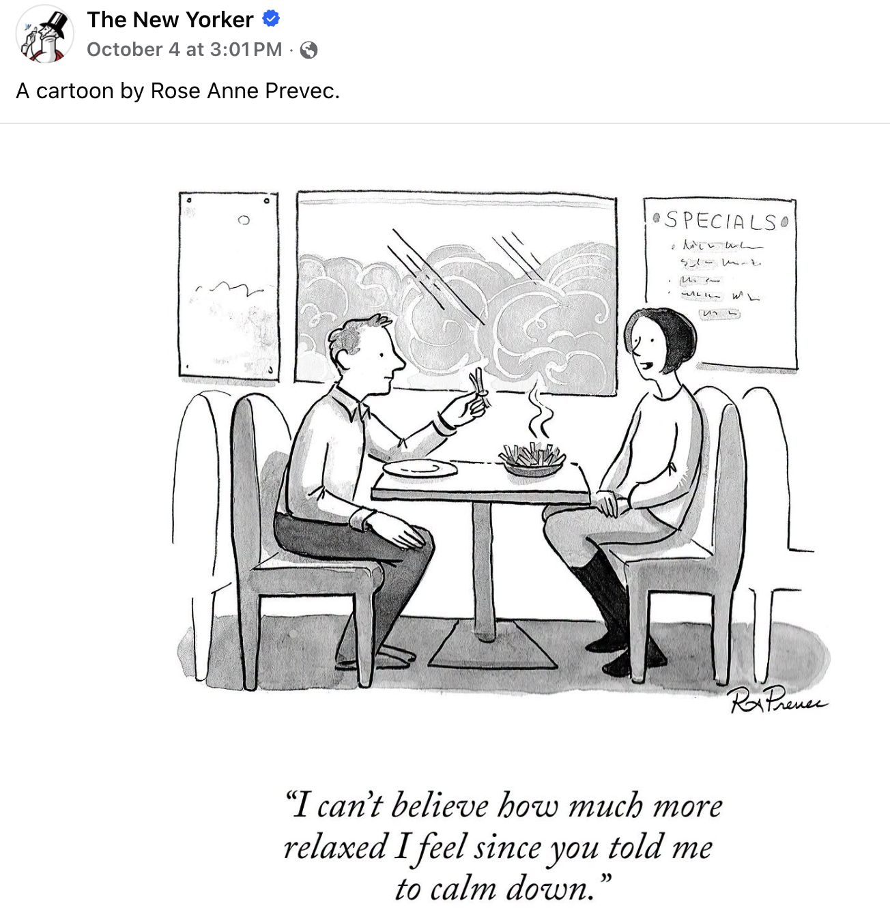

# Review for Exam 1 {.unnumbered}

### Practice exam

This [practice exam](https://github.com/yanivjb/biostats-book-data/raw/refs/heads/main/Exam1_practice.pdf) is adapted from my 2025 Applied Biostats exam.

### Practice app

Practice for Exam 1 (chapters 0–12): pick random questions or focus on chapters and concepts, check your answers, and explain ideas in your own words. The questions come from my homework, quizzes, Chime Ins and the book. Each one also has AI-written versions that test the same idea in a new way (click **Different version**). Like the exam, there's no code to write or run. Some questions are about R, but they ask about ideas, plots, and what code does.

---

#### Non-AI version

[Open the study guide full screen ↗](study_guide/index.html){target="_blank"} I love this and am very proud of it. It's also down below.


---


#### AI version (Claude)

[**Open the AI version ↗**](https://claude.ai/artifact/ANMj6BpXNkn1EmezZWqNsT){target="_blank"} Same questions, plus Claude: a tutor that talks you through questions you're stuck on, feedback on your written answers, new practice questions on demand, and a report on your strengths and weak spots. You need a (free) Claude account, and it uses your own Claude usage, only when you click. I've kept it light, so the free tier should go a long way. It's Claude-only because I couldn't get Gemini or ChatGPT to stick to the course questions.


#### AI version (ChatGPT)

I got a version of this going in [ChatGPT](https://chatgpt.com/g/g-68e564b8608c81919d670b272eb411b7-exam-1-tutor). On the whole I like it, but it doesn't allow for images, so it's missing some types of questions.  


#### AI version (Gemini)

I got a version of this going in [Gemini](https://gemini.google.com/gem/1MHn_YyLFLe0nqoTzhnPtUOKKkc0KIp_W?usp=sharing). On the whole, it's ok.. but it seems to never use my questions, and rather make up questions inspired by mine. It also wont use my images, but seems to make its own.  


---

#### Use in-book

```{=html}
<iframe src="study_guide/index.html" title="Exam 1 study guide"
        style="width:100%; height:85vh; border:1px solid #d5dccb; border-radius:10px;"></iframe>
```


## Relax

Also, dont worry too much, it's just an exam. 

```{r}
#| echo: false
#| message: false
#| warning: false
library(knitr)   

```